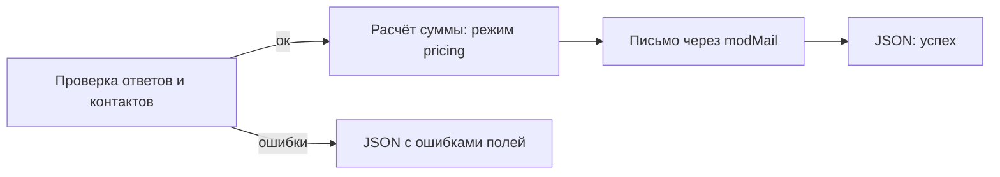

# Сниппет PageBuilderQuiz

Обработчик AJAX-отправки секции Pro [quiz](../sections/quiz). Чанк секции вызывает его через **FetchIt**. Из шаблона ресурса сниппет не вызывайте.

## Назначение

Валидация ответов и контактов, расчёт суммы на сервере в режиме `pricing`, письмо через `modMail`, JSON-ответ FetchIt.

## Где вызывается

Chunk `pagebuilderpro_quiz` вызывает [PageBuilderFetchIt](PageBuilderFetchIt) со свойствами `snippet` = `PageBuilderQuiz` и `form` = `pagebuilderpro_quiz_form`.

## Параметры

Отдельных свойств для вызова из шаблона нет. POST формы:

| Поле | Назначение |
| --- | --- |
| `pb_quiz_key` | Ключ квиза из данных секции. Пустой ключ — ошибка валидации |
| `answer[...]` | Ответы по шагам |
| контактные поля | Если включён блок контактов в секции |
| `nospam` | Honeypot. Заполненное поле отвечает success, письмо не отправляется |
| `pageId` | Необязательный id ресурса со страницы формы |

`resource_id` страницы, где искать секцию:

| Источник | Приоритет |
| --- | --- |
| POST `pageId` | 1 |
| свойство `resource_id` в action FetchIt | 2 |
| текущий ресурс MODX | 3 |

### Ошибки

| Ситуация | Ответ |
| --- | --- |
| Секция с тем же `quiz_key` не найдена | `pagebuilder_fe_quiz_not_found` |
| Прямой вызов обработчика без сервиса FetchIt | JSON с `pagebuilder_fe_fetchit_unavailable` |
| Отрисовка формы без FetchIt | Чанк показывает `pagebuilder_fe_form_unavailable`, см. [PageBuilderFetchIt](PageBuilderFetchIt) |

## Зависимости

| Пакет | Зачем |
| --- | --- |
| pagebuilderpro | Секция `quiz` |
| FetchIt | AJAX и ошибки в полях |

## См. также

- [Секция quiz](../sections/quiz)
- [PageBuilderContactForm](PageBuilderContactForm)
- [Обзор сниппетов](index)
