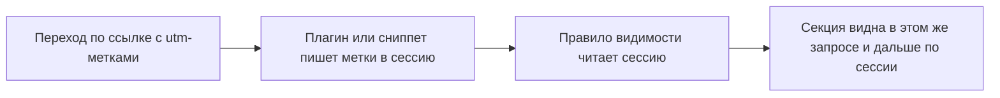

# Сниппет PageBuilderUtmSession

Записывает UTM-параметры из query string в `$_SESSION['utm']` при первом заходе. Так [PageBuilder](PageBuilder) применяет правила видимости секций (`settings.utm` в JSON документа) в этом же запросе и дальше по сессии.

## Когда вызывать

Плагин PageBuilder уже захватывает UTM на `OnHandleRequest` в контексте `web`. Сниппет нужен, если:

- плагин отключён на части шаблонов;
- сессия стартует позже события плагина;
- вы хотите явный вызов в layout.

Разместите **до** `PageBuilder` в общем chunk шапки или base layout.

Сниппет вызывает тот же захват (`UtmSessionCapture`), что и плагин на `OnHandleRequest`. Сессию они не стартуют: если `session_status()` не `PHP_SESSION_ACTIVE`, запись в `$_SESSION['utm']` не выполняется, ошибки в выводе нет.



## Параметры

Сниппет без properties, вызов без аргументов.

## Вызов

::: code-group

```modx
[[!PageBuilderUtmSession]]
```

```fenom
{'!PageBuilderUtmSession' | snippet}
```

:::

## Что сохраняется

Сниппет обрабатывает скалярные ключи из `$_GET` текущего запроса. Префикс `utm_` снимается, имя приводится к lowercase, короткие имена без префикса тоже допустимы. Ключ должен совпадать с `^[a-z][a-z0-9_]*$`, иначе пара отбрасывается. Пустые значения игнорируются.

| Query | Сессия |
| --- | --- |
| `?utm_source=google` | `$_SESSION['utm']['source'] = 'google'` |
| `?utm_campaign=sale` | `$_SESSION['utm']['campaign'] = 'sale'` |
| `?campaign=launch` | `$_SESSION['utm']['campaign'] = 'launch'` |

Реестр параметров и значения по умолчанию — вкладка **UTM** панели управления.

Правила **видимости** секций настраивают в диалоге **Видимость** инспектора, а не на вкладке UTM. Диалог не показывается, пока не включить `pagebuilder_inspector_visibility_enabled` (по умолчанию `0`).

## Плейсхолдеры в полях

В url и button секций доступен <code v-pre>{{utm:key}}</code>. См. [Панель управления → UTM](../cmp#utm). <!-- markdownlint-disable-line MD033 -->

## См. также

- [PageBuilderUtmUrl](PageBuilderUtmUrl)
- [PageBuilder](PageBuilder)
