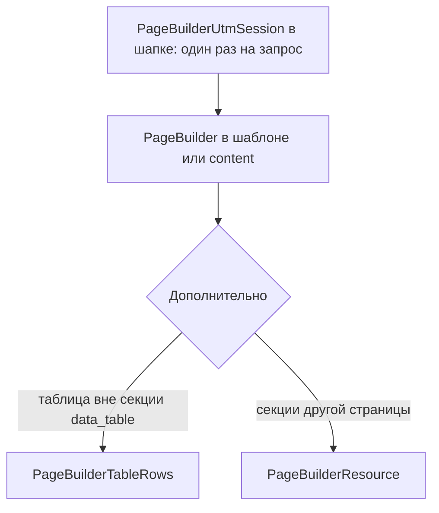

# Сниппеты PageBuilder

Сниппеты вывода. Pro-пакет добавляет к ним обработчики форм. Чанк секции: Free-пакет — `pagebuilder_{key}`, Pro — `pagebuilderpro_{key}` (исключение — `data_table` → `pagebuilder_data_table`). Namespace у чанков нет: префикс равен имени пакета.

| Сниппет | Назначение |
| --- | --- |
| [PageBuilder](PageBuilder) | HTML опубликованных секций текущего или заданного ресурса |
| [PageBuilderResource](PageBuilderResource) | Секции другого ресурса (`resource_id`, `0` = текущий ресурс) |
| [PageBuilderSitemap](PageBuilderSitemap) | XML sitemap страниц с опубликованными секциями |
| [PageBuilderUtmSession](PageBuilderUtmSession) | UTM из query string в сессию для правил видимости секций |
| [PageBuilderUtmUrl](PageBuilderUtmUrl) | UTM из реестра панели управления к произвольному URL |
| [PageBuilderTableRows](PageBuilderTableRows) | Строки табличных данных ресурса (JSON или chunk) |

Pro. Из шаблона не вызывайте: чанк секции вызывает [PageBuilderFetchIt](PageBuilderFetchIt).

| Сниппет | Назначение |
| --- | --- |
| [PageBuilderQuiz](PageBuilderQuiz) | Обработчик секции [quiz](../sections/quiz) |
| [PageBuilderContactForm](PageBuilderContactForm) | Обработчик секции [contact_form](../sections/contact_form) |
| [PageBuilderFormBuilder](PageBuilderFormBuilder) | Обработчик секции [form_builder](../sections/form_builder) |
| [PageBuilderFetchIt](PageBuilderFetchIt) | Отрисовка формы через Fenom. Чанк передаёт обработчик в `snippet` |

## Порядок на типовой странице

1. **PageBuilderUtmSession** в общий layout, если на странице работают UTM-правила секций: один раз на запрос, до отрисовки секций.
2. **PageBuilder** в шаблоне или поле content ресурса.
3. **PageBuilderTableRows** отдельно, если таблица выводится вне секции `data_table`.

Блок с другой страницы (hero с главной, FAQ из лендинга) выводит **PageBuilderResource**.

## Таблица соответствий (MODX / Fenom)

| Назначение | MODX | Fenom |
| --- | --- | --- |
| Секции страницы | `[[!PageBuilder]]` | `{'!PageBuilder' \| snippet}` |
| Фильтр секций | `` [[!PageBuilder? &section_types=`hero,cta`]] `` | `{'!PageBuilder' \| snippet : ['section_types' => 'hero,cta']}` |
| Секции другого ресурса | `` [[!PageBuilderResource? &resource_id=`42`]] `` | `{'!PageBuilderResource' \| snippet : ['resource_id' => 42]}` |
| JSON для SEO | `` [[!PageBuilder? &return_values=`1`]] `` | `{'!PageBuilder' \| snippet : ['return_values' => 1]}` |
| Sitemap | `[[!PageBuilderSitemap]]` | `{'!PageBuilderSitemap' \| snippet}` |
| UTM в сессию | `[[!PageBuilderUtmSession]]` | `{'!PageBuilderUtmSession' \| snippet}` |
| URL с UTM | `` [[!PageBuilderUtmUrl? &url=`/contacts/`]] `` | `{'!PageBuilderUtmUrl' \| snippet : ['url' => '/contacts/']}` |
| Строки таблицы | `` [[!PageBuilderTableRows? &table_key=`prices`]] `` | `{'!PageBuilderTableRows' \| snippet : ['table_key' => 'prices']}` |

## Кеш

`PageBuilder` и `PageBuilderResource` вызывайте некэшированно (`[[!...]]` или `{'!...' | snippet}`). Иначе MODX может отдать HTML без учёта свежей публикации.

`PageBuilderUtmSession` тоже некэшированный: сессия заполняется в том же HTTP-запросе, что и переход по UTM-ссылке.

## См. также

- [Вывод на сайте](../frontend)
- [Дизайн-система](../design-system)
- [Панель управления → UTM](../cmp#utm)
- [Public API](../public-api)
