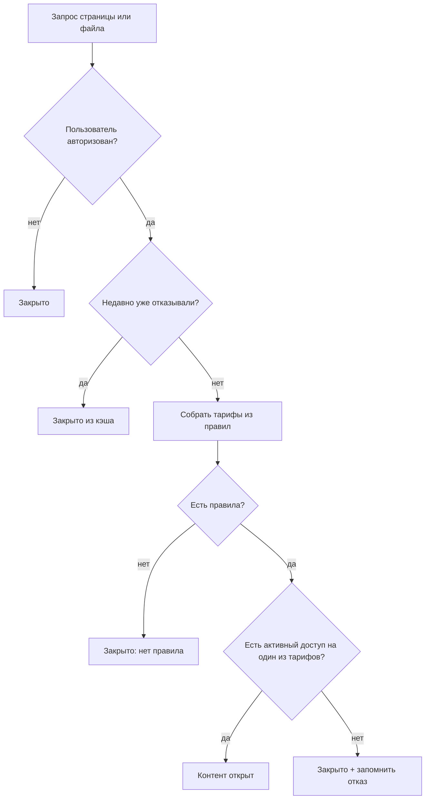
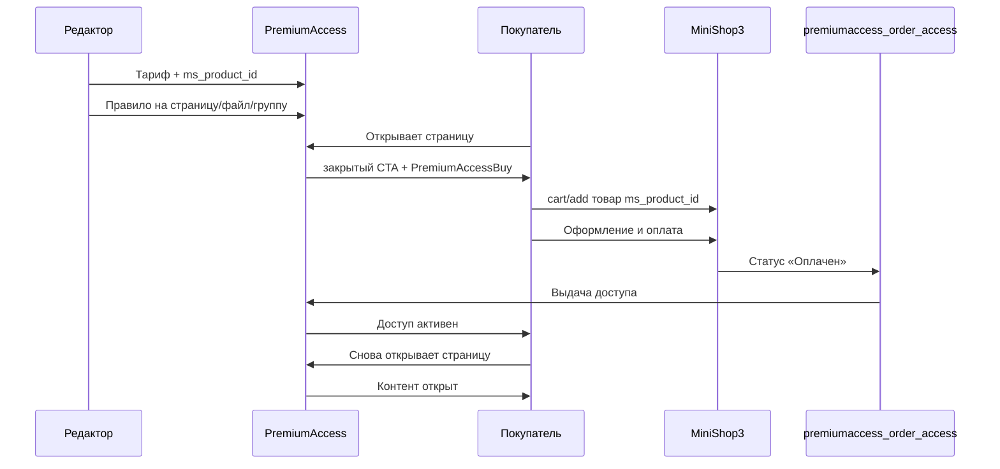

# Интеграция и покупка доступа

PremiumAccess **не принимает оплату сам**. Покупатель оформляет заказ в **miniShop3**. Компонент выдаёт и забирает доступ по статусам заказа или по вашим действиям в **Доступы**.

Примеры MODX/Fenom: [Сниппеты](snippets/index).

## Плагины

| Плагин | События | Назначение |
| --- | --- | --- |
| `premiumaccess_autoload` | `OnMODXInit` | Загрузка классов компонента |
| `premiumaccess_order_access` | `msOnChangeOrderStatus` | Выдача и отзыв по заказу MS3 |
| `premiumaccess_content_protection` | `OnLoadWebDocument`, `OnWebPagePrerender` | Paywall на витрине |
| `premiumaccess_fenom` | `pdoToolsOnFenomInit` | Fenom-модификаторы `pa_access` |
| `premiumaccess_front_assets` | `OnWebPageInit` | CSS/JS витрины |
| `premiumaccess_notifications` | `OnPaAccessGrant`, `OnPaAccessRevoke`, `OnPaAccessExtend` | Email, webhook, Telegram |
| `premiumaccess_expire_cron` | `OnSiteRefresh` | Истечение доступов и напоминания о продлении |

Плагины уведомлений и cron входят в пакет; сами оповещения включаются в **Настройках** (`premiumaccess.notifications_enabled`).

## Основные понятия

| Понятие | Простыми словами |
| --- | --- |
| **Тариф** | Что продаёте: название, срок, ID товара miniShop3 |
| **Правило** | Какой тариф открывает страницу, файл или блок |
| **Товар miniShop3** | То, что попадает в корзину и оплачивается |
| **Выдача доступа** | Запись в базе: у пользователя есть этот тариф (оплата, вручную или промокод) |
| **Проверка доступа** | Решение перед показом: открыть контент или закрытую страницу |

Важно: у тарифа PremiumAccess и товара в заказе MS3 должен совпадать **ID товара** (`ms_product_id`). И на странице должно быть **правило**, привязанное к этому тарифу — иначе после оплаты контент останется закрытым.

## Как проверяется доступ {#алгоритм-checkaccess}

По умолчанию контент **закрыт**. Компонент открывает его только если выполнены все условия ниже.



Пошагово:

1. **Гость** (не авторизован) всегда видит закрытую страницу.
2. **Кэш отказов** — если недавно уже отказали, повторная проверка в БД не нужна; разрешение всегда проверяется заново.
3. **Правила** — для страницы или файла собирается список тарифов из включённых правил.
4. **Нет правил** — контент закрыт, даже если у пользователя есть доступ к тарифу «в базе», но правило не создано.
5. **Есть доступ** — у пользователя активная выдача хотя бы на один тариф из списка → контент открыт.
6. **Иначе** — закрыто; отказ может кэшироваться на время из настройки `premiumaccess.access_cache_ttl`.

**Активный** доступ: не отозван и (бессрочный или дата окончания в будущем).

Подробнее о правилах: [Продукты и правила](interface/products-and-rules).

## Как происходит покупка доступа



### Настройка (один раз)

1. **Тариф** в менеджере: цена для CTA, срок, **`ms_product_id`**.
2. **Правило** на target (Мастер, **Правила** или привязка в **Ресурсы**).
3. **Настройки:** `premiumaccess.paid_order_statuses`, `premiumaccess.revoked_order_statuses`.
4. Плагин **`premiumaccess_order_access`** включён.
5. Плагин **miniShop3** включён; заданы `ms3_cart_page_id`, `ms3_order_page_id` (`ms3.js` подключается на витрине автоматически).

### Покупка на витрине

1. **Закрытая страница.** Гость видит заголовок, цену и кнопку «Купить» — полный текст страницы не отдаётся.
2. **Кнопка «Купить».** Сниппет **`PremiumAccessBuy`** добавляет в корзину товар, привязанный к тарифу этой страницы.
3. **Оформление.** Обычный заказ miniShop3: корзина → оформление → оплата.
4. **Выдача.** После статуса «оплачен» создаётся доступ (только если товар в заказе привязан к тарифу PremiumAccess).
5. **Контент открыт.** Покупатель обновляет страницу — видит полный текст.

### Отзыв при возврате / отмене

1. Заказ переходит в статус из списка **отменённых** (`premiumaccess.revoked_order_statuses`).
2. Отзывается только доступ, выданный **по этому заказу**.
3. Ручная выдача и промокод **не затрагиваются**.
4. В журнал пишется событие отзыва; при необходимости уходит email.

### Ручная выдача

**Доступы** → выберите пользователя и тариф. Заказ miniShop3 не нужен.

### Что не происходит автоматически

| Ожидание | Как на самом деле |
| --- | --- |
| Любая оплата в MS3 открывает контент | Только если товар в заказе привязан к тарифу PremiumAccess |
| Один доступ открывает весь сайт | Только страницы и файлы с правилом на этот тариф |
| Гость без аккаунта видит контент после оплаты | Доступ привязан к пользователю заказа — нужна авторизация |
| PremiumAccess принимает оплату | Оформление только через miniShop3 |

## Защита ресурса

**Автоматически:** плагин `premiumaccess_content_protection` на `OnWebPagePrerender`.

**Вручную в шаблоне:** [PremiumAccess](snippets/PremiumAccess).

Вызов **некэшируемый** (`[[!...]]` / `{'!...' | snippet}`).

## Premium blocks

1. **Компоненты → PremiumAccess → Premium-блоки** — создайте блок, скопируйте UUID из формы.
2. Вставьте маркер в content страницы:

```text
[[pa-block:550e8400-e29b-41d4-a716-446655440000]]
```

Без доступа HTML блока посетитель не увидит. Страница может быть открыта для всех, а блок — только для тех, у кого есть тариф (отдельное правило на блок).

## Защищённые файлы

1. Положите файл в каталог из настройки `premiumaccess.protected_path` (вне публичной папки сайта).
2. В **Правила** создайте правило типа «файл» с путём к файлу и нужным тарифом.
3. На странице выведите [PremiumAccessFile](snippets/PremiumAccessFile).

Скачивание: пользователь нажимает кнопку → получает одноразовую ссылку → файл отдаётся через `download.php`.

## Личный кабинет

Страница «Мои доступы»: сниппет [PremiumAccessCabinet](snippets/PremiumAccessCabinet).

Готовые чанки: `paCabinet`, `paCabinetItem`, `paCabinetEmpty`. Список доступов можно подгружать через AJAX (`web/cabinet/list`).

## Промокоды {#промокоды}

1. **Компоненты → PremiumAccess → Промокоды → Создать**:
   - укажите **тариф**, который выдаётся при активации;
   - задайте **текст кода** или оставьте пустым — сгенерируется автоматически;
   - при необходимости — **лимит активаций** и **срок действия** самого кода.
2. На сайте разместите форму [PremiumAccessPromoRedeem](snippets/PremiumAccessPromoRedeem) (страница кабинета, отдельный ресурс).
3. Пользователь **авторизован**, вводит код — получает доступ к тарифу. Событие попадает в **Журнал**.

Не более 10 попыток в минуту с одного аккаунта (защита от перебора).

Подробнее: [Доступы и промокоды](interface/accesses-and-clients#промокоды).

## Продление доступа

Продление — это **повторная покупка** того же товара в miniShop3. Автоматического списания с карты (подписки) **нет**: пользователь снова оформляет заказ, как при первой покупке.

### Кнопка на сайте

Сниппет [PremiumAccessRenew](snippets/PremiumAccessRenew) выводит кнопку «Продлить» — по сути та же «Купить», но с другим текстом (чанк `paRenewButton`).

Сниппет **сам не проверяет**, можно ли продлевать. Показывайте кнопку, когда доступ **истёк** или **скоро истекает** (статус в кабинете или ваша логика в шаблоне).

### Когда продление доступно {#когда-доступно-продление}

Проверка выполняется на сервере — при запросе ссылки на оформление заказа (см. ниже). Условия:

| Ситуация | Можно продлить? |
| --- | --- |
| Гость (не вошёл на сайт) | Нет |
| Доступ отозван или не был выдан | Нет |
| Доступ **истёк** | Да |
| Доступ **бессрочный** | Нет |
| Доступ **активен**, до окончания осталось не больше N дней (настройка «Напомнить за N дней») | Да |
| Доступ активен, до окончания больше N дней | Нет |

Дополнительно: у тарифа должен быть указан **ID товара MS3** — иначе ссылку на корзину или оформление построить нельзя.

Число N задаётся в **Настройки → Уведомления и cron** (`auto_renewal_remind_days`, по умолчанию 7).

### Ссылка на оформление заказа (AJAX)

Если на сайте свой интерфейс (не только сниппет), запросите URL оформления через connector:

```text
GET {assets_url}components/premiumaccess/connector.php
  ?action=web/access/renew-link
  &product_id=1
```

Пользователь должен быть **авторизован**. При успехе в ответе — адрес корзины или страницы оформления:

```json
{
  "success": true,
  "object": {
    "renewUrl": "https://example.com/checkout"
  }
}
```

При отказе — сообщение «Продление недоступно» (гость, неверный тариф, рано продлевать, нет товара MS3).

Подробнее: [PremiumAccessRenew](snippets/PremiumAccessRenew), [Личный кабинет](frontend/cabinet).

## API витрины {#api-витрины}

Connector: `{assets_url}components/premiumaccess/connector.php`.

| action | Auth | Назначение |
| --- | --- | --- |
| `web/access/check` | web session (гость OK) | `{ allowed, reason }` |
| `web/access/status` | web session | Включён ли компонент, авторизован ли пользователь |
| `web/access/renew-link` | пользователь web | Ссылка на корзину или оформление для продления |
| `web/cabinet/list` | пользователь web | Список доступов пользователя (JSON) |
| `web/files/issue-token` | пользователь web, POST + `HTTP_MODAUTH` | Токен скачивания |
| `web/promo/redeem` | пользователь web, POST + `HTTP_MODAUTH` | Активация промокода |

### web/access/status

```text
GET connector.php?action=web/access/status
```

Ответ:

```json
{
  "success": true,
  "object": {
    "enabled": true,
    "authenticated": true,
    "user_id": 4,
    "cabinet_available": true
  }
}
```

`cabinet_available` = `true`, если пользователь авторизован (`user_id > 0`). Для своего JS на витрине без сниппетов: сначала `web/access/status` — компонент включён (`enabled`) и пользователь вошёл (`authenticated`), затем `web/cabinet/list`.

Полный справочник mgr/web actions: [Connector API](development/api).

## Fenom-модификаторы

Плагин `premiumaccess_fenom` (pdoTools):

| Модификатор | Назначение |
| --- | --- |
| `pa_access` | Универсальная проверка: `target_type`, `target_identifier` |
| `pa_resource_access` | Доступ к resource ID |
| `pasraccess`, `pascaccess` | Устаревшие алиасы для страницы (`resource`) |

Без параметров `pa_access` использует **`target_type=resource`** и **`target_identifier`** = текущий ID ресурса (или переданный в модификатор).

Пример TV:

::: code-group

```fenom
{if 'protected_body' | pa_access : ['target_type' => 'tv', 'target_identifier' => 'protected_body']}
  {$_modx->resource.protected_body}
{else}
  {'!PremiumAccessBuy' | snippet : ['resourceId' => $_modx->resource.id]}
{/if}
```

```modx
[[!PremiumAccessBuy? &resourceId=`[[*id]]`]]
```

:::

AJAX: `action=web/access/check&target_type=resource&target_identifier=123`.

Дополнительные примеры Fenom: [Paywall — условные фрагменты](frontend/paywall#условные-фрагменты-fenom).

Типы `tv`, `contact`, `category` поддерживаются при проверке доступа; в форме создания правила в SPA часть типов может отсутствовать — см. [типы объектов](interface/products-and-rules#типы-объектов-на-витрине).

## Уведомления и cron истечения {#уведомления-и-cron-истечения}

### Включение

1. `premiumaccess.notifications_enabled = true` в [Настройках SPA или системных настройках MODX](settings#уведомления-и-cron-premiumaccess_notifications).
2. SMTP MODX настроен.
3. Плагины `premiumaccess_notifications`, `premiumaccess_expire_cron` включены.

### События

| Событие | Когда |
| --- | --- |
| `OnPaAccessGrant` | Выдача (MS3, ручная выдача, промокод) |
| `OnPaAccessRevoke` | Отзыв |
| `OnPaAccessExtend` | Продление |
| `OnPaAccessNotify` | Перед отправкой email, webhook и Telegram |
| Истечение / напоминание | Срок доступа прошёл или скоро закончится |

### Статусы доступа в уведомлениях

В письмах и webhook те же статусы, что в **Доступы**: **Активен**, **Истёк**, **Отозван**.

Ключи: [Системные настройки — уведомления](settings#уведомления-и-cron-premiumaccess_notifications).

### Тело webhook-запроса

POST JSON на `premiumaccess.notify_webhook_url`:

```json
{
  "event": "grant",
  "user_id": 4,
  "product_id": 1,
  "product_name": "Premium Access Demo",
  "user_email": "user@example.com",
  "expires_at": "2027-01-01 00:00:00",
  "source": "minishop3_order",
  "ms_product_id": "160"
}
```

Пример письма **«скоро истечёт доступ»** (cron + включённые напоминания о продлении):

```json
{
  "event": "auto_renewal_due",
  "user_id": 4,
  "product_id": 1,
  "product_name": "Premium Access Demo",
  "user_email": "user@example.com",
  "expires_at": "2026-07-12 00:00:00",
  "source": "expire_cron",
  "ms_product_id": "160",
  "renew_url": "https://example.com/checkout"
}
```

Поле `renew_url` — ссылка на оформление заказа в miniShop3 (если продление разрешено и у тарифа указан товар MS3). Подставляется в email-чанки `paEmailAutoRenewal*`.

### Telegram

При заполненных `notify_telegram_bot_token` и `notify_telegram_chat_id` отправляется текст:

```text
PremiumAccess grant: user #4, product #1 (Premium Access Demo)
```

Формат: `PremiumAccess {event}: user #{user_id}, product #{product_id} ({product_name})`. События те же, что у email: `grant`, `revoke`, `extend`, `expire`, `auto_renewal_due`.

Событие **`OnPaAccessNotify`** получает те же поля до отправки. Подробнее: [События MODX](development/events).

### Cron истечения

- **OnSiteRefresh** — не чаще интервала из `premiumaccess.expire_cron_interval`.
- **CLI:** `php core/components/premiumaccess/bin/expire-accesses.php` для system crontab.

Пример crontab (каждый час):

```bash
0 * * * * /usr/bin/php /path/to/modx/core/components/premiumaccess/bin/expire-accesses.php >> /var/log/premiumaccess-expire.log 2>&1
```

CLI не запускает вторую копию, пока работает первая (**`ModxCronLock`**, ключ `expire_cron_cli`, TTL 600 сек): повторный запуск завершится с кодом **0** и текстом `another run is in progress`, записи не обработаются дважды.

Stdout при успехе:

```text
PremiumAccess expire cron: expired=2, auto_renewal_reminders=1
```

Запись в **Журнал**: `access_expired`, `auto_renewal_reminder`. Подробнее: [Системные настройки — cron истечения](settings#expire-cron).

## Безопасность при развёртывании

- `protected_path` вне document root.
- HTTPS для connector и download.
- Права менеджера по принципу минимальных привилегий.
- После смены order statuses проверьте выдачу и отзыв доступа.

## См. также

- [Paywall на страницах](frontend/paywall)
- [Защищённые файлы](frontend/protected-files)
- [Личный кабинет](frontend/cabinet)
- [Витрина: CSS и чанки](frontend)
- [Интерфейс менеджера](interface/index)
- [События MODX](development/events)
- [FAQ](faq)
