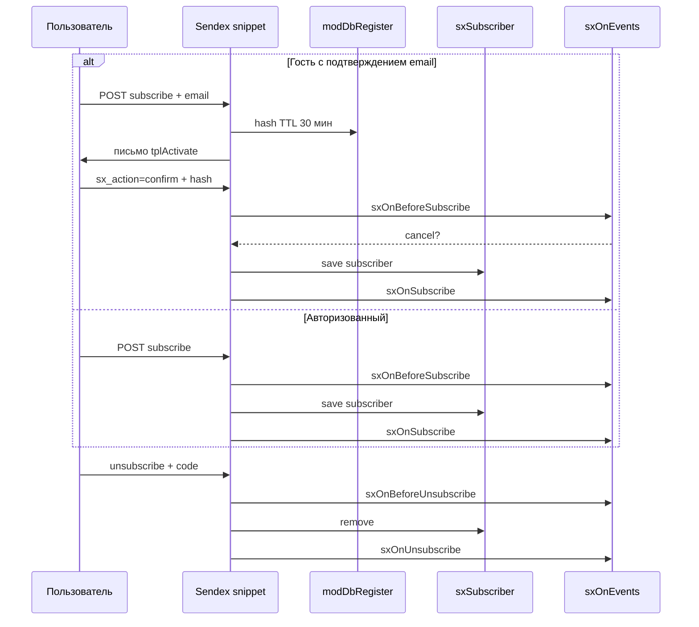
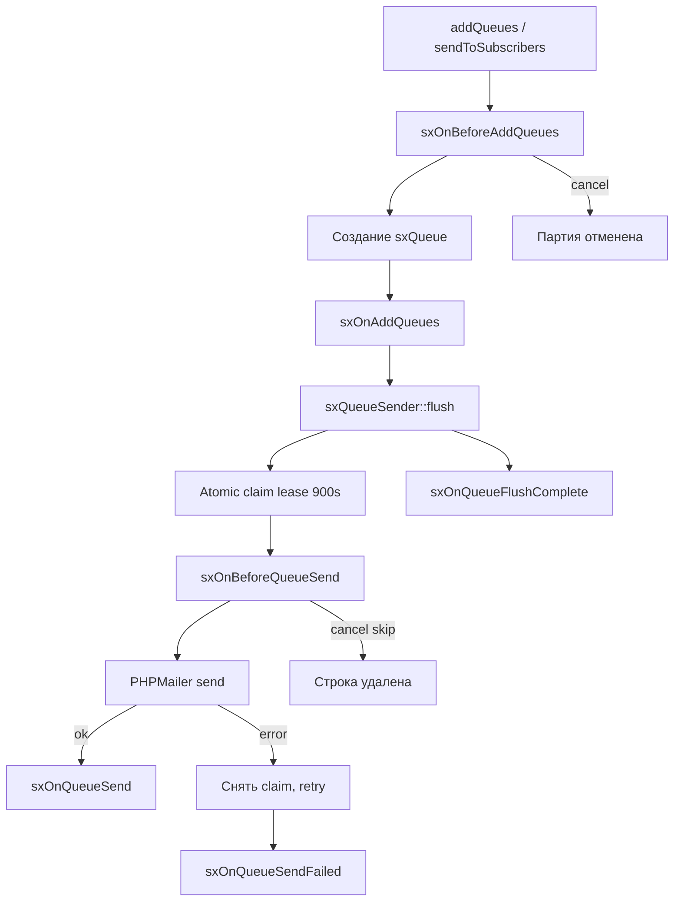

# События

Sendex регистрирует системные события `sxOn*` при установке пакета. После обновления переустановите пакет через **Extras → Installer**, если события не появились в **Управление → Системные события**.

## Подключение плагина

1. **Элементы → Плагины → Создать**
2. Вкладка **Системные события** — отметьте нужные `sxOn*`
3. Вставьте PHP-код в поле плагина
4. Сохраните и очистите кэш MODX

Отмена Before-события: `$modx->event->output('текст ошибки')`. Пользователь увидит это сообщение; операция не выполнится.

::: tip
Вызов `$modx->invokeEvent('sxOnSubscribe', …)` по имени работает и до регистрации события в transport, но для менеджера удобнее подписать плагин явно.
:::

## Поток подписки и отписки



Повторная подписка, неверный `code` или несовпадение `newsletter_id` — операция игнорируется, события **не срабатывают**.

## Подписка и отписка

| Событие | Когда | Отмена |
| --- | --- | --- |
| `sxOnBeforeSubscribe` | Перед созданием подписчика | да |
| `sxOnSubscribe` | После успешного сохранения | нет |
| `sxOnBeforeUnsubscribe` | Перед удалением подписчика | да |
| `sxOnUnsubscribe` | После успешного удаления | нет |

### Параметры subscribe / unsubscribe

| Параметр | BeforeSubscribe | Subscribe | BeforeUnsubscribe | Unsubscribe |
| --- | --- | --- | --- | --- |
| `newsletter` | да | да | да | да |
| `newsletter_id` | да | да | да | да |
| `user_id` | да | да | да | да |
| `email` | да | да | да | да |
| `subscriber` | `null` | объект | объект | объект |
| `source` | да | да | да | да |
| `code` | — | — | да | да |

### Значения `source`

| Значение | Описание |
| --- | --- |
| `snippet` | Обычный POST формы |
| `ajax` | AJAX-запрос |
| `confirm` | Подтверждение email по ссылке |
| `guest` | Мгновенная подписка гостя без подтверждения |
| `mgr` | Действие из менеджера |
| `group` | Массовая подписка группы (**события не вызываются**) |

## Поток очереди писем



## Очередь писем

| Событие | Когда | Отмена |
| --- | --- | --- |
| `sxOnBeforeAddQueues` | Перед формированием очереди | да (вся партия) |
| `sxOnAddQueues` | После создания строк очереди | нет |
| `sxOnBeforeQueueSend` | Перед отправкой одного письма (после claim) | да (строка удаляется, без requeue) |
| `sxOnQueueSend` | После успешной отправки | нет |
| `sxOnQueueSendFailed` | После ошибки SMTP (claim снят) | нет |
| `sxOnQueueFlushComplete` | После пакетной отправки | нет |

### Параметры очереди

| Событие | Параметры |
| --- | --- |
| `sxOnBeforeAddQueues` | `newsletter`, `subscribers` (массив, **можно изменить**) |
| `sxOnAddQueues` | `newsletter`, `created` (число новых строк) |
| `sxOnBeforeQueueSend` | `queue`, `message` (массив headers+body, **можно изменить**) |
| `sxOnQueueSend` | `queue`, `message` |
| `sxOnQueueSendFailed` | `queue`, `error` (строка) |
| `sxOnQueueFlushComplete` | `newsletter_id`, `stats` (`sent`, `skipped`, `failed`, `firstError`) |

На `sxOnBeforeQueueSend` плагин может изменить `$scriptProperties['message']` до отправки. Отмена через `$modx->event->output()` — строка удаляется, повторной постановки **нет**.

## События MODX (плагин Sendex)

| Событие MODX | Поведение |
| --- | --- |
| `OnManagerPageInit` | Подключение CSS менеджера |
| `OnUserActivate` | Слияние guest-подписчиков на пользователя по email |
| `OnUserSave` | То же при сохранении пользователя |

`OnBeforeUserActivate` **не используется** — отменённая активация не должна прикреплять guest-строки.

## Примеры плагинов

### Блокировка домена

```php
<?php
switch ($modx->event->name) {
    case 'sxOnBeforeSubscribe':
        $email = $modx->event->getParam('email');
        if (preg_match('/@spam\.example$/i', (string) $email)) {
            $modx->event->output('Подписка с этого домена запрещена');
        }
        break;
}
```

### Лог подписок

```php
<?php
switch ($modx->event->name) {
    case 'sxOnSubscribe':
        $modx->log(
            modX::LOG_LEVEL_INFO,
            '[Sendex] subscribe: ' . $modx->event->getParam('email')
            . ' newsletter=' . $modx->event->getParam('newsletter_id')
            . ' source=' . $modx->event->getParam('source')
        );
        break;
    case 'sxOnUnsubscribe':
        $modx->log(
            modX::LOG_LEVEL_INFO,
            '[Sendex] unsubscribe: ' . $modx->event->getParam('email')
        );
        break;
}
```

### Исключение подписчиков перед очередью

```php
<?php
if ($modx->event->name !== 'sxOnBeforeAddQueues') {
    return;
}

$subscribers = $modx->event->getParam('subscribers');
if (!is_array($subscribers)) {
    return;
}

$filtered = array();
foreach ($subscribers as $subscriber) {
    if (strpos((string) $subscriber->get('email'), '@internal.local') !== false) {
        continue;
    }
    $filtered[] = $subscriber;
}

$modx->event->setParam('subscribers', $filtered);
```

### Персонализация темы письма

```php
<?php
if ($modx->event->name !== 'sxOnBeforeQueueSend') {
    return;
}

$message = $modx->event->getParam('message');
if (!is_array($message)) {
    return;
}

$queue = $modx->event->getParam('queue');
$attempts = $queue ? (int) $queue->get('attempts') : 0;
if ($attempts > 1) {
    $message['subject'] = '[retry] ' . $message['subject'];
}

$modx->event->setParam('message', $message);
```

### Уведомление при ошибке SMTP

```php
<?php
if ($modx->event->name !== 'sxOnQueueSendFailed') {
    return;
}

$error = $modx->event->getParam('error');
$queue = $modx->event->getParam('queue');
$modx->log(
    modX::LOG_LEVEL_ERROR,
    '[Sendex] queue id ' . ($queue ? $queue->get('id') : '?') . ': ' . $error
);
```

## Связанные разделы

- [FAQ](../faq) — типичные проблемы с подпиской и очередью
- [PHP API](api) — подписка и формирование очереди из кода
- [Очередь писем](../interface/queue) — claim, retry, cron
- [Сниппет Sendex](../snippets/sendex) — источники `source`
