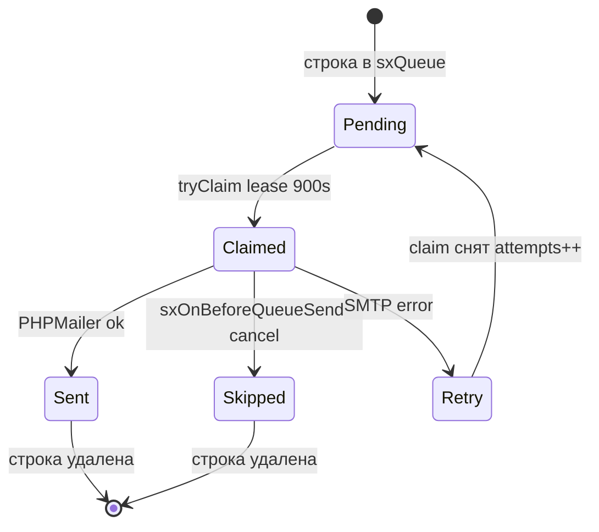

# Очередь писем

Вкладка **Очередь писем** в **Компоненты → Sendex** — формирование и отправка писем подписчикам.

## Формирование очереди

1. Откройте **Компоненты → Sendex**
2. На вкладке **Очередь писем** выберите рассылку в выпадающем списке и нажмите **Добавить в очередь**


Для каждого подписчика создаётся запись `sxQueue` со снимком заголовков письма. Тело письма рендерится **в момент отправки** из шаблона рассылки (компактный режим: `email_body` в очереди пустой).

Дубликаты пропускаются по hash строки очереди.

При формировании срабатывают события `sxOnBeforeAddQueues` (можно отменить) и `sxOnAddQueues`.

## Отправка вручную


| Действие | Описание |
| --- | --- |
| **Отправить** | Отправить выбранные письма |
| **Отправить все** | Отправить всю очередь |
| **Удалить / Удалить все** | Убрать записи из очереди без отправки |

Ручная отправка из менеджера останавливается при первой ошибке (`stopOnError: true`).

### Как работает отправка одного письма

1. Atomic claim: строка получает `claimed_at`, `attempts++`, `expires_at` (+900 сек)
2. Рендер тела из шаблона с плейсхолдерами `newsletter`, `subscriber`, `user`, `profile`
3. Событие `sxOnBeforeQueueSend` — плагин может отменить (строка удаляется без повторной постановки)
4. Отправка через PHPMailer
5. Успех — строка удаляется из очереди, событие `sxOnQueueSend`
6. Ошибка — claim снимается, событие `sxOnQueueSendFailed`, повтор при следующем запуске

После пакетной отправки — событие `sxOnQueueFlushComplete`.

### Claim и повтор при ошибке



| Результат | Строка очереди | Событие |
| --- | --- | --- |
| Успех | удалена | `sxOnQueueSend` |
| Отмена в sxOnBeforeQueueSend | удалена | — |
| Ошибка SMTP | claim снят, retry | `sxOnQueueSendFailed` |
| Plugin skip (`false`) | удалена | — |

Параллельные cron-процессы не отправят одну строку дважды — atomic claim на уровне БД.

## Cron {#cron}

Для регулярной отправки добавьте задание cron из корня сайта MODX:

```bash
php core/components/sendex/cron/send.php
```

Частота зависит от числа подписчиков и лимитов хостинга. За один запуск отправляется до **100** писем (значение по умолчанию).

Лимит меняется системной настройкой `sendex_queue_limit` — ключ **не создаётся** transport, добавьте вручную при необходимости. Подробнее: [Системные настройки](../settings#настройки-которых-нет-в-transport).

Пример записи cron (ежеминутно):

```bash
* * * * * php /path/to/modx/core/components/sendex/cron/send.php
```

Cron использует тот же сценарий отправки, что и «Отправить все», но **не останавливается** на первой ошибке и пишет ошибки в лог MODX.

## Отправка из менеджера vs cron

| | Менеджер «Отправить подписчикам» | Очередь + cron |
| --- | --- | --- |
| Формирование очереди | да | вручную или через «Добавить в очередь» |
| Отправка | сразу | по расписанию |
| Остановка на ошибке | да | нет |
| Лимит за запуск | все записи очереди | `sendex_queue_limit` (100) |

## Связанные разделы

- [Подписки](subscriptions) — создание рассылки и «Отправить подписчикам»
- [События](../integration/events) — хуки очереди
- [Системные настройки](../settings) — `sendex_queue_limit`
