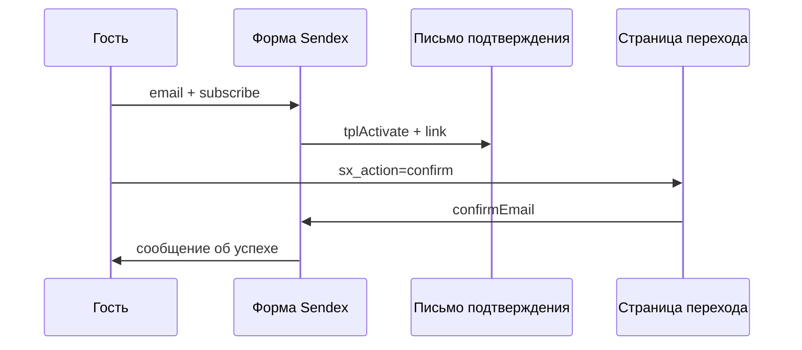

# Sendex

Сниппет выводит форму подписки или отписки и обрабатывает действия пользователя.

Вызывайте **некэшированным** — вывод зависит от авторизации.

::: code-group

```fenom
{'!Sendex' | snippet : ['id' => 1]}
```

```modx
[[!Sendex? &id=`1`]]
```

:::

## Параметры

| Параметр | По умолчанию | Описание |
| --- | --- | --- |
| `&id` | — | ID рассылки (`sxNewsletter`) |
| `&showInactive` | `0` | Показывать форму для неактивной рассылки |
| `&msgClass` | `active` | CSS-класс для `[[+class]]`, когда `[[+message]]` не пуст |
| `&tplSubscribeAuth` | `tpl.Sendex.subscribe.auth` | Чанк формы для авторизованных |
| `&tplSubscribeGuest` | `tpl.Sendex.subscribe.guest` | Чанк формы для гостей |
| `&tplUnsubscribe` | `tpl.Sendex.unsubscribe` | Чанк отписки |
| `&tplActivate` | `tpl.Sendex.activate` | Чанк письма подтверждения email |

## Дополнительные параметры (только в коде)

Эти параметры работают при вызове, но **не отображаются** в свойствах сниппета MODX:

| Параметр | По умолчанию | Описание |
| --- | --- | --- |
| `&confirmEmail` | `sendex_confirm_email` (`1`) | Гостям нужно подтверждение по email |
| `&confirmRateLimit` | `sendex_confirm_rate_limit` (`0`) | Интервал между письмами подтверждения (сек) |
| `&csrfProtect` | `sendex_csrf_protect` (`0`) | CSRF для POST subscribe/unsubscribe |
| `&loadJs` | `1` | Подключить `assets/components/sendex/js/web/sendex.js` |
| `&widgetKey` | *(пусто)* | Ключ виджета при нескольких формах на странице |

## Плейсхолдеры в чанках формы

| Плейсхолдер | MODX | Fenom |
| --- | --- | --- |
| ID рассылки | `[[+id]]` | `{$id}` |
| Название | `[[+name]]` | `{$name}` |
| Описание | `[[+description]]` | `{$description}` |
| Сообщение | `[[+message]]` | `{$message}` |
| CSS-класс | `[[+class]]` | `{$class}` |
| Ошибка | `[[+error]]` | `{$error}` |
| Ключ виджета | `[[+widget_key]]` | `{$widget_key}` |
| CSRF-токен | `[[+csrf_token]]` | `{$csrf_token}` |
| Код подписчика | `[[+code]]` | `{$code}` |

Для авторизованных в чанк также попадают поля `modUser` и Profile (`[[+username]]` / `{$username}`, `[[+email]]` / `{$email}` и др.).

## Сценарии подписки

### Авторизованный пользователь

Один клик → `subscribe(userId)`. Email берётся из Profile. Если guest-строка с тем же email уже есть — `user_id` прикрепляется к ней.

### Гость с подтверждением (по умолчанию)

1. POST `sx_action=subscribe` + `email`
2. Sendex создаёт hash в modDbRegister (`/sendex/subscribe/`, TTL 30 мин)
3. Отправляет письмо с чанком `tplActivate` и ссылкой `sx_action=confirm&hash=...&newsletter_id=...`
4. Переход по ссылке → `confirmEmail()` → подписка с `source=confirm`

### Гость без подтверждения

::: code-group

```fenom
{'!Sendex' | snippet : ['id' => 1, 'confirmEmail' => 0]}
```

```modx
[[!Sendex? &id=`1` &confirmEmail=`0`]]
```

:::

Или системная настройка `sendex_confirm_email=Нет` → подписка с `source=guest`.

### Подтверждение по ссылке из письма

Query-параметры страницы перехода:

| Параметр | Значение |
| --- | --- |
| `sx_action` | `confirm` |
| `hash` | hash из modDbRegister |
| `newsletter_id` | ID рассылки |

Сниппет на странице обрабатывает их автоматически; отдельный вызов не нужен.



## Отписка

### На сайте

Авторизованный подписчик видит форму отписки. POST `sx_action=unsubscribe` с `code` подписчика.

### По ссылке из письма

Страница должна вызывать сниппет Sendex:

::: code-group

```fenom
{'!Sendex' | snippet : ['id' => 1]}
```

```modx
[[!Sendex? &id=`1`]]
```

:::

Query-параметры:

| Параметр | Обязательный | Описание |
| --- | --- | --- |
| `sx_action` | да | `unsubscribe` |
| `code` | да | `sxSubscriber.code` |
| `newsletter_id` | нет | ID рассылки; сниппет определяет рассылку по `code`, если `&id` другой |

Ссылки подтверждения и отписки **не содержат** `sendex_widget_key`. На странице перехода держите один сниппет без `&widgetKey`.

## AJAX

По умолчанию сниппет подключает `sendex.js`. Формы с атрибутами `data-sendex-widget`, `data-sendex-form`, `data-sendex-message` отправляются через `fetch` без перезагрузки.

Сервер отвечает JSON:

```json
{"success": true, "message": "...", "html": "..."}
```

AJAX-запрос определяется по `X-Requested-With: XMLHttpRequest`, `ajax=1` или `sendex_ajax=1`.

Отключить JS:

::: code-group

```fenom
{'!Sendex' | snippet : ['id' => 1, 'loadJs' => 0]}
```

```modx
[[!Sendex? &id=`1` &loadJs=`0`]]
```

:::

Формы работают обычным POST с редиректом.

### Несколько форм на странице

Каждому вызову задайте уникальный `widgetKey` и передайте его в hidden `sendex_widget_key`. POST обрабатывает только сниппет с совпадающим ключом.

::: code-group

```fenom
{'!Sendex' | snippet : ['id' => 1, 'widgetKey' => 'footer']}
{'!Sendex' | snippet : ['id' => 2, 'widgetKey' => 'sidebar']}
```

```modx
[[!Sendex? &id=`1` &widgetKey=`footer`]]
[[!Sendex? &id=`2` &widgetKey=`sidebar`]]
```

:::

## Шаблон письма {#шаблон-письма}

При отправке из очереди MODX-шаблон рассылки получает объекты:

| Объект | MODX | Fenom |
| --- | --- | --- |
| `newsletter` | `[[+newsletter.id]]`, `[[+newsletter.name]]`, … | `{$newsletter.id}`, `{$newsletter.name}`, … |
| `subscriber` | `[[+subscriber.email]]`, `[[+subscriber.code]]`, … | `{$subscriber.email}`, `{$subscriber.code}`, … |
| `user` | `[[+user.id]]`, `[[+user.username]]`, … | `{$user.id}`, `{$user.username}`, … |
| `profile` | `[[+profile.fullname]]`, `[[+profile.email]]`, … | `{$profile.fullname}`, `{$profile.email}`, … |

Ссылка отписки:

::: code-group

```fenom
{set $args = [
  'sx_action' => 'unsubscribe',
  'newsletter_id' => $newsletter.id,
  'code' => $subscriber.code,
]}
<a href="{'site_start' | option | url : ['scheme' => 'full'] : $args}">Отписаться</a>
```

```modx
<a href="[[~[[++site_start]]?scheme=`full`&sx_action=`unsubscribe`&newsletter_id=`[[+newsletter.id]]`&code=`[[+subscriber.code]]`]]">
  Отписаться
</a>
```

:::

### Кастомный чанк формы для гостей

::: code-group

```fenom
<div class="sendex-widget" data-sendex-widget>
  <p class="sendex-message {$class}" data-sendex-message><b>{$message}</b></p>
  <form action="" method="post" data-sendex-form>
    <input type="hidden" name="sx_action" value="subscribe">
    <input type="hidden" name="newsletter_id" value="{$id}">
    {if $widget_key}
      <input type="hidden" name="sendex_widget_key" value="{$widget_key}">
    {/if}
    {if $csrf_token}
      <input type="hidden" name="sendex_csrf" value="{$csrf_token}">
    {/if}
    <input type="email" name="email" required>
    <button type="submit">Подписаться</button>
  </form>
</div>
```

```modx
<div class="sendex-widget" data-sendex-widget>
  <p class="sendex-message [[+class]]" data-sendex-message><b>[[+message]]</b></p>
  <form action="" method="post" data-sendex-form>
    <input type="hidden" name="sx_action" value="subscribe">
    <input type="hidden" name="newsletter_id" value="[[+id]]">
    [[+widget_key:notempty=`<input type="hidden" name="sendex_widget_key" value="[[+widget_key]]">`]]
    [[+csrf_token:notempty=`<input type="hidden" name="sendex_csrf" value="[[+csrf_token]]">`]]
    <input type="email" name="email" required>
    <button type="submit">Подписаться</button>
  </form>
</div>
```

:::

## Чанки по умолчанию

| Чанк | Назначение |
| --- | --- |
| `tpl.Sendex.subscribe.auth` | Форма для авторизованных |
| `tpl.Sendex.subscribe.guest` | Форма для гостей (email + hidden fields) |
| `tpl.Sendex.unsubscribe` | Форма отписки |
| `tpl.Sendex.activate` | Тело письма подтверждения (`[[+link]]`, `[[+email_body]]`) |

### Форма для авторизованных

::: code-group

```fenom
<div class="sendex-widget" data-sendex-widget>
  <p class="sendex-message {$class}" data-sendex-message><b>{$message}</b></p>
  <form action="" method="post" data-sendex-form>
    <input type="hidden" name="sx_action" value="subscribe">
    <input type="hidden" name="newsletter_id" value="{$id}">
    <button type="submit">Подписаться</button>
  </form>
</div>
```

```modx
<div class="sendex-widget" data-sendex-widget>
  <p class="sendex-message [[+class]]" data-sendex-message><b>[[+message]]</b></p>
  <form action="" method="post" data-sendex-form>
    <input type="hidden" name="sx_action" value="subscribe">
    <input type="hidden" name="newsletter_id" value="[[+id]]">
    <button type="submit">Подписаться</button>
  </form>
</div>
```

:::

### Форма отписки

::: code-group

```fenom
<div class="sendex-widget" data-sendex-widget>
  <form action="" method="post" data-sendex-form>
    <input type="hidden" name="sx_action" value="unsubscribe">
    <input type="hidden" name="newsletter_id" value="{$id}">
    <input type="hidden" name="code" value="{$code}">
    <button type="submit">Отписаться</button>
  </form>
</div>
```

```modx
<div class="sendex-widget" data-sendex-widget>
  <form action="" method="post" data-sendex-form>
    <input type="hidden" name="sx_action" value="unsubscribe">
    <input type="hidden" name="newsletter_id" value="[[+id]]">
    <input type="hidden" name="code" value="[[+code]]">
    <button type="submit">Отписаться</button>
  </form>
</div>
```

:::

### Письмо подтверждения (tplActivate)

::: code-group

```fenom
<p>Подтвердите подписку:</p>
<p><a href="{$link}">{$link}</a></p>
```

```modx
<p>Подтвердите подписку:</p>
<p><a href="[[+link]]">[[+link]]</a></p>
```

:::

### Несколько форм и страница перехода для confirm/unsubscribe

На странице с двумя рассылками — у каждой свой `widgetKey`. Отдельная страница перехода **без** `widgetKey` обрабатывает ссылки из писем:

::: code-group

```fenom
{'!Sendex' | snippet : ['id' => 1, 'widgetKey' => 'promo']}
{'!Sendex' | snippet : ['id' => 2, 'widgetKey' => 'news']}

{# страница перехода /confirm — без widgetKey #}
{'!Sendex' | snippet : ['id' => 1]}
```

```modx
[[!Sendex? &id=`1` &widgetKey=`promo`]]
[[!Sendex? &id=`2` &widgetKey=`news`]]

[[!Sendex? &id=`1`]]
```

:::

## Дополнительные параметры в примерах

### Неактивная рассылка на превью-странице

::: code-group

```fenom
{'!Sendex' | snippet : ['id' => 1, 'showInactive' => 1]}
```

```modx
[[!Sendex? &id=`1` &showInactive=`1`]]
```

:::

### Свой CSS-класс сообщения

::: code-group

```fenom
{'!Sendex' | snippet : ['id' => 1, 'msgClass' => 'alert-success']}
```

```modx
[[!Sendex? &id=`1` &msgClass=`alert-success`]]
```

:::

## Слияние guest → user

Плагин Sendex на `OnUserActivate` и `OnUserSave` прикрепляет guest-строки с тем же email к новому `modUser`. На `OnBeforeUserActivate` слияние **не выполняется**.

## Связанные разделы

- [Системные настройки](../settings) — `sendex_confirm_email`, CSRF, rate limit
- [События](../integration/events) — `sxOnSubscribe`, `sxOnUnsubscribe`
- [FAQ](../faq) — типичные проблемы
- [PHP API](../integration/api) — вызов из кода
