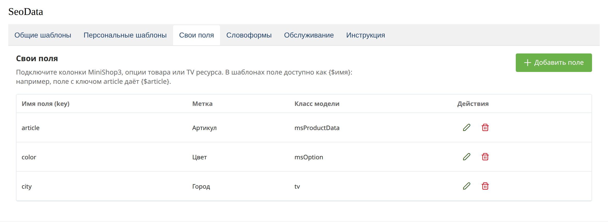
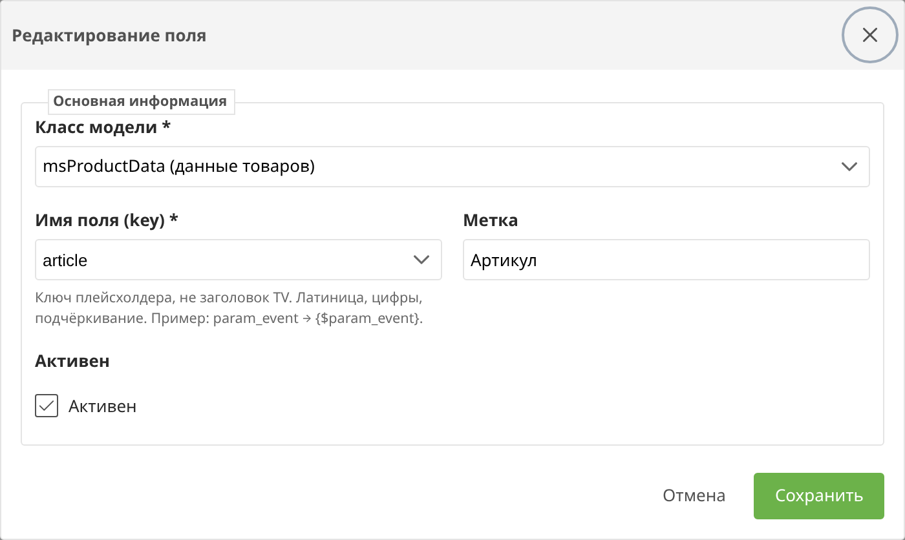

# Свои поля

На вкладке **Свои поля** к шаблонам подключаются колонки MiniShop3, опции товара и TV. В шаблоне поле доступно как `{$имя}`.

Имя поля — это ключ плейсхолдера, не подпись TV. Латиница, цифры и подчёркивание: ключ `param_event` даёт `{$param_event}`, ключ `article` даёт `{$article}`.

| Источник | Что читается |
| --- | --- |
| msProductData | Данные товара: цена, артикул, картинка |
| msProduct | Поля товара |
| msOption | Опции товара |
| msCategory | Поля категории |
| msVendor | Производитель |
| TV | Дополнительное поле ресурса |

Список ключей в форме подгружается из выбранного источника. Для TV в списке ключ (`param_event`), а не заголовок поля в менеджере.

Значение TV читается у текущего ресурса. Если в отладке value пустой, проверьте ключ и привязку TV к шаблону MODX.

Один и тот же ключ источника нельзя добавить дважды. Имя плейсхолдера тоже уникально.
