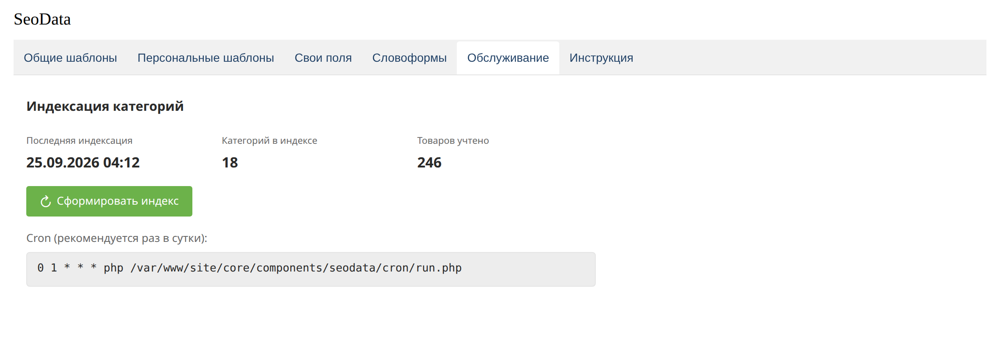

# Индексация

Цены и количество товаров категории считаются заранее, чтобы витрина не собирала их на каждый просмотр. Результат попадает в `{$price.min}`, `{$price.max}`, `{$price.avg}` и `{$count}`.



Кнопка **Сформировать индекс** обходит категории пачками. Размер пачки задаёт настройка `seodata.index_chunk`. На витрине удобнее cron раз в сутки:

```bash
0 1 * * * php /path/to/core/components/seodata/cron/run.php
```

Путь в панели уже подставлен в строку cron на вкладке «Обслуживание».

В индекс попадают категории MiniShop3. Какие товары учитывать, ограничивает JSON-фильтр `seodata.product_where`, например `{"Data.discontinued":0}`. Настройка `seodata.include_zero_price_in_count` решает, входят ли товары с нулевой ценой в `{$count}`.

Без MiniShop3 вкладка показывает, что индексация каталога недоступна. Шаблоны документов при этом работают.
