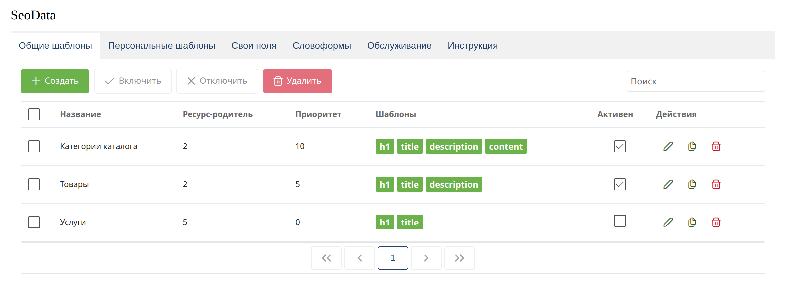
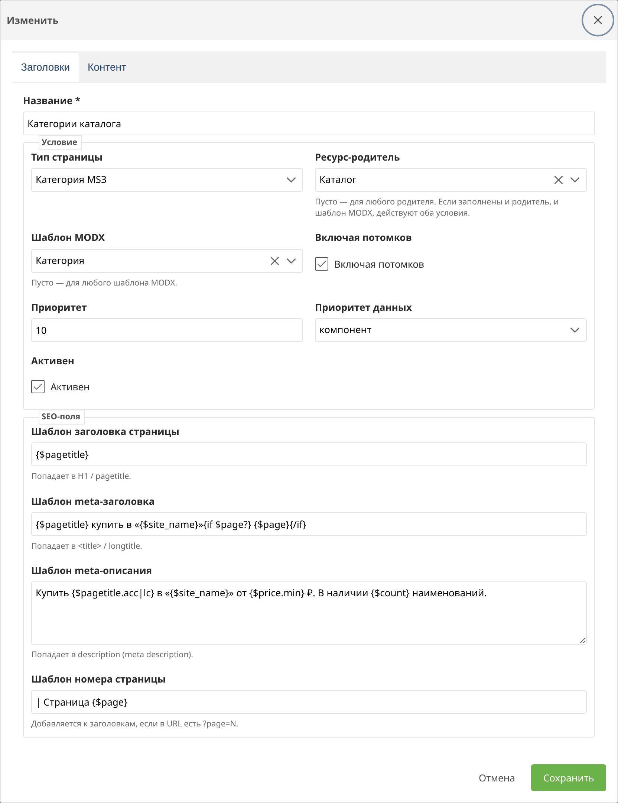
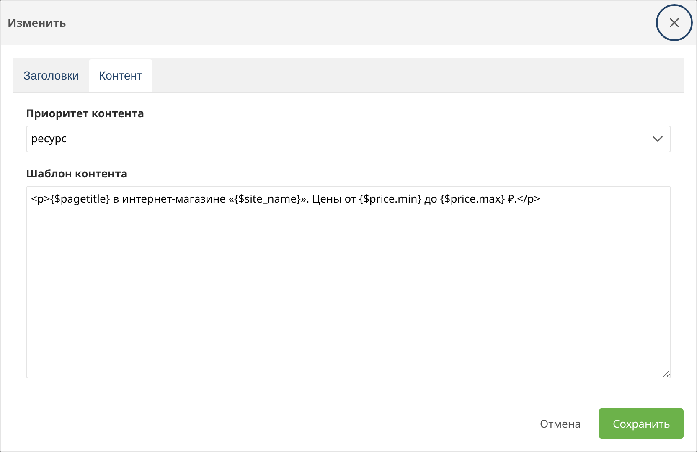
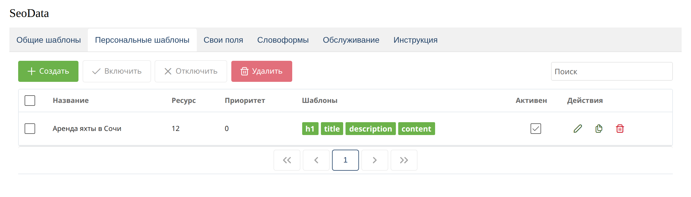

# Шаблоны

Правило хранит условия, приоритет данных и четыре Fenom-шаблона. Сохранение, удаление и включение правила очищают кэш MODX, включая скомпилированный Fenom pdoTools.

## Общие шаблоны

Общее правило выбирается по типу страницы, родителю и шаблону MODX.

Тип страницы:

| Значение | Класс |
| --- | --- |
| Документ | `modDocument` |
| Товар MS3 | `msProduct` |
| Категория MS3 | `msCategory` |

Колонка «Ресурс-родитель» показывает id родителя. Пустой родитель в форме означает любой раздел. Колонка «Шаблоны» отмечает, какие тексты заполнены: `h1`, `title`, `description`, `content`.

Двойной щелчок по строке или карандаш открывают правило.

Поля условия:

| Поле | Смысл |
| --- | --- |
| Тип страницы | Документ, товар или категория |
| Ресурс-родитель | Раздел, внутри которого действует правило. Пусто — любой родитель |
| Шаблон MODX | Шаблон ресурса. Пусто — любой шаблон. Вместе с родителем условие складывается через И |
| Включая потомков | Правило действует и на вложенные ресурсы |
| Приоритет | Чем больше число, тем раньше правило сравнивается с другими общими |
| Приоритет данных | Откуда брать заголовки и description |
| Активен | Выключенное правило не участвует в выборе |

Блок «SEO-поля»:

| Поле | Назначение |
| --- | --- |
| Шаблон заголовка страницы | H1 / `pagetitle` |
| Шаблон meta-заголовка | `<title>` / `longtitle` |
| Шаблон meta-описания | `description` |
| Шаблон номера страницы | Фрагмент `{$page}` при `?page=N` |

## Контент

На вкладке «Контент» приоритет задаётся отдельно от заголовков.

## Персональные шаблоны

Персональное правило привязано к одному ресурсу. Активным может быть только одно правило на ресурс.

Приоритет данных и шаблоны полей те же, что у общего правила. Условие по родителю и шаблону MODX здесь не задаётся: ресурс выбран явно.

## Приоритет данных

| Значение | Поведение |
| --- | --- |
| ресурс | Оставить штатное поле. Шаблон подставляется, только если поле пустое |
| компонент | Всегда брать результат шаблона |
| компонент дополняет ресурс | Склеить значение ресурса и результат шаблона |

Для контента используется отдельный приоритет на вкладке «Контент».

Системная настройка `seodata.fallback_empty_resource` уточняет режим «ресурс»: при пустом поле ресурса подставляется шаблон. `seodata.keep_filled_on_empty` в режиме «компонент» не затирает заполненное поле ресурса, если шаблон вернул пустую строку.

Номер страницы дописывается к title, pagetitle и description, когда в URL есть `?page=N`. Настройка `seodata.always_append_page` включает это всегда при наличии параметра.
