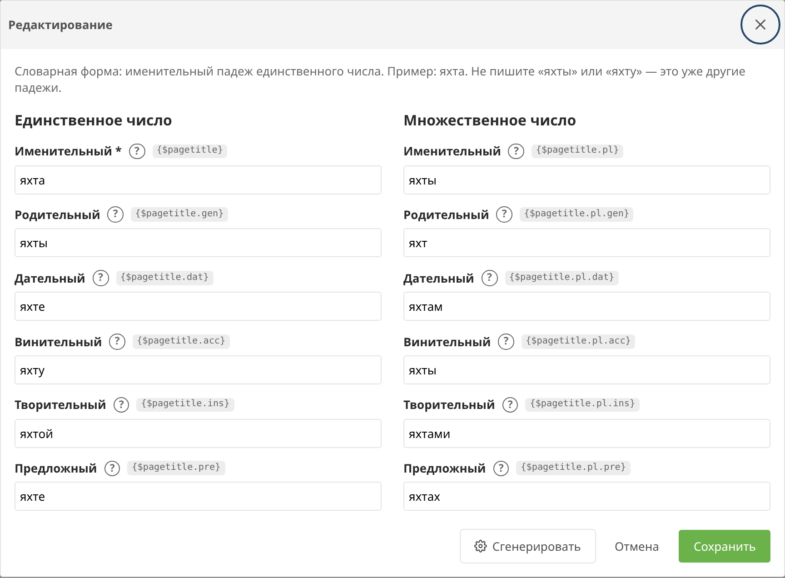

# Словоформы

Вкладка **Словоформы** — словарь падежей. В шаблон попадают только те слова и фразы, которые занесены в таблицу. Остальной текст не меняется.

**Словарная форма** — слово в именительном падеже единственного числа, как в словаре: `яхта`, не `яхты` и не `яхту`. Словосочетание заносится одной строкой, например `день рождения`.

## Падежи в шаблоне

Суффиксы работают у `{$pagetitle}`, `{$parent.pagetitle}`, `{$menutitle}`, `{$site_name}`, `{$vendor.name}` и своих строковых полей.

| Запись | Падеж | Для «яхта» |
| --- | --- | --- |
| `{$pagetitle}` | именительный | яхта |
| `{$pagetitle.gen}` | родительный | яхты |
| `{$pagetitle.dat}` | дательный | яхте |
| `{$pagetitle.acc}` | винительный | яхту |
| `{$pagetitle.ins}` | творительный | яхтой |
| `{$pagetitle.pre}` | предложный без предлога | яхте |

Регистр исходного слова сохраняется: `Яхта` становится `Яхты`.

В словаре есть `яхта` и `катер`, заголовок страницы — `Аренда яхты и катера в Сочи`:

| Шаблон | Результат |
| --- | --- |
| `{$pagetitle}` | Аренда яхты и катера в Сочи |
| `{$pagetitle.dat}` | Аренда яхте и катеру в Сочи |

`Сочи` в словаре нет, поэтому город не склоняется.

Если в словаре есть и короткое слово, и более длинная фраза, берётся самое длинное совпадение по границам слов. `День рождения на теплоходе` и `{$pagetitle.gen|lc}` дают `дня рождения на теплоходе`, когда в словаре есть `день рождения`.

Множественное число (`{$color.pl}`, `{$color.pl.gen}`) подставляется, только если вся строка целиком совпала со словарной формой. У длинного заголовка `{$pagetitle.pl}` остаётся в единственном числе.

## Карточка слова

Слева единственное число, справа множественное. У каждого падежа указан модификатор Fenom. Знак вопроса показывает вопрос падежа.

## Генерация через Morpher

Кнопки **Сгенерировать** и **Пакетная генерация** вызывают [Morpher.ru](https://www.morpher.ru/ws3/) только в панели. Витрина читает таблицу и к API не обращается.

Токен задаётся настройкой `seodata.morpher_token`. Без токена действует бесплатный суточный лимит Morpher.

Пакетная генерация заполняет пустые падежи у выбранных строк или у всей таблицы. Галка «Только строки без родительного падежа» пропускает уже заполненные записи.

Кнопка **Очистить всё** удаляет словарь. Шаблоны с `{$pagetitle.gen}` снова выводят исходный текст.
