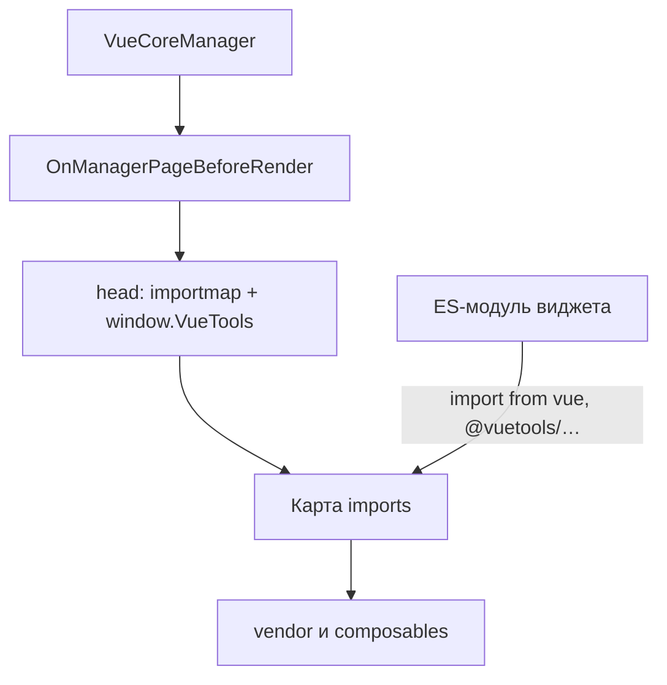

# VueTools

Vue, Pinia и PrimeVue подключаются один раз через Import Map. Extra не тащит свои копии в бандл.

## Что решает

Без общего пакета каждый Extra тащит отдельные копии Vue, Pinia и PrimeVue.

- Единая версия библиотек у всех компонентов.
- Библиотеки загружаются один раз и кэшируются браузером.
- Иконки PrimeIcons изолированы префиксом `.vueApp` (см. ниже).
- Готовые composable: `useLexicon`, `useApi`, `useModx`, `usePermission`, `usePrimeVueLocale`, `useTheme`.
- Тема оформления из системной настройки `vuetools.theme` (с версии 1.2.0).

## Состав пакета

| Библиотека | Версия | Назначение |
|------------|--------|------------|
| Vue 3 | 3.5.x | Реактивный фреймворк |
| Pinia | 3.0.x | Управление состоянием |
| PrimeVue | 4.5.x | UI-компоненты, темы `Aura` и `Modx` |
| PrimeIcons | 7.0.x | Иконки |

| Composable | Назначение |
|--------|------------|
| `useLexicon` | Лексиконы MODX |
| `useApi` | HTTP-клиент к стандартному connector API MODX |
| `useModx` | Доступ к объекту `window.MODx` |
| `usePermission` | Проверка прав пользователя |
| `usePrimeVueLocale` | Локали PrimeVue для DataTable и DatePicker |
| `useTheme` | Активная тема из настройки `vuetools.theme` |

## Требования

| Требование | Версия |
|------------|--------|
| MODX Revolution | 3.0.0+ |
| PHP | 8.1+ |
| Браузер | ES Modules (Chrome 89+, Firefox 108+, Safari 16.4+, Edge 89+) |

## Установка

1. Откройте **Приложения → Установщик**.
2. Нажмите **Загрузить дополнения**.
3. Найдите **VueTools** и нажмите **Загрузить**, затем **Установить**.

После установки VueTools сам вставляет Import Map, стили и клиентскую настройку темы на страницах панели управления.

## Как работает Import Map



Плагин `VueCoreManager` на `OnManagerPageBeforeRender` вставляет один блок: Import Map и скрипт `window.VueTools`. Обычно в начало `<head>` контроллера. Если `controller->head['html']` недоступен, HTML уходит в `sjscripts`.

База URL: `MODX_ASSETS_URL` или `vuetools.assets_url`. К файлам добавляют `?v=` (mtime или версия пакета), чтобы после обновления не тянуть старый кэш.

Пример карты (пути и `?v=` условные):

```json
{
  "imports": {
    "vue": "/assets/components/vuetools/vendor/vue.min.js?v=…",
    "pinia": "/assets/components/vuetools/vendor/pinia.min.js?v=…",
    "primevue": "/assets/components/vuetools/vendor/primevue.min.js?v=…",
    "vuetools": "/assets/components/vuetools/vendor/primevue.min.js?v=…",
    "vuetools/theme": "/assets/components/vuetools/vendor/primevue.min.js?v=…",
    "@vuetools/useApi": "/assets/components/vuetools/composables/useApi.min.js?v=…",
    "@vuetools/useLexicon": "/assets/components/vuetools/composables/useLexicon.min.js?v=…",
    "@vuetools/useModx": "/assets/components/vuetools/composables/useModx.min.js?v=…",
    "@vuetools/usePermission": "/assets/components/vuetools/composables/usePermission.min.js?v=…",
    "@vuetools/usePrimeVueLocale": "/assets/components/vuetools/composables/usePrimeVueLocale.min.js?v=…",
    "@vuetools/useTheme": "/assets/components/vuetools/composables/useTheme.min.js?v=…",
    "@vuetools/": "/assets/components/vuetools/composables/"
  }
}
```

`import { ref } from 'vue'` берёт URL из этой карты.

Ключи `vuetools` и `vuetools/theme` указывают на ту же сборку, что `primevue`. Из них импортируют пресеты темы (`Modx`, `ModxManagerTheme`, `ModxTheme`). Ключ `vuetools/theme` ещё и признак VueTools 1.2.0+ (см. [Тема](theme)).

Префикс `@vuetools/` ведёт в каталог composables. Ключа `@vuetools` без слэша нет: не используйте его как публичную точку входа.

### `window.VueTools`

Второй тег того же блока пишет:

```javascript
window.VueTools = Object.assign({}, window.VueTools || {}, { theme: 'aura' })
```

В объекте только `theme` (значение настройки `vuetools.theme`). Версию пакета и библиотек этот объект не отдаёт. См. [PHP-сервис](integration#php-service).

## Изоляция стилей

В `vuetools.css` префиксом `.vueApp` обёрнуты селекторы **PrimeIcons** (`.pi`). Контейнер виджета должен иметь класс `vueApp`, иначе иконки не видны:

```html
<div id="my-vue-app" class="vueApp"></div>
```

Стили PrimeVue 4 не завязаны на `.vueApp`. Класс на контейнере нужен только для иконок, не для изоляции от ExtJS.

::: warning
Без класса `vueApp` иконки PrimeIcons (`.pi`) к виджету не применятся.
:::

::: info Прежнее название
Ранее пакет назывался **ModxProVueCore** и был переименован в **VueTools**.
:::

## Дальше

- [Быстрый старт](quick-start): от установки до виджета на вкладке.
- [Интеграция](integration): Vite, контроллер, PHP-сервис.
- [Тема](theme): переключение и пресеты.
- [API Composables](composables): справочник функций.
- [Практики и CRUD](practices): структура Extra и сценарий list → form → toast.

## Поддержка

GitHub Issues: [modx-pro/vuetools](https://github.com/modx-pro/vuetools/issues)
