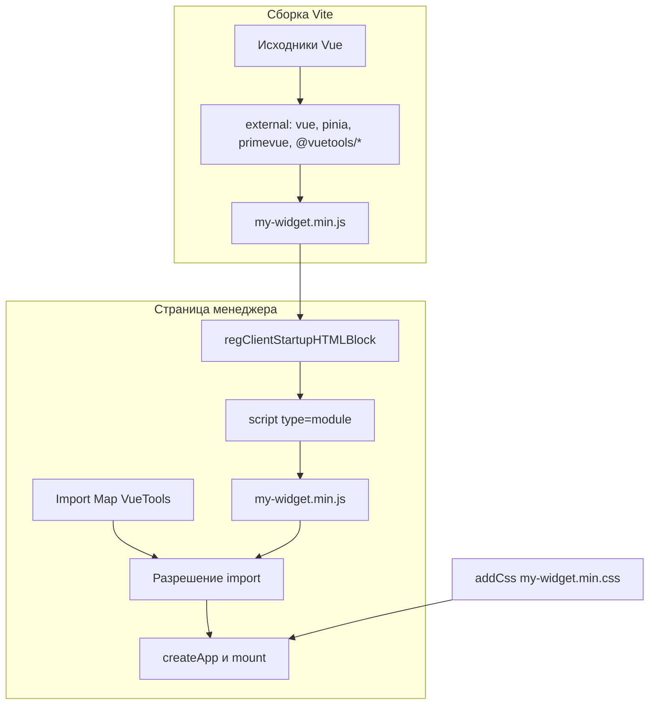

# Интеграция в компонент

Соберите виджет как ES-модуль с внешними `vue`, `pinia`, `primevue` и подключите его в контроллере через `regClientStartupHTMLBlock`.

## Настройка Vite

В `vite.config.js` перечислите внешние зависимости. Их даёт VueTools через Import Map:

```javascript
import { defineConfig } from 'vite'
import vue from '@vitejs/plugin-vue'
import prefixSelector from 'postcss-prefix-selector'

export default defineConfig({
  plugins: [vue()],
  build: {
    rollupOptions: {
      external: [
        'vue',
        'pinia',
        'primevue',
        'vuetools',
        'vuetools/theme',
        '@vuetools/useTheme',
        '@vuetools/useApi',
        '@vuetools/useLexicon',
        '@vuetools/useModx',
        '@vuetools/usePermission',
        '@vuetools/usePrimeVueLocale'
      ],
      output: { format: 'es', entryFileNames: '[name].min.js' }
    }
  },
  css: {
    postcss: {
      plugins: [prefixSelector({ prefix: '.vueApp', exclude: [/^:root/, /^\.p-/, /^\.pi/, /^\[data-p-/] })]
    }
  }
})
```

PrimeVue импортируйте только через `primevue`. Пресеты берите из `vuetools` или `vuetools/theme`. Путь вида `primevue/button` тянет второй экземпляр: тема к нему не применяется.

## Загрузка модулей в контроллере



ES-модули подключайте через `regClientStartupHTMLBlock`, после Import Map. Каждый скрипт отдельным вызовом.

```php
class MyComponentManagerController extends modExtraManagerController
{
    public function loadCustomCssJs()
    {
        $assetsUrl = $this->myComponent->config['assetsUrl'];

        $this->addCss($assetsUrl . 'css/mgr/vue-dist/my-widget.min.css');
        $this->modx->regClientStartupHTMLBlock(
            '<script type="module" src="' . $assetsUrl . 'js/mgr/vue-dist/my-widget.min.js"></script>'
        );
    }
}
```

::: danger
`addJavascript()` и `addLastJavascript()` не ставят `type="module"`. Несколько тегов в одной строке с переносами MODX разобьёт неправильно: регистрируйте каждый отдельным вызовом.
:::

## Проверка наличия VueTools {#vuetools-check}

Без VueTools в консоли будет `Failed to resolve module specifier "vue"`, контейнер останется пустым.

```php
protected static $vueCoreCheckRegistered = false;

public function addVueModule(string $src): void
{
    if (!self::$vueCoreCheckRegistered) {
        $this->registerVueCoreCheck();
        self::$vueCoreCheckRegistered = true;
    }
    $this->modx->regClientStartupHTMLBlock(
        '<script type="module" data-vue-module src="' . $src . '"></script>'
    );
}

protected function registerVueCoreCheck(): void
{
    $message = $this->modx->lexicon('mycomponent_vuetools_required')
        ?: 'Требуется пакет VueTools. Установите его через Менеджер пакетов.';

    $script = <<<JS
<script>
(function () {
    var map = document.querySelector('script[type="importmap"]');
    var ok = false;
    if (map) {
        try {
            var imports = JSON.parse(map.textContent).imports;
            ok = imports && imports.vue;
        } catch (e) { ok = false; }
    }
    if (!ok) {
        document.querySelectorAll('script[type="module"][data-vue-module]').forEach(function (el) { el.remove(); });
        if (typeof MODx !== 'undefined' && MODx.msg) { MODx.msg.alert('', '{$message}'); }
        window.MY_COMPONENT_VUE_CORE_MISSING = true;
    }
})();
</script>
JS;
    $this->modx->regClientStartupHTMLBlock($script);
}
```

Атрибут `data-vue-module` нужен, чтобы при отсутствии VueTools снять модули с страницы. Для темы через `getActiveTheme()` проверяйте ещё `vuetools/theme`. См. [Тема](theme#version).

```php
$this->addVueModule($assetsUrl . 'js/mgr/vue-dist/my-widget.min.js');
```

```php
$_lang['mycomponent_vuetools_required'] = 'Требуется пакет VueTools. Установите его через Менеджер пакетов.';
```

## PHP-сервис {#php-service}

Extras не создают `new \VueTools\Service`. Берите сервис из контейнера MODX:

```php
/** @var \VueTools\Service $vueTools */
$vueTools = $modx->services->get('vuetools');
// алиас того же объекта:
// $modx->services->get('vueTools');
```

Ключи контейнера `vuetools` и `vueTools` указывают на **один** экземпляр (иначе Import Map и стили регистрируются дважды).

Методы (`VueTools\VueCore` / `Service`):

| Метод | Назначение |
|-------|------------|
| `include()` | Import Map + CSS + combo настройки темы |
| `registerImportMap()` | Только Import Map и `window.VueTools.theme` |
| `includeStyles()` | `vuetools.css` |
| `getVersion()` | Версия пакета, например `1.2.1-pl` |
| `getVersions()` | Массив версий библиотек (`vue`, `pinia`, `primevue`, `primeicons`) |
| `getAssetsUrl()` | URL assets VueTools |

Сигнатура зависимости transport-пакета: **`vuetools`** (не старое имя `modxpro-vue-core`).

Опция `vuetools.assets_url` читается через `getOption`, если задана вручную. В transport пакета как системная настройка не поставляется. Обычно достаточно `MODX_ASSETS_URL`.

## Использование в компоненте

```vue
<script setup>
import { ref, computed } from 'vue'
import { Button, DataTable, Column } from 'primevue'
import { useLexicon } from '@vuetools/useLexicon'
import { usePermission } from '@vuetools/usePermission'

const { _ } = useLexicon()
const { can } = usePermission()

const items = ref([])
const canEdit = computed(() => can('my_component_edit'))
</script>

<template>
  <div class="my-component">
    <Button v-if="canEdit" :label="_('my_component_add')" />
    <DataTable :value="items">
      <Column field="name" :header="_('my_component_name')" />
    </DataTable>
  </div>
</template>
```

## Точка входа

```javascript
import { createApp } from 'vue'
import { createPinia } from 'pinia'
import { PrimeVue, ToastService } from 'primevue'
import { getActiveTheme } from '@vuetools/useTheme'
import MyWidget from '../components/MyWidget.vue'

let app = null

export function init(selector = '#my-vue-widget') {
  const el = document.querySelector(selector)
  if (!el || el.dataset.vApp === 'true') return app

  app = createApp(MyWidget)
  app.use(createPinia())
  app.use(PrimeVue, getActiveTheme())
  app.use(ToastService)
  app.mount(selector)
  el.dataset.vApp = 'true'
  return app
}

window.MyComponentWidget = { init }
```

`dataset.vApp` защищает от повторного монтирования при повторной активации вкладки.

## Вкладка ExtJS

Контейнер с классом `vueApp`, инициализация при активации вкладки:

```javascript
{
  title: _('my_tab_title'),
  html: '<div id="my-vue-widget" class="vueApp"></div>',
  listeners: {
    activate: function () {
      if (window.MyComponentWidget) {
        window.MyComponentWidget.init('#my-vue-widget')
      }
    }
  }
}
```

::: warning
Без класса `vueApp` иконки PrimeIcons (`.pi`) не применятся. Стили компонентов PrimeVue от этого класса не зависят.
:::

## Собственный API-клиент {#own-api-client}

`useApi` работает со стандартным connector. Свой роутер пишите в локальный `request.js`:

```javascript
class Request {
  buildUrl(route, params = {}) {
    const url = new URL(window.myComponent.config.connector_url, window.location.origin)
    url.searchParams.set('action', 'MyComponent\\Processors\\Api\\Index')
    url.searchParams.set('route', route)
    const token = window.MODx?.siteId
    if (token) url.searchParams.set('HTTP_MODAUTH', token)
    Object.entries(params).forEach(([k, v]) => { if (v != null) url.searchParams.set(k, v) })
    return url.toString()
  }

  async request(method, route, data = null) {
    const options = { method, headers: { Accept: 'application/json' }, credentials: 'same-origin' }
    let url = this.buildUrl(route, method === 'GET' ? data : {})
    if (method !== 'GET' && data) {
      options.headers['Content-Type'] = 'application/json'
      options.body = JSON.stringify(data)
    }
    const result = await (await fetch(url, options)).json()
    if (!result.success) throw new Error(result.message || 'Request failed')
    return result.object || result.data || result
  }

  get(route, params) { return this.request('GET', route, params) }
  post(route, data) { return this.request('POST', route, data) }
}

export default new Request()
```

Распаковка `object || data` есть только в **этом** образце, не в `useApi`.

## Чеклист

- [ ] `external` в Vite: `vue`, `pinia`, `primevue`, при необходимости `vuetools` / `vuetools/theme`, используемые `@vuetools/*`.
- [ ] PrimeVue без subpath-импортов.
- [ ] Тема через `getActiveTheme()`, не жёсткий пресет (если нужен переключатель).
- [ ] `addVueModule()` с проверкой зависимости.
- [ ] Лексикон сообщения об ошибке на двух языках.
- [ ] `class="vueApp"` на контейнерах (для иконок).
- [ ] Топики лексиконов в контроллере.
- [ ] Свой `request.js`, если свой роутер.
- [ ] Зависимость пакета: сигнатура `vuetools`.

## Пример

[MiniShop3](https://github.com/modx-pro/MiniShop3): интеграция со своим роутером.
