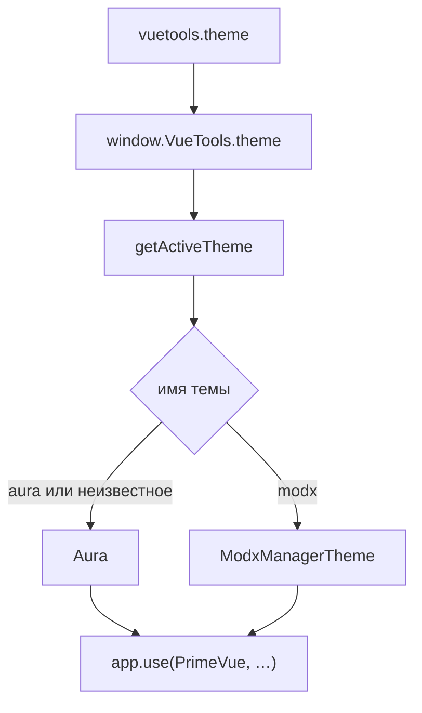

# Тема

Системная настройка `vuetools.theme` задаёт тему PrimeVue для всех компонентов, которые вызывают `getActiveTheme()`. С версии 1.2.0.

## Переключить тему

Настройка **Система → Системные настройки → `vuetools.theme`**.



| Значение | Тема |
|----------|------|
| `aura` | `Aura`: стандартная тема PrimeVue (по умолчанию) |
| `modx` | `ModxManagerTheme`: вид панели MODX Revolution 3 (без тёмного режима) |

После смены значения компоненты, которые вызывают `getActiveTheme()`, получают новую тему без пересборки. Неизвестное или пустое значение даёт `aura`.

Реестр в коде фиксированный: только `aura` и `modx`. Публичного API «зарегистрировать свою тему» нет.

## Подключить в компоненте

```javascript
import { PrimeVue } from 'primevue'
import { getActiveTheme } from '@vuetools/useTheme'

app.use(PrimeVue, getActiveTheme())
```

С локалью:

```javascript
import { getPrimeVueLocale } from '@vuetools/usePrimeVueLocale'

app.use(PrimeVue, { ...getActiveTheme(), locale: getPrimeVueLocale() })
```

`getActiveTheme()` читает `window.VueTools.theme` и возвращает `{ theme }` для активной записи реестра.

Не задавайте тему вручную (`{ theme: { preset: Aura } }`), если нужен переключатель настройки. Такой компонент останется на жёстком пресете.

`useTheme({ name })` делает то же, что `getActiveTheme(name)`. Возвращает `{ theme }`, не имя строки.

## Пресеты `Modx`, `ModxManagerTheme`, `ModxTheme`

Импорт из `primevue`, `vuetools` или `vuetools/theme` (одна сборка):

| Экспорт | Назначение |
|---------|------------|
| `Modx` | Пресет цветов/семантики MODX |
| `ModxManagerTheme` | `{ preset: Modx, options: { darkModeSelector: 'none' } }`. Менеджер без тёмного режима. Это то, что отдаёт `getActiveTheme()` при `vuetools.theme = modx` |
| `ModxTheme` | `{ preset: Modx, options: { darkModeSelector: '.p-dark' } }`. standalone / витрина: тёмный режим по классу `p-dark` на предке |

```javascript
import { Modx, ModxManagerTheme, ModxTheme } from 'vuetools/theme'
```

## Требование версии {#version}

`getActiveTheme()` и ключ `@vuetools/useTheme` появились в VueTools 1.2.0. На более старом пакете ключа в Import Map нет: модуль упадёт на импорте.

Признак версии с темой: ключ `vuetools/theme` в Import Map. Проверку зависимости (см. [Интеграция](integration#vuetools-check)) расширьте:

```javascript
hasVueCore = mapContent.imports
    && mapContent.imports.vue
    && mapContent.imports['vuetools/theme'];
```

В сообщении укажите минимум VueTools 1.2.0.

## Существующие компоненты

Обновление VueTools само по себе вид не меняет: по умолчанию `Aura`. Компонент с жёстким `Aura` или `ModxManagerTheme` в коде не следует за настройкой, пока его не переведут на `getActiveTheme()`.

## Своя тема в компоненте

Пресет можно расширить локально через `definePreset`. Это пресет **вашего** приложения: он не попадает в реестр VueTools и не меняет `getActiveTheme()` у других extras:

```javascript
import { definePreset, Modx } from 'primevue'

const MyPreset = definePreset(Modx, {
  semantic: { primary: { 500: '#1a3a5c' } }
})

app.use(PrimeVue, { theme: { preset: MyPreset } })
```

Чтобы тема стала общей для всех extras, её нужно добавить в пакет VueTools (правка `useTheme.js` / релиз).
