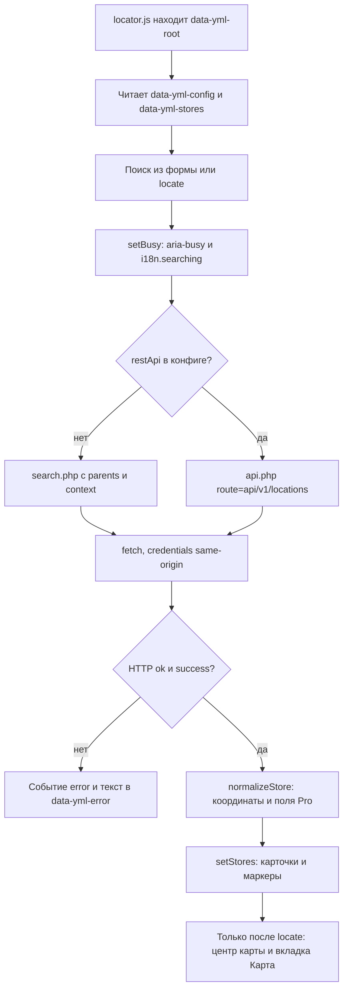

# Интерфейс

Интерфейс Free: Fenom-чанки, `locator.css` и модули JS. Вид: BEM. Поведение: атрибуты `data-yml-*`.

## Колонки и табы

На узком экране одна колонка и табы «Список» / «Карта». С 769px шире две колонки, табы прячутся.

Табы стоят в общей разметке, не внутри панели списка. Карту из HTML не удаляем: в режиме списка панель карты получает `hidden`. Перед балуном скрипт переключает вид на «Карта».

## BEM

| Блок | Назначение |
|------|------------|
| `yml-locator` | Корень, CSS-переменные |
| `yml-search` | Форма поиска |
| `yml-store` | Карточка точки |
| `yml-balloon` | HTML внутри балуна |

Состояние держите в data-атрибутах, не в CSS-модификаторах вроде `is-active`.

## data-yml-* (контракт)

| Атрибут | Где | Назначение |
|---------|-----|------------|
| `data-yml-root` | `.yml-locator` | Корень. По нему `locator.js` находит разметку и поднимает экземпляр |
| `data-yml-config` | `<script type="application/json">` в корне | Карта и параметры запроса. Опционален: без него локатор стартует с пустым конфигом |
| `data-yml-stores` | `<script type="application/json">` в корне | Стартовый список точек |
| `data-yml-view="list\|map"` | корень | Режим на мобильном |
| `data-yml-view-tab` | табы | Переключение «Список» / «Карта» |
| `data-yml-empty` | корень | Пустой список |
| `data-yml-located` | корень | Активен геофильтр после `locate()` |
| `data-yml-parents` | корень | ID родителей |
| `data-yml-search` | форма | Поиск |
| `data-yml-submit` | кнопка формы | Отправка поиска |
| `data-yml-submit-label` | обёртка текста внутри `data-yml-submit` | Надпись кнопки. Пока идёт запрос, JS подменяет текст на `i18n.searching`, потом возвращает исходный |
| `data-yml-search-tools` | блок под полем | Контейнер вторичных действий формы. Кнопка геолокации лежит внутри |
| `data-yml-error` | форма | Текст ошибки поиска |
| `data-yml-locate` | кнопка | «Моё местоположение» / «Все точки» |
| `data-yml-list` / `data-yml-map` | панели | Список и карта |
| `data-yml-panel="list\|map"` | панели | Тот же смысл для JS |
| `data-yml-selected` | таб | Активный таб. Присутствие атрибута без значения: JS ставит и снимает `data-yml-selected`, попутно обновляя `aria-selected` и `tabindex` |
| `data-yml-store-id` | карточка | ID точки |
| `data-yml-active` | карточка | Активная точка в списке. Поведение одинаковое с `data-yml-selected`: присутствие без значения |
| `data-yml-select` | кнопка карточки | Открыть точку на карте |
| `data-yml-lat`, `data-yml-lng` | карточка | Координаты |

Свой `outer` обязан содержать `[data-yml-root]` и подключать модуль:

```html
<div class="yml-locator" data-yml-root data-yml-view="list">
    <script type="module" src="/assets/components/yandexmapslocator/js/locator.js"></script>
</div>
```

Скрипт сам поднимает экземпляр для каждого `[data-yml-root]`; повторная инициализация одного и того же узла блокируется флагом `__yandexMapsLocator`.

Pro добавляет `data-yml-open-now` и бейджи `.yml-store__status` («Открыто» / «Закрыто»).

## Ключи `data-yml-config`

Сниппет кодирует конфиг в `<script type="application/json" data-yml-config>`. Правьте его, если собираете свой `outer` вручную.

| Ключ | Тип | По умолчанию | Назначение |
|------|-----|--------------|------------|
| `provider` | string | `yandex` | Провайдер карты |
| `apiKey` | string | *(пусто)* | Ключ из `yandexmapslocator_api_key`. Публичный JS-ключ, в HTML попадает |
| `center` | object | `{latitude, longitude}` из `default_latitude` / `default_longitude` | Центр карты. Сниппет пересчитывает: при гео-origin берёт координаты запроса, иначе среднее по точкам (или точка, если она одна) |
| `zoom` | number | `10` | Масштаб из `yandexmapslocator_default_zoom` |
| `cluster` | boolean | `true` | Кластеризация маркеров |
| `assetsUrl` | string | `{assets_url}components/yandexmapslocator/` | Относительный путь к файлам пакета |
| `balloon` | object | `{defaultImage: ""}` | Запасная картинка балуна |
| `markerIconSize` | array | `[32, 32]` | Размер своей иконки маркера |
| `markerOptions` | object | `{preset: "islands#redDotIcon", balloonMaxWidth: 360, balloonMinWidth: 220}` | Параметры маркеров и ширина балуна |
| `frontendModules` | array | `[]` | Модули от Extension API. Строкой или `{src}` |
| `searchUrl` | string | `{assetsUrl}/search.php` | Endpoint Free |
| `restApi` | boolean | `false` в Free | `true`, если есть capability `pro`, включён `api_enabled` и пуст `api_token` |
| `apiUrl` | string | *(нет в Free)* | URL REST Pro. Появляется только при `restApi: true` |
| `parents` | string | *(пусто)* | ID родителей из критериев запроса |
| `context` | string | *(текущий)* | Список context key через запятую |
| `i18n` | object | 20 ключей, см. ниже | Строки интерфейса и ошибок |

## Ключи `config.i18n`

Значения берутся из лексикона `yandexmapslocator:default`, поэтому тексты зависят от языка сайта. В таблице русские строки из `lexicon/ru/default.inc.php`.

| Ключ | Текст по умолчанию | Где показывается |
|------|--------------------|-----------------|
| `empty` | Магазины не найдены. | Пустая выдача |
| `route` | Построить маршрут | Ссылка маршрута в карточке и балуне |
| `showOnMap` | Показать на карте | Текст кнопки `data-yml-select` в карточке |
| `locateMe` | Моё местоположение | Кнопка геолокации |
| `showAll` | Все точки | Кнопка геолокации, когда геофильтр активен |
| `openNow` | Открыто | Бейдж статуса в чанке точки |
| `closedNow` | Закрыто | Бейдж статуса в чанке точки |
| `filterOpenNow` | Только открытые | **Pro:** подпись чекбокса фильтра |
| `searching` | Ищем… | Текст кнопки отправки во время запроса |
| `errEmptyAddress` | Укажите адрес. | Пустое поле адреса |
| `errGeolocationDenied` | Доступ к геолокации запрещён. Разрешите определение местоположения в браузере. | Отказ браузера |
| `errGeolocationUnavailable` | Не удалось определить местоположение. | Ошибка геолокации |
| `errGeolocationTimeout` | Истекло время ожидания геолокации. | Таймаут 15 с |
| `errGeolocationFailed` | Ошибка геолокации. | Ошибка геолокации |
| `errGeolocationUnsupported` | Геолокация не поддерживается браузером. | Нет `navigator.geolocation` |
| `errRateLimit` | Слишком много запросов. Повторите через минуту. | Ответ 429 |
| `errSearchFailed` | Ошибка поиска. | Ответ сервера с `success: false` |
| `errInvalidResponse` | Некорректный ответ сервера. | Тело ответа не читается как JSON |
| `errProRequired` | REST API доступен только с YandexMapsLocator Pro. | REST запрошен без Pro |

## AJAX Free

Поиск с формы и геолокация идут на:

```text
/assets/components/yandexmapslocator/search.php?parents=42&address=Омск,%20ул.%20Ленина,%2025&sortby=distance
```

Пример ответа:

```json
{
  "success": true,
  "data": [
    {
      "id": 15,
      "pagetitle": "Магазин на Ленина",
      "address": "Омск, ул. Ленина, 25",
      "latitude": 54.9893,
      "longitude": 73.3682,
      "phone": "+7 3812 00-00-00",
      "distance": 0.4,
      "distance_formatted": "0.4 км",
      "context_key": "web"
    }
  ],
  "meta": { "total": 1 }
}
```

Запрос с той же страницы, без CORS и Bearer. Локатор на странице идёт в REST `api.php` только если стоят Pro, `api_enabled=Да` и пустой `api_token`. Если токен задан, `api_enabled=No` или Pro нет, страница остаётся на `search.php`. Bearer в HTML не попадает.

Если в запросе есть `address`, `search.php` тратит и бакет list (`api_list_rate_limit`, 120/мин), и бакет geocode (`api_geocode_rate_limit`, 30/мин).



Ошибки `search.php` (не REST):

| Код | HTTP | Когда |
|-----|------|-------|
| `parents_required` | 400 | пустой `parents` |
| `where_not_allowed` | 400 | передан `where` |
| `invalid_param` | 400 | передан `include`, `fields` или `route` |
| `invalid_context` | 400 | неизвестный или запрещённый контекст |
| `empty_address` | 400 | запрос с пустым `address` дошёл до геокодера |
| `missing_api_key` | 400 | не задан `yandexmapslocator_api_key`, а адрес пришлось бы отправить в геокодер |
| `network_error` | 400 | Геокодер не ответил или вернул HTTP ≥ 400 |
| `invalid_response` | 400 | ответ Геокодера не разобрался как JSON |
| `method_not_allowed` | 405 | не GET |
| `rate_limit_exceeded` | 429 | исчерпан лимит. Есть заголовок `Retry-After: 60` |
| `internal_error` | 500 | любое необработанное исключение, попадает в лог как `[YandexMapsLocator search] …` |
| `modx_bootstrap` | 500 | не нашлись `index.php` или сервис `yandexmapslocator` |

### Заголовки ответа

| Заголовок | Когда |
|-----------|-------|
| `X-Content-Type-Options: nosniff` | всегда, и на успехе, и на ошибке |
| `Cache-Control: private, max-age=60` | успешный ответ |
| `Cache-Control: no-store` | ошибка |
| `Retry-After: 60` | ответ 429 |

CORS-заголовков у `search.php` нет вообще. Запрос `OPTIONS` отбивается пустым ответом 204, но браузер всё равно не получит разрешающих заголовков: endpoint строго same-origin, JS ходит в него с `credentials: 'same-origin'`. Для клиента вне сайта нужен REST Pro.

## JavaScript API

Класс: `window.YandexMapsLocator`.

```javascript
const locator = new YandexMapsLocator('[data-yml-root]', { apiUrl, config, stores });

locator.search({ address: 'Омск, ул. Ленина, 25' });
locator.locate();
locator.clearLocation();
locator.showStore(15);
locator.setStores(stores);
locator.setCenter(54.98, 73.36);
locator.getStores();

locator.on('store:click', ({ id }) => console.log('card', id));
locator.on('marker:click', ({ id }) => console.log('marker', id));
locator.on('balloon:build', (payload) => {});
locator.on('search:start', (params) => {});
locator.on('search:complete', (data) => {});
locator.on('error', ({ message }) => {});
```

События JS:

| Событие | Когда | Данные |
|---------|-------|--------|
| `store:click` | Клик по карточке в списке | `{id, element}` |
| `store:active` | Активная точка переключилась в списке | `{id, element}` |
| `marker:click` | Клик по маркеру | `{id, store}` |
| `balloon:build` | Сборка содержимого балуна | `{store, properties, config}` |
| `marker:options` | Правка параметров маркера | `{store, options, config}` |
| `search:start` | Запрос ушёл | параметры запроса |
| `search:complete` | Ответ получен | `{success, results, meta}` |
| `geolocation:start` | Запрошены координаты пользователя | — |
| `geolocation:complete` | Координаты получены | `{latitude, longitude}` |
| `error` | Ошибка поиска, геолокации, карты или модуля | `{source, message, ...}` |

Pro на `search:start` дописывает `filters=working_now`.

### Методы

| Метод | Что делает |
|-------|------------|
| `search(params)` | Запрос с формы или из кода, обновляет список и маркеры |
| `locate()` | Геолокация, поиск по координатам с `sortby: 'distance'`, центрирование карты |
| `clearLocation()` | Сброс геофильтра, очистка поля адреса, возврат во вкладку «Список» |
| `showStore(id)` | Активная точка в списке, открытие балуна на карте |
| `setStores(stores)` | Заменить список целиком |
| `setCenter(latitude, longitude, zoom)` | Переместить и масштабировать карту |
| `getStores()` | Копия текущего списка |
| `setView(view)` | Переключить вкладку: `list` или `map`. На узком экране прячет неактивную панель |
| `setBusy(isBusy)` | `aria-busy` на корне и форме, `disabled` у кнопок, текст кнопки на `i18n.searching` |
| `clearError()` | Скрыть блок ошибки |
| `setLocationActive(active)` | Переключить состояние геофильтра: `data-yml-located` на корне и текст кнопки геолокации |
| `ensureMapVisible()` | На узком экране переключиться на «Карту». Возвращает `true`, если переключение было |
| `syncEmptyState(isEmpty)` | Проставить или снять `data-yml-empty` |
| `loadFrontendModules()` | Загрузить модули из `config.frontendModules` и вызвать у каждого `install(locator)` |
| `readJson(selector)` | Разобрать JSON из узла внутри корня. Битый JSON даёт `null` |
| `syncEvents()` | Переподписать встроенные обработчики: `store:click` открывает точку, `marker:click` подсвечивает карточку |

После `locate()` кнопка становится «Все точки» и сбрасывает геофильтр. На мобильном после геолокации открывается вкладка «Карта».

### Открыть точку из своего кода

```javascript
const root = document.querySelector('[data-yml-root]');
const card = root.querySelector('[data-yml-store-id="15"]');
card?.querySelector('[data-yml-select]')?.click();
```

## Стилизация

Токены на `.yml-locator` (CSS-переменные `--yml-*`). Переопределяйте в теме сайта, файлы пакета не трогайте. JS ставит `data-yml-active` на карточку и классы `is-open` / `is-closed` на `.yml-store__status`.

```css
.yml-locator {
  --yml-color-accent: #e11d48;
}
```
