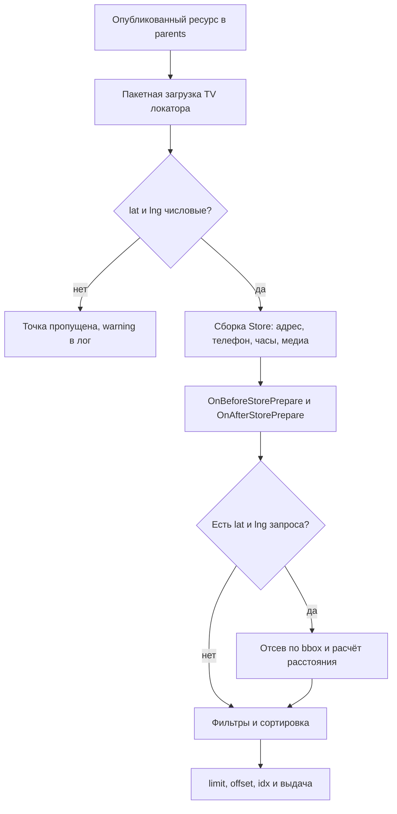

# Точки и TV

Точка на карте: **опубликованный** ресурс MODX. Контейнер задаёте параметром `parents` у сниппета.

## TV Free

При установке создаётся категория **YandexMapsLocator** и TV:

| TV | Тип | Назначение |
|----|-----|------------|
| `yandexmaps_address` | text | Адрес |
| `yandexmaps_latitude` | text | Широта |
| `yandexmaps_longitude` | text | Долгота |
| `yandexmaps_phone` | text | Телефон |
| `yandexmaps_email` | text | Email |
| `yandexmaps_working_hours` | textarea | Часы работы (текст или JSON для Pro) |
| `yandexmaps_category` | text | Категория |
| `yandexmaps_balloon_image` | image | Картинка в балуне |
| `yandexmaps_marker_icon` | image | Иконка маркера на карте |

Имена меняются через `yandexmapslocator_tv_*`: [настройки](settings).

## TV Pro

Resolver Pro создаёт (если ещё нет):

| TV | Тип | Назначение |
|----|-----|------------|
| `yandexmaps_timezone` | text | IANA-таймзона точки (`Europe/Moscow`, `Asia/Omsk`). Пусто: сеть `yandexmapslocator_timezone` |
| `ms3_product_id` | number | Один ID товара MiniShop3 (прежний) |
| `ms3_product_ids` | text | Несколько ID: `25,26` или JSON `[25,26]`. Если заполнено, важнее `ms3_product_id` |
| `yandexmaps_amenities` | text | Теги удобств через запятую (`wifi,card,parking`) |
| `yandexmaps_brand` | text | Бренд для фильтра `brand` |

К шаблону TV сами не привязываются. Назначьте их шаблону точек, как остальные TV локатора.

См. [MiniShop3](pro/minishop3), [Открыто сейчас](pro/working-now).



## Геокод в менеджере

Плагин Free на `OnDocFormRender` добавляет кнопку «Получить координаты» под полем адреса: берёт адрес из TV и подставляет координаты. Нужен `yandexmapslocator_api_key`. Кнопка монтируется с повторными попытками, до 120 проверок по 250 мс, пока `Ext` не отрисует поле TV, поэтому на медленной админке появляется не сразу.

Pro добавляет «Проверить расписание» под TV часов: разбор JSON, статус «открыто сейчас», ближайшее открытие/закрытие.

## Геокод из кода

Кнопка в форме ходит через коннектор `/assets/components/yandexmapslocator/connector.php`. Коннектор требует менеджерский контекст и право `save_document`, иначе отдаёт `access_denied`.

За процессором стоит `YandexMapsLocator\Processors\Geocode\Geocode`: параметр `address`, при успехе `object` с `latitude` и `longitude`. Пустой адрес, ненайденный адрес и ошибки геокодера приходят как `success: false` с текстом в `message`. Отдельного сниппета-обёртки у процессора нет, поэтому в MODX-чанке вызывайте его через свой сниппет:

::: code-group

```fenom
{runProcessor 'YandexMapsLocator\Processors\Geocode\Geocode' : ['address' => $address]}
    {if $success}
        {$object.latitude}, {$object.longitude}
    {else}
        {$message}
    {/if}
```

```php
<?php
$address = $modx->getOption('address', $scriptProperties, '');
$result = $modx->runProcessor('YandexMapsLocator\Processors\Geocode\Geocode', ['address' => $address]);
return $result['success'] ? "{$result['object']['latitude']}, {$result['object']['longitude']}" : $result['message'];
```

:::

Из кода пакета процессор вызывается напрямую через `LocatorService::get($modx)->getGeocoder()->geocode($address)`: [Extension API](extension-api#доступ-из-кода-пакета).

## Точка входа коннектора

`/assets/components/yandexmapslocator/connector.php` обслуживает только процессоры пакета в разделе `Processors/`. Действие передаётся строкой `action`, например `YandexMapsLocator\Processors\Geocode\Geocode`. Свои обработчики через этот коннектор не добавляются: держите свой путь и свою проверку прав.

## Чанки Free

| Чанк | Назначение |
|------|------------|
| `yandexmapslocator.outer` | Обёртка локатора |
| `yandexmapslocator.search` | Форма поиска |
| `yandexmapslocator.store` | Карточка точки |
| `yandexmapslocator.empty` | Пустой результат |
| `yandexmapslocator.error` | Ошибка, плейсхолдер `{$error}` |

Pro своих чанков не кладёт. Разметка и `data-yml-*`: [Интерфейс](frontend).

## Часы работы

Обычный текст в `yandexmaps_working_hours` виден в карточке.

Для «открыто сейчас» и бейджей Pro нужен **JSON** и верный часовой пояс (TV точки или `yandexmapslocator_timezone`). Иначе для `working_now` точка закрыта. Подробнее: [Открыто сейчас](pro/working-now).
