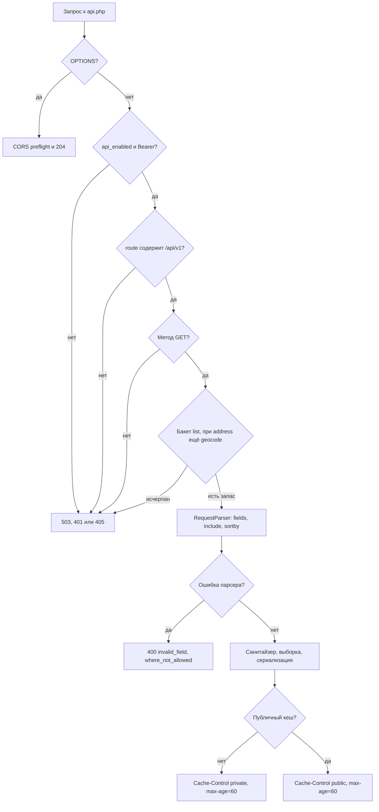

# REST API v1

Только **Pro**: эндпоинт живёт в файле `api.php` namespace `yandexmapslocatorpro` и работает по факту установки пакета. Запрос со страницы сниппета в Free идёт через `search.php`: [Интерфейс](../frontend).

Базовый URL:

```text
/assets/components/yandexmapslocatorpro/api.php
```

Маршруты задавайте query `route=`:

| Маршрут | Описание |
|-------|----------|
| `?route=api/v1/locations` | Список точек |
| `?route=api/v1/locations/{id}` | Деталь |
| `?route=api/v1/geocode` | Геокодирование |
| `?route=api/v1/meta` | Возможности, поля, фильтры, URL |

PATH_INFO вида `api.php/api/v1/...` на многих хостингах отдаёт HTML 404. Берите `route=`.



## Аутентификация

Пустой `yandexmapslocator_api_token`: публичное чтение, удобно на стенде. На рабочем сайте задайте токен для серверных клиентов (сервер Nuxt, свой сервер). В HTML страницы со сниппетом токен не попадает. Локатор на сайте тогда ходит в `search.php`.

```http
Authorization: Bearer YOUR_TOKEN
```

## GET locations

| Параметр | Описание |
|-------|----------|
| `parents` | ID родителей через запятую (max 20) |
| `limit` | По умолчанию 20, max 100 |
| `offset` | max 10000 |
| `fields` | Белый список полей через запятую |
| `include` | `resource`, `tv` (`tv` требует `resource`). Любой `include` снимает публичный кеш ответа |
| `sortby` | `pagetitle`, `distance`, `menuindex`, `id`, `createdon` |
| `sortdir` | `ASC` / `DESC` |
| `lat`, `lng` | Координаты для distance |
| `address` | Адрес (геокодируется) |
| `radius` | км |
| `filters`, `category` | `category` режет список сам. «Открыто сейчас»: `filters=working_now` |
| `amenity` / `amenities` | Теги удобств через запятую (можно без `filters=amenity`). Работает как «И»: нужны все перечисленные теги |
| `brand` | Фильтр по TV `yandexmaps_brand` |
| `context` | MODX context |
| `product_id` | Pro: фильтр MiniShop3 |

`where` → `400 where_not_allowed`.

По умолчанию короткий набор: `id`, `resource_id`, `title`, `address`, `coordinates`. Для `distance`, `is_open_now`, `status_hint`, `closes_at` и т.п. перечислите их в `fields`.

`fields=resource` без `include=resource` вернёт точку без блока `resource`: поле просто не попадёт в ответ, ошибки не будет.

### Примеры запросов

Ближайшие к координатам:

```text
?route=api/v1/locations&parents=5&lat=54.98&lng=73.36&radius=15&sortby=distance&fields=id,title,address,distance_formatted,coordinates
```

```json
{
  "success": true,
  "data": [
    {
      "id": 12,
      "title": "Магазин на Ленина",
      "address": "Омск, ул. Ленина, 25",
      "distance_formatted": "1.2 км",
      "coordinates": { "lat": 54.9893, "lon": 73.3682 }
    }
  ],
  "meta": { "total": 8, "limit": 20, "offset": 0 }
}
```

По адресу:

```text
?route=api/v1/locations&parents=5&address=Омск,%20Ленина%2025&sortby=distance&limit=10
```

Ответ по умолчанию (короткий набор полей):

```json
{
  "success": true,
  "data": [
    {
      "id": 12,
      "resource_id": 12,
      "title": "Магазин",
      "address": "Москва",
      "coordinates": { "lat": 55.75, "lon": 37.62 }
    }
  ],
  "meta": { "total": 42, "limit": 10, "offset": 0 }
}
```

С категорией и Pro-статусом:

```text
?route=api/v1/locations&parents=5&category=аптека&fields=id,title,category,is_open_now
```

```json
{
  "success": true,
  "data": [
    {
      "id": 15,
      "title": "Аптека №3",
      "category": "аптека",
      "is_open_now": true
    }
  ],
  "meta": { "total": 4, "limit": 20, "offset": 0 }
}
```

Только открытые (`working_hours_schedule` только в REST). Форма полей: [Открыто сейчас](working-now).

```text
?route=api/v1/locations&parents=5&filters=working_now&fields=id,title,is_open_now,status_hint,closes_at,working_hours_schedule
```

По amenity:

```text
?route=api/v1/locations&parents=5&amenity=wifi,card&fields=id,title,amenities
```

Останутся точки, у которых есть оба тега. Режима «любого из» у параметра нет: запрашивайте по одному тегу или фильтруйте на своей стороне.

С ресурсом и TV (имена TV из `yandexmapslocator_api_resource_tvs`):

```text
?route=api/v1/locations&parents=5&include=resource,tv&fields=id,title,resource
```

```json
{
  "success": true,
  "data": [
    {
      "id": 12,
      "title": "Магазин",
      "resource": {
        "id": 12,
        "pagetitle": "Магазин",
        "longtitle": "",
        "description": "",
        "uri": "stores/shop-1/",
        "alias": "shop-1",
        "parent": 5,
        "tv": {
          "metro_station": "Площадь Ленина"
        }
      }
    }
  ],
  "meta": { "total": 1, "limit": 20, "offset": 0 }
}
```

Одна точка:

```text
?route=api/v1/locations/12&fields=id,title,address,phone,email,coordinates,is_open_now
```

```json
{
  "success": true,
  "data": {
    "id": 12,
    "title": "Магазин на Ленина",
    "address": "Омск, ул. Ленина, 25",
    "phone": "+7 3812 00-00-00",
    "email": "shop@example.com",
    "coordinates": { "lat": 54.9893, "lon": 73.3682 },
    "is_open_now": false
  }
}
```

У детали нет `meta`. Неопубликованный или чужой ресурс → **404**:

```json
{
  "success": false,
  "error": "Location not found",
  "code": "not_found"
}
```

### Типичные ошибки списка

`where` в query:

```json
{
  "success": false,
  "error": "where_not_allowed",
  "code": "where_not_allowed"
}
```

Неверный Bearer (токен задан в настройках):

```json
{
  "success": false,
  "error": "Unauthorized",
  "code": "unauthorized"
}
```

## GET geocode

| Параметр | Описание |
|-------|----------|
| `address` | Строка, max 500 символов |

Лимит: `yandexmapslocator_api_geocode_rate_limit` (по умолчанию 30/min/IP).

```text
?route=api/v1/geocode&address=Омск,%20ул.%20Ленина,%2025
```

```json
{
  "success": true,
  "data": [
    {
      "latitude": 54.9893,
      "longitude": 73.3682
    }
  ]
}
```

Адрес не распознан: `"data": []`. Пустой `address` → `400 empty_address`.

```javascript
const url = new URL('/assets/components/yandexmapslocatorpro/api.php', location.origin);
url.searchParams.set('route', 'api/v1/geocode');
url.searchParams.set('address', 'Омск, ул. Ленина, 25');

const res = await fetch(url, {
  headers: {
    Accept: 'application/json',
    Authorization: 'Bearer YOUR_TOKEN',
  },
});
const { data } = await res.json();
```

## GET meta

Ответ описывает возможности, белый список полей, зарегистрированные фильтры, URL и настройки сети.

```text
?route=api/v1/meta
```

## Клиент вне сайта

Список точек:

```javascript
const base = 'https://example.com/assets/components/yandexmapslocatorpro/api.php';

const res = await fetch(`${base}?route=api/v1/locations&parents=5&limit=20`, {
  headers: {
    Accept: 'application/json',
    Authorization: 'Bearer YOUR_TOKEN',
  },
});
const json = await res.json();
```

Nuxt 3, маршрут на сервере (токен только на сервере):

```ts
// server/api/locations.get.ts
export default defineEventHandler(async (event) => {
  const query = getQuery(event);
  const base = useRuntimeConfig().locatorApiBase;
  const token = useRuntimeConfig().locatorApiToken;

  const url = new URL(base);
  url.searchParams.set('route', 'api/v1/locations');
  if (query.parents) url.searchParams.set('parents', String(query.parents));
  if (query.limit) url.searchParams.set('limit', String(query.limit));

  const headers: Record<string, string> = { Accept: 'application/json' };
  if (token) headers.Authorization = `Bearer ${token}`;

  return await $fetch(url.toString(), { headers });
});
```

CORS: `yandexmapslocator_api_cors_origins` (`https://app.example.com`, не `*` на рабочем сайте).

## Поля location

Базовые: `id`, `resource_id`, `title`, `address`, `latitude`, `longitude`, `coordinates`, `phone`, `email`, `category`, `working_hours`, `working_hours_formatted`, `working_hours_compact`, `distance`, `distance_meters`, `distance_km`, `distance_formatted`, `url`, `context_key`, `balloon_image`, `marker_icon`, `resource`.

Pro: `is_open_now`, `status_hint`, `closes_at`, `next_open_at`, `working_hours_schedule`, `amenities`, `brand`, `timezone`.

## Коды ошибок

| Код | HTTP | Когда |
|-----|------|-------|
| `unauthorized` | 401 | нет или неверный Bearer |
| `api_disabled` | 503 | `api_enabled=Нет` |
| `method_not_allowed` | 405 | не GET |
| `where_not_allowed` | 400 | передан `where` |
| `invalid_sortby` | 400 | неизвестный `sortby` |
| `invalid_field` | 400 | неизвестное поле в `fields` |
| `invalid_include` | 400 | неизвестный `include` |
| `invalid_request` | 400 | прочая ошибка парсера |
| `empty_address` | 400 | пустой `address` у geocode |
| `not_found` | 404 | нет точки |
| `rate_limit_exceeded` | 429 | лимит IP |
| `internal_error` | 500 | необработанная ошибка, смотрите лог MODX |

`yandexmapslocator_api_enabled = Нет` → `503` на REST:

```json
{
  "success": false,
  "error": "API is disabled",
  "code": "api_disabled"
}
```

Локатор на странице переключается на `search.php`.

См. [Безопасность API](api-security).
