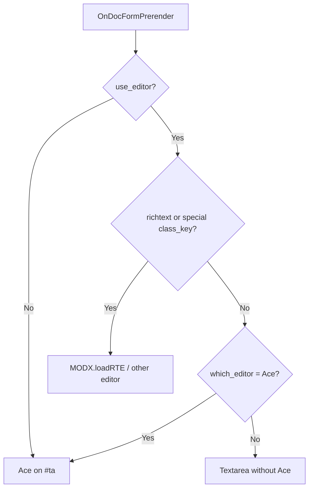

# Integration

Where Ace attaches, how it coexists with RTEs, MIME types, and Tab snippets.

Plugin **Ace** listens to manager events: element forms, files, resource, resource overview cache tab, RTE registration, and TV input list.

## Where the editor runs

| Context | Event / field | Default mime |
| --- | --- | --- |
| Snippet | `OnSnipFormPrerender` → `modx-snippet-snippet` | PHP |
| Plugin | `OnPluginFormPrerender` | PHP |
| Template | `OnTempFormPrerender` | `ace.html_elements_mime` or auto |
| Chunk | `OnChunkFormPrerender` | HTML/Fenom/Twig; static: by file extension |
| File | `OnFileCreateFormPrerender` / `OnFileEditFormPrerender` | by extension |
| Resource (content) | `OnDocFormPrerender` → `#ta` | content type / html mime |
| Resource overview → cache | `OnManagerPageBeforeRender` → `modx-rdata-buffer` | html mime |
| TV | input type **Ace** | from TV properties |

If `which_element_editor` ≠ `Ace`, the plugin does **not** initialize the editor on element forms (aside from registering the RTE name).

## Resources and RTE



Rules (1.9.10+):

1. `use_editor` and `which_editor` respect the resource **context**.
2. With `use_editor = Yes` and richtext (or Static/SymLink/WebLink/XMLRPC), Ace does **not** touch `#ta`.
3. With `use_editor = Yes` and `which_editor` ≠ Ace, Ace does **not** replace `#ta` on non-richtext resources: a plain textarea remains (Ace used to take over the field).

Typical setups:

| Setup | Settings |
| --- | --- |
| Code in resources via Ace | `use_editor = No` or `which_editor = Ace` |
| TinyMCE for articles, textarea for “code” pages | `use_editor = Yes`, `which_editor = TinyMCE` (or other RTE), richtext only where needed |
| Ace as the only content editor | `which_editor = Ace`, `use_editor = Yes` |

## Mime and MODX / Fenom highlighting

MODX tag highlighting is enabled only for HTML-like mimes:

- `text/html`
- `text/x-smarty` (Fenom / Smarty)
- `text/x-twig`

For CSS/SCSS/LESS/static chunks with a `.css` extension, MODX mixed mode is **off**: `//` and `/* */` comments highlight as CSS.

Auto `ace.html_elements_mime` when empty:

| Condition | Mime |
| --- | --- |
| `twiggy_class` present | `text/x-twig` |
| `pdotools_fenom_parser` on | `text/x-smarty` |
| Otherwise | `text/html` |

Set `ace.html_elements_mime = text/x-smarty` explicitly if Fenom in chunks is always required.

## Tab snippets

`ace.snippets` format (Ace snippets):

```text
snippet getr
    [[!getResources? &parents=`${1}` &limit=`${2:10}` &tpl=`${3}`]]
```

Ace definitions need a real Tab after the snippet name (**Alt+09** in the setting), not spaces. The indent above is spaces for markdown only. Expand in the editor: name + **Tab**.

Default set (when `ace.snippets` is empty on install/upgrade): `getr`, `getResources`, `pdoResources`, `pdoMenu`, `chunk`, `snippet`, `tv`, `formit`, and more. Reference file: `assets/components/ace/snippets/modx.default.snippets`.

Add your own abbreviations in the system setting; do not edit the assets file (package upgrades may overwrite it).

## Completions

**Ctrl+Space** (or Cmd+Space): snippets, properties, resource fields, PHP functions, etc. via `completions/*` processors.

## Ace TV type

1. Create a TV → input type **Ace**
2. Set mime/mode in TV properties if needed
3. Assign the TV to a resource template

## Drafts

With `ace.draft_restore = Yes`, field text is written to localStorage. After an accidental reload Ace offers restore or discard. Drafts clear after a successful form save / `MODx.onSaveEditor`. TTL: 7 days.

## Related

- [System settings](settings)
- [Keyboard shortcuts](hotkeys)
- [Troubleshooting](troubleshooting)
