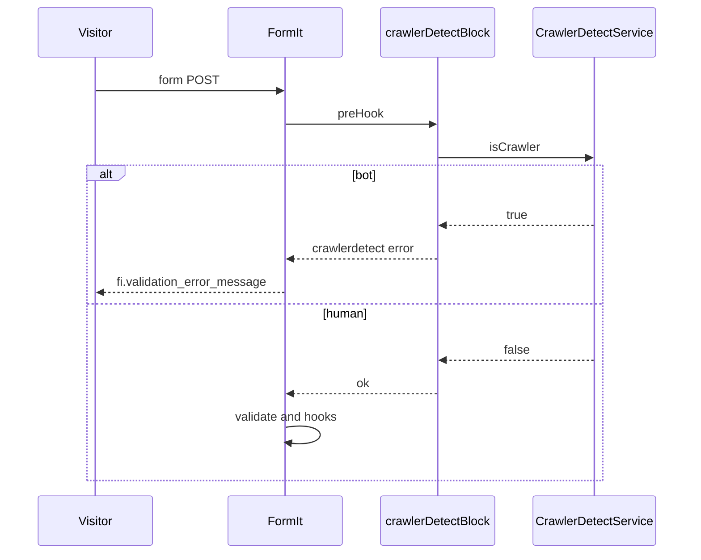

# Integration

## Form spam protection

### How it works

1. User submits the form.
2. FormIt runs preHook `crawlerDetectBlock` **before** validation and send.
3. If `isCrawler` treats the request as a bot (JayBizzle headers, not User-Agent alone), the form is not processed. The message from settings is shown.
4. If human, the form is processed as usual.



[crawlerDetectBlock](snippets/crawlerDetectBlock)

PHP service: `$modx->services->get('CrawlerDetect\\CrawlerDetectService')`. Methods: `isCrawler($ua = null)` and `getMatches()`. Missing vendor class: method returns `false` with no log line.

### Regular form (FormIt)

Add `crawlerDetectBlock` to FormIt’s `&preHooks`. List other preHooks comma-separated.

::: code-group

```modx
&preHooks=`crawlerDetectBlock,otherHook`
```

```fenom
'preHooks' => 'crawlerDetectBlock,otherHook'
```

:::

### AJAX form (FetchIt)

FetchIt processes forms via FormIt on the server.

1. In FetchIt config set the URL or page where FormIt is called.
2. In that page’s FormIt call add `` &preHooks=`crawlerDetectBlock` ``.
3. When a bot is blocked FetchIt gets an error response and shows the message from `crawlerdetect_block_message`.

### AJAX form (SendIt)

SendIt uses FormIt. Parameters are set in presets (file from **si_path_to_presets**).

1. Open your presets file. Do not edit the default `core/components/sendit/presets/sendit.inc.php`: it is overwritten on SendIt update.
2. Add `preHooks` with `crawlerDetectBlock` to the needed preset.
3. When a bot is blocked SendIt returns an error and shows the message from CrawlerDetect settings.

**Preset example:**

```php
return [
  'contact' => [
    'preHooks' => 'crawlerDetectBlock',
    'hooks' => 'email,FormItSaveForm',
    'validate' => 'name:required,email:email:required',
    'emailTo' => 'manager@site.com',
    'emailSubject' => 'Contact form',
    // ...
  ],
];
```

If `preHooks` already exists, add comma-separated: `'preHooks' => 'crawlerDetectBlock,otherHook'`.

## Hiding content from bots

Snippet **isCrawler** returns `"1"` (bot) or `"0"` (not bot). Call it uncached.

### Widget for humans only

::: code-group

```modx
[[!isCrawler:eq=`0`:then=`[[$chatWidget]]`]]
```

```fenom
{if $modx->runSnippet('isCrawler', []) == '0'}
  {$modx->getChunk('chatWidget')}
{/if}
```

:::

### Analytics for humans only

::: code-group

```modx
[[!isCrawler:eq=`0`:then=`[[$googleAnalytics]]`]]
```

```fenom
{if $modx->runSnippet('isCrawler', []) == '0'}
  {$modx->getChunk('googleAnalytics')}
{/if}
```

:::

[isCrawler](snippets/isCrawler)

## Typical scenarios

### Contact form

Add `crawlerDetectBlock` to FormIt preHooks. See [Quick start](quick-start).

### Multiple forms on the site

Add `crawlerDetectBlock` to `&preHooks` in each FormIt call.

### “N users online” counter

Run the counter snippet only when the visitor is not a bot:

::: code-group

```modx
[[!isCrawler:eq=`0`:then=`[[!yourVisitorCounterSnippet]]`]]
```

```fenom
{if $modx->runSnippet('isCrawler', []) == '0'}
  {$modx->runSnippet('yourVisitorCounterSnippet', [])}
{/if}
```

:::

### “Request a call” form (FetchIt)

Same steps as [AJAX form (FetchIt)](#ajax-form-fetchit).

### E‑commerce — “Viewing this product”

Exclude bots from product view count:

::: code-group

```modx
[[!isCrawler:eq=`0`:then=`[[!msProductViews? &id=`[[*id]]`]]`]]
```

```fenom
{if $modx->runSnippet('isCrawler', []) == '0'}
  {$modx->runSnippet('msProductViews', ['id' => $productId])}
{/if}
```

:::
