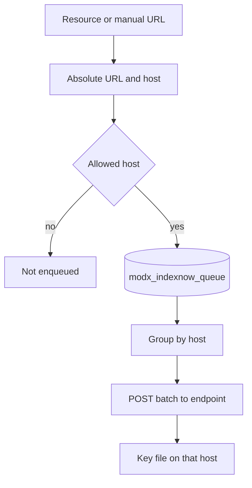

# Contexts and domains

IndexNow supports multiple MODX contexts. Enqueued rows store `context_key`, absolute URL, and `host`.

An absolute URL is not enqueued when the host is `localhost`, `metadata.google.internal`, or a private/reserved IP. This applies to resource URLs and manual enqueue.

## One host, several contexts

Typical case: `web`, `ru`, `en` on one domain. The worker sends batches to one host. One key file in the web root is enough.

URLs are built for the resource context (prepare context, fallback: `site_url` and `uri`). Saves from the manager context (`mgr`) should not break front-end context URLs.

## Different hosts per context

When contexts use different `http_host` / `site_url`, the worker groups sends by host. Each public document root crawlers use needs `{key}.txt`.

## Manual send

The **Send URL** tab accepts only hosts from known site contexts. Foreign domains are rejected. Action is always `update`.

## After a domain change

1. Context settings: `site_url`, `http_host`, `base_url`.
2. Key file on the new host.
3. `indexnow_endpoint` if you changed it.
4. Test resource save and a row in **Queue**.
