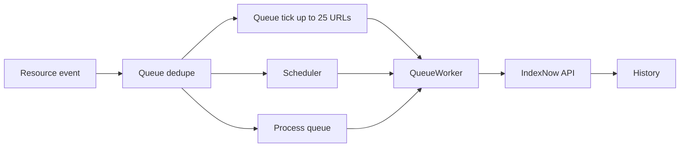
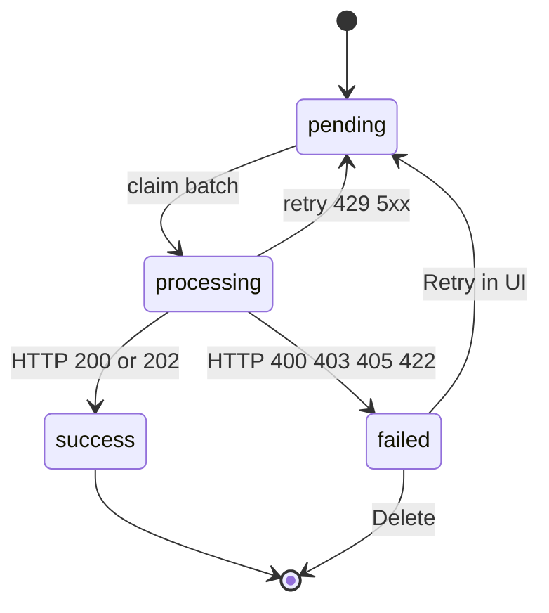

# Queue and delivery

## Flow

Tables: `modx_indexnow_queue`, `modx_indexnow_history` (with your table prefix).

## Queue tick (primary background)

The plugin listens to `OnWebPageComplete` (front end) and `OnManagerPageAfterRender` (manager). With IndexNow enabled and `indexnow_queue_enabled = Yes`, after enqueue the code calls `scheduleQueueTick()`: once per request, via `register_shutdown_function`.

One tick:

- takes a MODX cache lock (`indexnow_queue_tick`, TTL **55** seconds) so parallel requests do not run duplicate workers;
- processes at most **25** due URLs (`QUEUE_TICK_BATCH_MAX`), even if `indexnow_batch_size` is higher;
- if Scheduler is installed, calls `ensureScheduledRun()` as backup cron.

Scheduler is not required for background delivery. Tick covers the usual case after a resource save or a manager page load.

## Plugin events

| Event | Behavior |
| --- | --- |
| `OnDocFormSave` | Published resource → `update`. Unpublished → `delete`. |
| `OnResourcePublish` | Same as saving published → `update`. |
| `OnResourceUnPublish` | → `delete`. |
| `OnBeforeDocFormDelete` | Stores URL before delete. |
| `OnDocFormDelete` | Enqueues `delete` for the stored URL. |
| `OnWebPageComplete` | Schedules queue tick after the front-end response. |
| `OnManagerPageAfterRender` | Schedules queue tick after the manager response. |

Update enqueue applies to published, non-deleted resources with a resolvable absolute URL. Hosts `localhost`, private/reserved IPs, and `metadata.google.internal` fail URL validation.

If `publishedon` is in the future, the row waits with `available_at = publishedon`.

## Deduplication

Open rows (`pending` / `processing`) are unique by `host + url`.

Saving the same page again does not create duplicates. `action`, `available_at`, and metadata are updated.

Last event wins. Example: unpublish sets `delete`, republish rewrites the same row to `update`.

## Worker

One pass:

1. Reset stale `processing` older than 15 minutes to `pending`.
2. Claim `pending` rows with `available_at <= now`, limited by `indexnow_batch_size` (or less on tick).
3. Group by `host`.
4. POST batch(es) to the endpoint per host group.
5. Write history and update the queue.

If the key is invalid or `indexnow_endpoint` fails validation, the worker **exits without sending** (message in the MODX log). The queue grows with no history rows.

## HTTP codes

| Code | Behavior |
| --- | --- |
| `200`, `202` | Success. Row leaves the queue; history status `success`. |
| `429`, `5xx`, network / timeout | Temporary. Retry after `indexnow_retry_delay` until `indexnow_max_attempts`. |
| `400`, `403`, `405`, `422` | Permanent. Status `failed`; no endless automatic retry. |
| Other 4xx (e.g. `401`, `404`, `410`) | Also **immediate** `failed`, no retry series (not treated as temporary). |

A successful IndexNow response means the notification was accepted, not that the page is already in search results. Same in [Yandex documentation](https://yandex.com/support/webmaster/indexing-options/index-now.html).

## IndexNow retry vs Scheduler retry

- Queue `attempts` / `available_at`: delivery to the endpoint.
- Scheduler task retry: separate; only when the task runner itself fails.

## Manual processing

- **Process queue** on Status: immediate full worker pass with `indexnow_batch_size` limit.
- Queue tick and Scheduler pick up due URLs without UI action.
