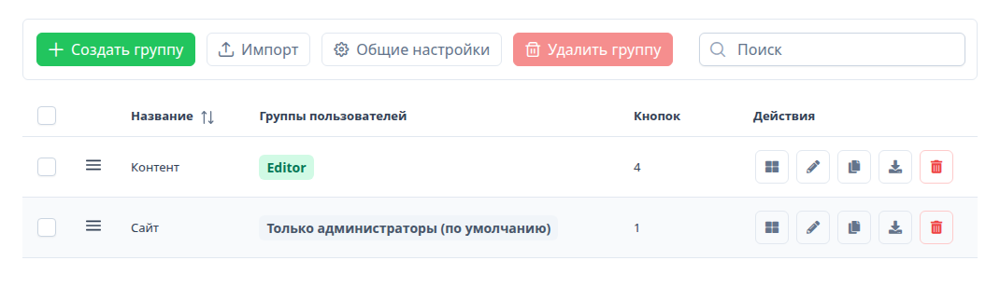
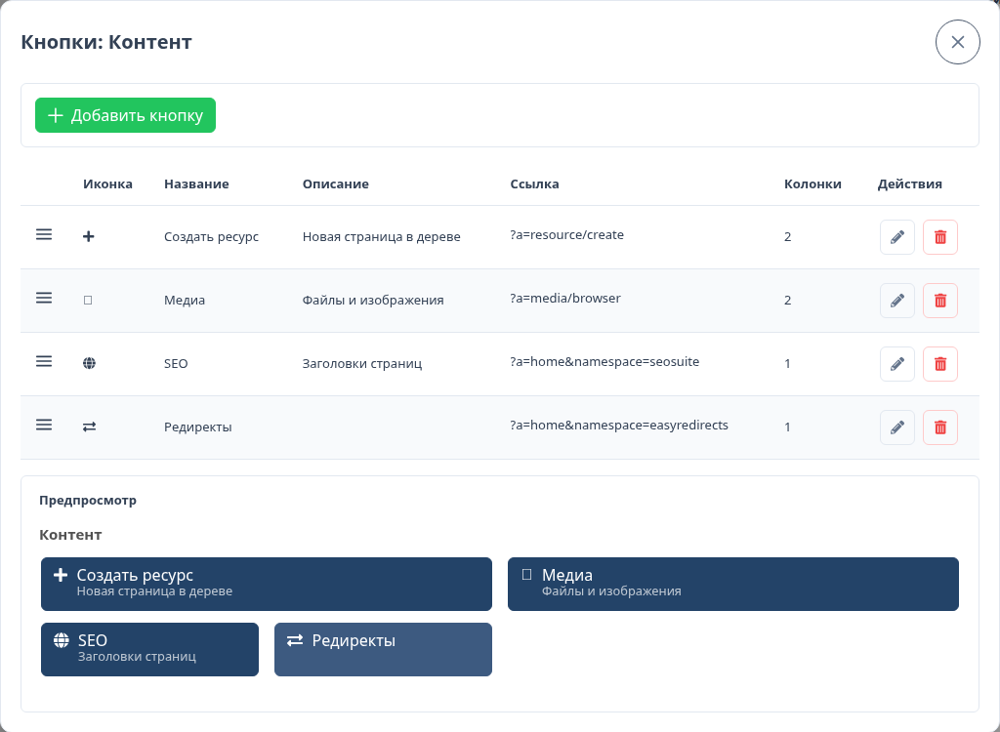
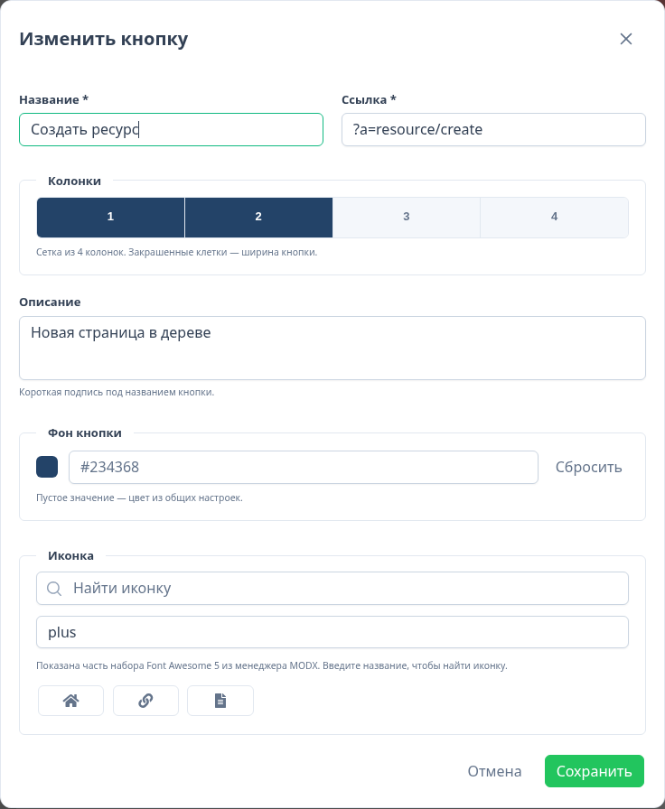
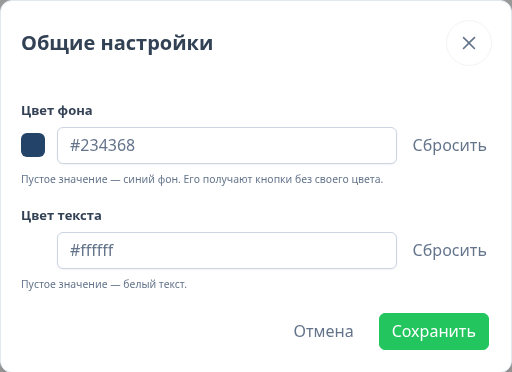
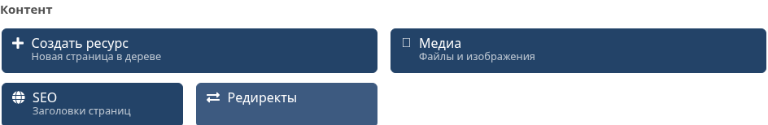

# ManagerButtons

Button groups for the manager dashboard. A button opens a manager page or an external link. A group can be limited to user groups, or left for administrators only.

The interface uses [VueTools](/en/components/vuetools/). Colors and controls follow the `vuetools.theme` setting.

## Requirements

| | |
| --- | --- |
| MODX | 3.0+ |
| PHP | 8.1+ |
| VueTools | 1.2.0+ |

Install VueTools first. The transport package requires it.

## Installation

1. Open **Extras → Installer** and install VueTools if it is not there yet.
2. Upload `ManagerButtons-1.2.1-pl.transport.zip` and install it.
3. Sign out of the manager and sign in again.

**ManagerButtons** appears under **Extras**. A widget with the same name is added to the Default dashboard.

The menu item is available to administrators and to users with the `managerbuttons` permission. Setup adds that permission to the Administrator policy.

## Groups

A group is a set of buttons on a four-column grid.



A group has a **name** and **user groups**.

Administrators (the `Administrator` group and `sudo` users) see every set. If no user groups are selected, only administrators see the set.

Drag rows to change the order. Ordering is paused while the search box is not empty. Check several rows to delete them together.

## Buttons

The grid icon on a group row opens its buttons. The bottom of that window is the same layout as the dashboard.



A button has:

- **Name**
- **Link** — a manager action (`?a=resource/create`), a site path, or an `https://` address
- **Columns** — width from 1 to 4. Filled cells show how much of the row the button uses
- **Description** — a short line under the name. Optional
- **Background** — its own color. Empty uses the general setting
- **Icon** — Font Awesome 5 from the MODX manager. The short name is stored, for example `plus`



Links that start with `?a=` open inside the manager. `http` and `https` addresses open in a new tab.

Buttons in the same grid row share one height. The label stays at the top, so a short name does not sit in the middle next to a button that has a description.

## General settings

**General settings** sets the background and text color for every button.



With no background, buttons are `#234368` and the text is white. A color on the button itself wins. The same values are stored in `managerbuttons.background` and `managerbuttons.color`.

## Dashboard

The **ManagerButtons** widget lists the sets the current user can see. Each group has its own heading and grid.



To show one group, set the widget property `group_id` to that group's numeric id. Leave it empty to show every set the user can access.

## Export and import

**Export** downloads the group as JSON: name, buttons, and user group names.

**Import** always creates a new group. Use it to move a set to another site or to copy it here. **Duplicate** in the table does the same without a file.

User groups are matched by name. A name that does not exist on the site is skipped. Administrators still see the imported set.

```json
{
  "package": "ManagerButtons",
  "format": 1,
  "version": "1.2.1-pl",
  "group": {
    "name": "Content",
    "usergroups": ["Editor"],
    "buttons": [
      {
        "name": "Create resource",
        "url": "?a=resource/create",
        "icon": "plus",
        "description": "New page in the tree",
        "background": "",
        "cols": 2,
        "rank": 0
      }
    ]
  }
}
```

## License

MIT.
