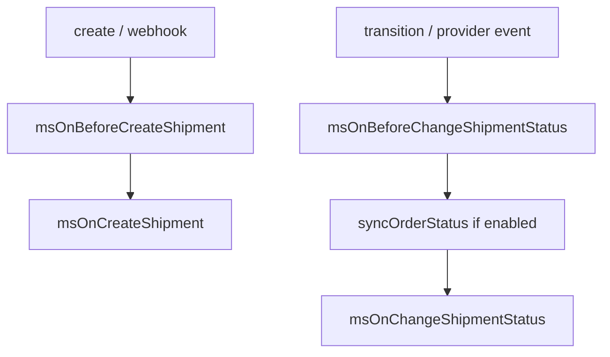
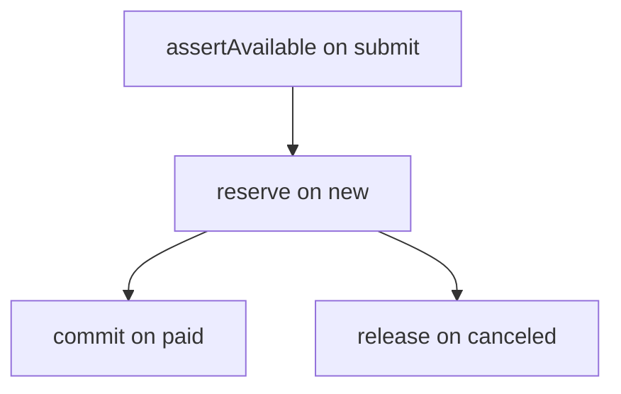
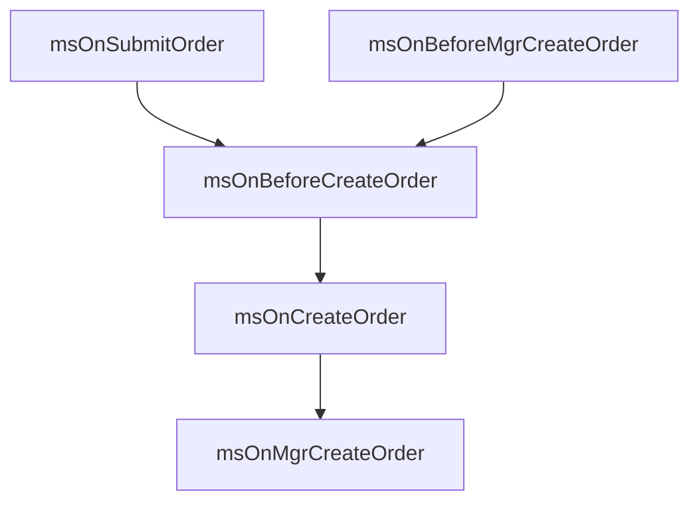

# Events and plugins

MiniShop3 runs on the MODX event system. A plugin steps into cart, order, product and customer processing without changing the source code.

## Getting started

- [Working with plugins](events/plugins-guide) — how to get parameters, abort an operation, modify data, pass data between plugins

## Events by category

### Cart

| Event | Description |
| --- | --- |
| [msOnBeforeGetCart](events/cart#msonbeforegetcart) | Before getting cart |
| [msOnGetCart](events/cart#msongetcart) | After getting cart |
| [msOnBeforeAddToCart](events/cart#msonbeforeaddtocart) | Before adding product |
| [msOnAddToCart](events/cart#msonaddtocart) | After adding product |
| [msOnBeforeChangeInCart](events/cart#msonbeforechangeincart) | Before changing quantity |
| [msOnChangeInCart](events/cart#msonchangeincart) | After changing quantity |
| [msOnBeforeChangeOptionsInCart](events/cart#msonbeforechangeoptionsincart) | Before changing options |
| [msOnChangeOptionInCart](events/cart#msonchangeoptionincart) | After changing options |
| [msOnBeforeRemoveFromCart](events/cart#msonbeforeremovefromcart) | Before removing product |
| [msOnRemoveFromCart](events/cart#msonremovefromcart) | After removing product |
| [msOnBeforeEmptyCart](events/cart#msonbeforeemptycart) | Before clearing cart |
| [msOnEmptyCart](events/cart#msonemptycart) | After clearing cart |
| [msOnGetStatusCart](events/cart#msongetstatuscart) | Getting cart status |

### Order

| Event | Description |
| --- | --- |
| [msOnBeforeAddToOrder](events/order#msonbeforeaddtoorder) | Before adding field to order |
| [msOnAddToOrder](events/order#msonaddtoorder) | After adding field |
| [msOnBeforeValidateOrderValue](events/order#msonbeforevalidateordervalue) | Before field validation |
| [msOnValidateOrderValue](events/order#msonvalidateordervalue) | After field validation |
| [msOnErrorValidateOrderValue](events/order#msonerrorvalidateordervalue) | Validation error |
| [msOnBeforeRemoveFromOrder](events/order#msonbeforeremovefromorder) | Before removing field |
| [msOnRemoveFromOrder](events/order#msonremovefromorder) | After removing field |
| [msOnBeforeEmptyOrder](events/order#msonbeforeemptyorder) | Before clearing order draft |
| [msOnEmptyOrder](events/order#msonemptyorder) | After clearing order draft |
| [msOnSubmitOrder](events/order#msonsubmitorder) | Storefront order submit |
| [msOnBeforeMgrCreateOrder](events/order#msonbeforemgrcreateorder) | Before manager finalization |
| [msOnMgrCreateOrder](events/order#msonmgrcreateorder) | After manager finalization |
| [msOnBeforeCreateOrder](events/order#msonbeforecreateorder) | Before creating order |
| [msOnCreateOrder](events/order#msoncreateorder) | After creating order |

### Cost

| Event | Description |
| --- | --- |
| [msOnBeforeGetCartCost](events/cost#msonbeforegetcartcost) | Before cart cost calculation |
| [msOnGetCartCost](events/cost#msongetcartcost) | After cart cost calculation |
| [msOnBeforeGetDeliveryCost](events/cost#msonbeforegetdeliverycost) | Before delivery cost calculation |
| [msOnGetDeliveryCost](events/cost#msongetdeliverycost) | After delivery cost calculation |
| [msOnBeforeGetPaymentCost](events/cost#msonbeforegetpaymentcost) | Before payment fee calculation |
| [msOnGetPaymentCost](events/cost#msongetpaymentcost) | After payment fee calculation |
| [msOnBeforeGetOrderCost](events/cost#msonbeforegetordercost) | Before order total (cart + delivery + payment) |
| [msOnGetOrderCost](events/cost#msongetordercost) | After total: override `cost` / `cart_cost` / `delivery_cost` / `payment_cost` |

### Order status

| Event | Description |
| --- | --- |
| [msOnBeforeChangeOrderStatus](events/status#msonbeforechangeorderstatus) | Before status change |
| [msOnChangeOrderStatus](events/status#msonchangeorderstatus) | After status change |

### Customer

| Event | Description |
| --- | --- |
| [msOnBeforeGetOrderCustomer](events/customer#msonbeforegetordercustomer) | Before getting customer |
| [msOnGetOrderCustomer](events/customer#msongetordercustomer) | After getting customer |
| [msOnBeforeGetOrderUser](events/customer#msonbeforegetorderuser) | Before resolving `modUser` on submit |
| [msOnGetOrderUser](events/customer#msongetorderuser) | After resolving `modUser` |
| [msOnBeforeAddToCustomer](events/customer#msonbeforeaddtocustomer) | Before adding field |
| [msOnAddToCustomer](events/customer#msonaddtocustomer) | After adding field |
| [msOnBeforeValidateCustomerValue](events/customer#msonbeforevalidatecustomervalue) | Before field validation |
| [msOnValidateCustomerValue](events/customer#msonvalidatecustomervalue) | After field validation |
| [msOnErrorValidateCustomerValue](events/customer#msonerrorvalidatecustomervalue) | Validation error |
| [msOnBeforeCreateCustomer](events/customer#msonbeforecreatecustomer) | Before creating customer |
| [msOnCreateCustomer](events/customer#msoncreatecustomer) | After creating customer |
| [msOnBeforeAddCustomerAddress](events/customer#msonbeforeaddcustomeraddress) | Before adding address |
| [msOnAddCustomerAddress](events/customer#msonaddcustomeraddress) | After adding address |
| [msOnBeforeUpdateCustomer](events/customer#msonbeforeupdatecustomer) | Before updating customer (processor; neither the manager nor the Web API calls it yet) |
| [msOnUpdateCustomer](events/customer#msonupdatecustomer) | After updating customer (processor; neither the manager nor the Web API calls it yet) |

### Products (catalog)

| Event | Description |
| --- | --- |
| [msOnGetProductPrice](events/product#msongetproductprice) | Product price modification |
| [msOnGetProductWeight](events/product#msongetproductweight) | Product weight modification |
| [msOnGetProductFields](events/product#msongetproductfields) | Product fields modification |
| [msOnGetPublicSeo](events/product#msongetpublicseo) | After the public SEO set is assembled (`PublicSeoService`, `ms3_public_seo_tv_map`) |

### msProducts snippet

Events for integrating third-party packages (ms3Variants, msBrands and others) without changing core code.

| Event | Description |
| --- | --- |
| [msOnProductsLoad](events/msproducts#msonproductsload) | After product list is loaded (bulk loading) |
| [msOnProductPrepare](events/msproducts#msonproductprepare) | Preparing each product's data |

::: tip usePackages parameter
To enable data loading, pass the package name in the snippet parameter: `&usePackages='ms3Variants,msBrands'`
:::

### Order products

| Event | Description |
| --- | --- |
| [msOnBeforeCreateOrderProduct](events/order-product#msonbeforecreateorderproduct) | Before adding product to order |
| [msOnCreateOrderProduct](events/order-product#msoncreateorderproduct) | After adding product |
| [msOnBeforeUpdateOrderProduct](events/order-product#msonbeforeupdateorderproduct) | Before updating product |
| [msOnUpdateOrderProduct](events/order-product#msonupdateorderproduct) | After updating product |
| [msOnBeforeRemoveOrderProduct](events/order-product#msonbeforeremoveorderproduct) | Before removing product |
| [msOnRemoveOrderProduct](events/order-product#msonremoveorderproduct) | After removing product |

### Order model (xPDO)

| Event | Description |
| --- | --- |
| [msOnBeforeSaveOrder](events/order-model#msonbeforesaveorder) | Before save (xPDO) |
| [msOnSaveOrder](events/order-model#msonsaveorder) | After save (xPDO) |
| [msOnBeforeRemoveOrder](events/order-model#msonbeforeremoveorder) | Before remove (xPDO) |
| [msOnRemoveOrder](events/order-model#msonremoveorder) | After remove (xPDO) |
| [msOnBeforeUpdateOrder](events/order-model#msonbeforeupdateorder) | Reserved — never fired ([#844](https://github.com/modx-pro/MiniShop3/issues/844)) |
| [msOnUpdateOrder](events/order-model#msonupdateorder) | Reserved — never fired ([#844](https://github.com/modx-pro/MiniShop3/issues/844)) |

### Notifications

| Event | Description |
| --- | --- |
| [msOnBeforeSendNotification](events/notifications#msonbeforesendnotification) | Before sending notification |
| [msOnAfterSendNotification](events/notifications#msonaftersendnotification) | After sending notification |
| [msOnRegisterNotificationChannels](events/notifications#msonregisternotificationchannels) | Channel registration |

### Vendors

| Event | Description |
| --- | --- |
| [msOnBeforeVendorCreate](events/vendor#msonbeforevendorcreate) | Before creating vendor |
| [msOnVendorCreate](events/vendor#msonvendorcreate) | After creating |
| [msOnBeforeVendorUpdate](events/vendor#msonbeforevendorupdate) | Before updating |
| [msOnVendorUpdate](events/vendor#msonvendorupdate) | After updating |
| [msOnBeforeVendorDelete](events/vendor#msonbeforevendordelete) | Before deleting |
| [msOnVendorDelete](events/vendor#msonvendordelete) | After deleting |

All six vendor events are fired only by the older `Settings/Vendor/*` processors. CRUD in the manager goes through the Manager API, and that does not call them — see [vendor events](events/vendor) and [issue #847](https://github.com/modx-pro/MiniShop3/issues/847).

### Import

| Event | Description |
| --- | --- |
| [msOnBeforeImport](events/import#msonbeforeimport) | Before import start |
| [msOnAfterImport](events/import#msonafterimport) | After import complete |
| [msOnImportRow](events/import#msonimportrow) | When processing a row |

### Manager

| Event | Description |
| --- | --- |
| [msOnManagerCustomCssJs](events/manager#msonmanagercustomcssjs) | Loading scripts and styles |

### Shipments

The logic lives in `ShipmentLifecycleService` (`ms3_shipment_lifecycle`), the tables are `ms3_shipments` and `ms3_shipment_events`. Creating a shipment and `setTracking` work even with `ms3_shipment_enabled=0`, while the delivery webhook answers 404 in that case. Before-events are aborted with `success=false` in the `invokeEvent` response.

| Event | Parameters | When |
| --- | --- | --- |
| `msOnBeforeCreateShipment` / `msOnCreateShipment` | before: `order_id`, `delivery_id`; after: `shipment` (the record) | `create()` |
| `msOnBeforeChangeShipmentStatus` / `msOnChangeShipmentStatus` | before: `shipment`, `status`; after: `shipment` | `transition()` / delivery provider webhook |
| `msOnBeforeUpdateShipmentTracking` / `msOnUpdateShipmentTracking` | before: `shipment`, `tracking_number`; after: `shipment` | `setTracking()` / webhook on a tracking change |

Shipment statuses: `preparing`, `shipped`, `in_transit`, `delivered`, `cancelled`, `returned`, `failed` (`ShipmentStatus`).

### Inventory

With `ms3_inventory_enabled=1` the work is done by `ProductStockInventory` (`ms3_inventory`), the contract is `InventoryServiceInterface`. Event parameters: `key` (`InventoryKey`), `qty`, `ctx` (`InventoryContext`: `orderId`, `origin`). A before-event returning `success=false` raises an `InventoryException` (`ms3_err_inventory_cancelled`). Passing `$notify=false` to reserve and release skips the event pair — compensation happens inside the SQL transaction.

| Event | When, in terms of order status |
| --- | --- |
| `msOnBeforeInventoryReserve` / `msOnInventoryReserve` | Reserve on `ms3_status_new` (and right before commit, when an order goes straight to paid) |
| `msOnBeforeInventoryCommit` / `msOnInventoryCommit` | Commit on `ms3_status_paid` (does not decrease the stock twice) |
| `msOnBeforeInventoryRelease` / `msOnInventoryRelease` | Release on `ms3_status_canceled` before commit. Also when payment `send()` fails |

## Changes from miniShop2

| miniShop2 | MiniShop3 | Changes |
| --- | --- | --- |
| `product` | `msProduct` | Parameter renamed |
| `msOnGetOrderCost` | Kept + 3 partials | Also `msOnGetCartCost`, `msOnGetDeliveryCost`, `msOnGetPaymentCost`. Override the total in `msOnGetOrderCost` |
| — | `controller` | Parameter on many controller events |
| — | `msOnBeforeEmptyOrder` / `msOnEmptyOrder` | Draft cleanup |
| — | `msOnBeforeMgrCreateOrder` / `msOnMgrCreateOrder` | Manager finalization |
| — | `msOnBeforeGetOrderUser` / `msOnGetOrderUser` | `modUser` on submit |
| — | `msOnBeforeValidateCustomerValue` | New event |
| — | `msOnCreateCustomer` | New event |
| — | `msOnAddCustomerAddress` | New event |
| — | `msOnBeforeSendNotification` | New event |
| — | `msOnImportRow` | New event |
| — | `msOnProductsLoad` | Third-party package integration |
| — | `msOnProductPrepare` | Third-party package integration |
| — | `msOnGetPublicSeo` | Public SEO for the Web API |
| — | `msOn*Shipment*` | Shipment lifecycle |
| — | `msOn*Inventory*` | Stock reserve / commit / release |

### Call chains (where to look in code)

| Action | Events in order |
| --- | --- |
| Clear draft (`order/clean`) | `msOnBeforeEmptyOrder` → field reset → `msOnEmptyOrder` |
| Storefront total | cart/delivery/payment cost → `msOnBeforeGetOrderCost` → compose → `msOnGetOrderCost` (return any of the 4 amounts) |
| Storefront submit | `msOnSubmitOrder` → … → `msOnBeforeCreateOrder` → `msOnCreateOrder` |
| Manager finalize | `msOnBeforeMgrCreateOrder` → `msOnBeforeCreateOrder` → `msOnCreateOrder` → `msOnMgrCreateOrder` |

All names above are registered in MODX; the registration list is `_build/elements/events.php`.
