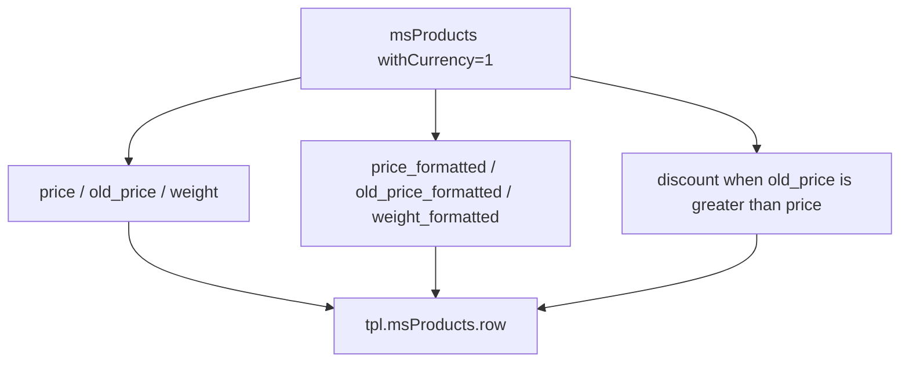

# Product catalog

The catalog is the main store page that displays a list of products from a category.

For SPA or a mobile client without msProducts use the public Web API: `GET /api/v1/product/list`, `GET /api/v1/category/list` / `tree`, `GET /api/v1/product/filters`. The catalog response goes through `ProductCatalogService` with a field allowlist. See [Web API: catalog](/en/components/minishop3/development/web-api/catalog).

<!--  -->

[](https://file.modx.pro/files/e/4/2/e42014d3fca7e7073ef6e30d7709cff6.png)

## Catalog structure

| Component | File | Purpose |
| --- | --- | --- |
| Category template | `elements/templates/catalog.tpl` | Page layout, msProducts snippet call |
| Product card chunk | `elements/chunks/ms3_products_row.tpl` | Appearance of a single product in the grid |

## Category template

**Path:** `core/components/minishop3/elements/templates/catalog.tpl`

The template extends the base template (`base.tpl`) and contains:

```fenom
{extends 'file:templates/base.tpl'}
{block 'pagecontent'}
    <div class="container py-4">
        <main>
            {* Category title *}
            <div class="page-header mb-4">
                <h1>{$_modx->resource.pagetitle}</h1>
                {if $_modx->resource.introtext}
                    <p class="lead text-muted">{$_modx->resource.introtext}</p>
                {/if}
            </div>

            {* Bootstrap Grid product list *}
            <div class="row">
                {* msProducts snippet call *}
                {'!msProducts'|snippet:[
                    'tpl' => 'tpl.msProducts.row',
                    'includeThumbs' => 'small,medium',
                    'includeVendorFields' => 'name,logo',
                    'formatPrices' => 1,
                    'withCurrency' => 1,
                    'limit' => 12,
                    'showLog' => 0,
                    'sortby' => 'menuindex',
                    'sortdir' => 'ASC',
                    'includeTVs' => '',
                    'showZeroPrice' => 0,
                ]}
            </div>
        </main>
    </div>
{/block}
```

Further down the file there is a commented-out pagination markup sample — the working pdoPage variant is described [at the end of this page](#pagination).

### Key call parameters

| Parameter | Value | Purpose |
| --- | --- | --- |
| `tpl` | `tpl.msProducts.row` | Product card chunk |
| `includeThumbs` | `small,medium` | Load image thumbnails |
| `includeVendorFields` | `name,logo` | Include vendor data |
| `withCurrency` | `1` | Add the currency symbol to `{$price_formatted}` and `{$old_price_formatted}` |
| `showZeroPrice` | `0` | Hide products with no price |

msProducts has no `formatPrices` parameter (it belongs to `msOrderTotal`). The demo `catalog.tpl` still passes it, and the snippet silently ignores it ([issue #818](https://github.com/modx-pro/MiniShop3/issues/818)).

The stock card chunk prints the raw `{$price}`. For a formatted price use `{$price_formatted}` together with `withCurrency`. The `{$weight_formatted}` field is always filled and does not depend on `withCurrency`.



::: tip More on parameters
See the full parameter list in the [msProducts](/en/components/minishop3/snippets/msproducts) snippet documentation.
:::

## Product card

**Path:** `core/components/minishop3/elements/chunks/ms3_products_row.tpl`

**Chunk name in DB:** `tpl.msProducts.row`

[](https://file.modx.pro/files/2/e/8/2e8fceaf20e53d57b44631b3fea62888.png)

The card is built on Bootstrap 5.

### Card elements

- **Image** that scales smoothly on hover (`transform: scale(1.05)`), with the `ms3_small.png` placeholder when there is no thumbnail
- **Status badges**: in stock, discount, NEW, POPULAR, favorite
- **Product info**: vendor, SKU, name
- **Product options**: color, size (first 3 + count of others)
- **Price**: old and current, as the raw `{$old_price}` and `{$price}` values
- **Weight and delivery time**: `{$weight}` kg when `weight > 0`, plus a hardcoded "1-3 days" caption
- **Cart buttons**: two forms with state switching

There is no separate "Quick view" overlay in the chunk: the `.product-overlay` rules are still in `default.css`, but the element itself is gone from the markup.

### Badges and labels

| Badge | Condition in the chunk | Position |
| --- | --- | --- |
| In stock / On order | `{$weight > 0}` | Top left |
| Discount (-XX%) | `{$discount > 0}` | Top right |
| NEW | `{$new}` | Top right |
| POPULAR | `{$popular}` | Top right |
| FAV | `{$favorite}` | Top right |

::: warning Availability based on weight
In the stock chunk the availability badge looks at `weight`, not at the `stock` value. `itemprop="availability"` is always `InStock`. See [issue #813](https://github.com/modx-pro/MiniShop3/issues/813).
:::

The `{$discount}` percentage is calculated by the msProducts loop when `old_price > price`.

### Cart button states

The card contains two forms:

**"Add" state** — product not in cart:

```html
<form method="post" class="ms3_form ms3-add-to-cart" data-cart-state="add" data-ms3-form>
    <input type="hidden" name="id" value="{$id}">
    <input type="hidden" name="count" value="1">
    <input type="hidden" name="ms3_action" value="cart/add">
    <button type="submit">Add to cart</button>
</form>
```

**"In cart" state** — product already added:

```html
<form method="post" class="ms3_form ms3-cart-controls" data-cart-state="change" data-ms3-form>
    <input type="hidden" name="product_key" value="">
    <input type="hidden" name="ms3_action" value="cart/change">
    <button class="dec-qty" data-ms3-qty="dec">−</button>
    <input name="count" value="1" data-ms3-qty="input">
    <button class="inc-qty" data-ms3-qty="inc">+</button>
    <span>✓ In cart</span>
</form>
```

Both forms are present in the markup at the same time, and the `ProductCardUI` JavaScript module controls which one is visible through the `data-cart-state` attribute. Switching fires on the `ms3:cart:updated` event. The action comes from the hidden `ms3_action` field: `cart/add` and `cart/change`. The script fills the `product_key` field once the product is in the cart.

[](https://file.modx.pro/files/2/c/b/2cbef63bd61c6ee6e707163e52917a12.png)

### Schema.org microdata

The card includes markup for search engines:

```html
<div class="card ..." itemtype="http://schema.org/Product" itemscope>
    <meta itemprop="description" content="{$description ?: $pagetitle}">
    <meta itemprop="name" content="{$pagetitle}">

    {if $thumb?}
        
    {/if}

    <div class="card-body ..." itemtype="http://schema.org/Offer" itemprop="offers" itemscope>
        <meta itemprop="price" content="{$price}">
        <meta itemprop="priceCurrency" content="RUB">
        <link itemprop="availability" href="http://schema.org/InStock"/>
        <link itemprop="url" href="{$id | url : ['scheme' => 'full']}"/>
    </div>
</div>
```

In the stock markup `description` falls back to `pagetitle` when the description is empty, and `itemprop="image"` is only emitted when a thumbnail exists: a product showing the placeholder contributes no image to the microdata. The `priceCurrency` value is hardcoded as `RUB`.

## Responsive grid

Cards use Bootstrap Grid with responsive classes:

```html
<div class="col-12 col-sm-6 col-md-4 col-lg-3">
```

| Screen | Products per row |
| --- | --- |
| < 576px (mobile) | 1 |
| ≥ 576px (sm) | 2 |
| ≥ 768px (md) | 3 |
| ≥ 992px (lg) | 4 |

## Customization

### Changing the category template

1. Copy `catalog.tpl` to your theme
2. Adjust msProducts call parameters
3. Assign the template to categories in the Manager

### Changing the product card

1. Create your own chunk, e.g. `tpl.myProducts.row`
2. Specify it in the call: `'tpl' => 'tpl.myProducts.row'`

### Adding filters

To filter products, use the mFilter2 component or add `where` and `optionFilters` parameters:

```fenom
{'!msProducts' | snippet : [
    'tpl' => 'tpl.msProducts.row',
    'where' => ['Data.vendor_id' => 5],
    'optionFilters' => ['color' => 'red']
]}
```

## Pagination

For paged navigation, wrap the call in pdoPage:

```fenom
{'!pdoPage' | snippet : [
    'element' => 'msProducts',
    'tpl' => 'tpl.msProducts.row',
    'limit' => 12
]}

<nav class="mt-4">
    {'page.nav' | placeholder}
</nav>
```
