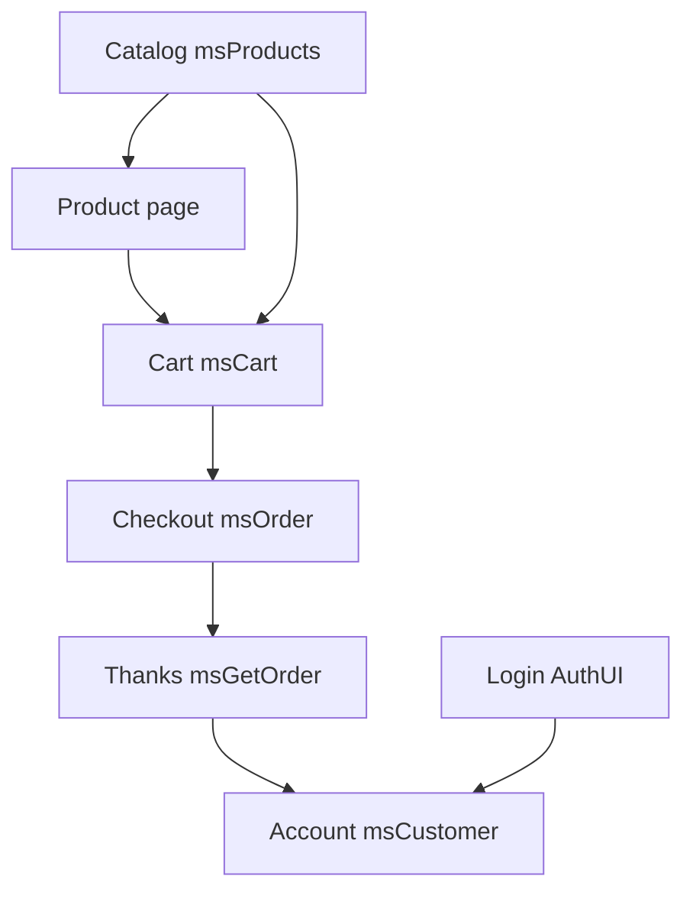

# Frontend interface

The MiniShop3 user interface on the site.

## Sections

- [Product catalog](catalog) — category template and product card
- [Product page](product) — product details with gallery and add-to-cart form
- [Cart](cart) — cart widget and item management
- [Checkout](order) — order form, delivery and payment selection
- [Thank you](thanks) — the page shown after checkout

### Customer account

- [Login and registration](customer-auth) — login, registration and password recovery forms
- [Customer profile](customer-profile) — edit personal data
- [Delivery addresses](customer-addresses) — manage saved addresses
- [Order history](customer-orders) — view and filter orders
