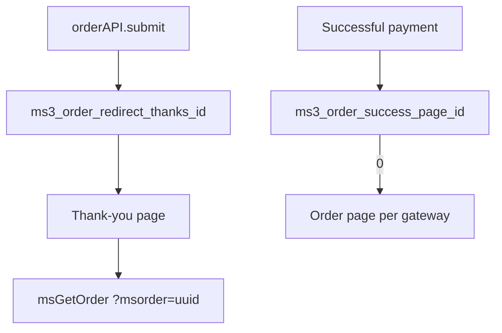

# Thank you

The thank-you page is shown after a successful checkout. It displays order details and next steps for the customer.

<!--  -->

[](https://file.modx.pro/files/e/9/3/e936fc08c9cbf5e83cae96910ae66fd7.png)

## Page structure

| Component | File | Purpose |
| --- | --- | --- |
| Page template | `elements/templates/thanks.tpl` | Thank-you page layout |
| Order chunk | `elements/chunks/ms3_get_order.tpl` | Placed order details |

## Page template

**Path:** `core/components/minishop3/elements/templates/thanks.tpl`

The template extends the base template and contains three sections.

### Page sections

| Section | Description |
| --- | --- |
| Success header | Icon, "Thank you for your order!" title, subtitle |
| Order details | msGetOrder snippet call |
| "What's next?" block | Information and navigation buttons |

### Template code

```fenom
{extends 'file:templates/base.tpl'}
{block 'pagecontent'}
    <div class="container my-5">
        <main>
            {* Success header *}
            <div class="text-center mb-5">
                <div class="mb-4">
                    <svg class="text-success" width="80" height="80" fill="currentColor">
                        <use xlink:href="#icon-check"/>
                    </svg>
                </div>
                <h1 class="display-5 fw-bold text-success mb-3">Thank you for your order!</h1>
                <p class="lead text-muted">Your order has been placed and is being processed</p>
            </div>

            {* Order details *}
            <div class="row justify-content-center">
                <div class="col-lg-10">
                    {'!msGetOrder'|snippet:[
                        'tpl' => 'tpl.msGetOrder',
                    ]}
                </div>
            </div>

            {* "What's next?" block *}
            <div class="row justify-content-center mt-5">
                <div class="col-lg-10">
                    <div class="card border-0 bg-light">
                        <div class="card-body text-center py-4">
                            <h5 class="card-title mb-3">What's next?</h5>
                            <p class="card-text text-muted mb-4">
                                We sent an order confirmation to your email.<br>
                                Our manager will contact you shortly to confirm the details.
                            </p>
                            <div class="d-flex gap-3 justify-content-center flex-wrap">
                                <a href="[[~[[++site_start]]]]" class="btn btn-outline-primary">
                                    Home
                                </a>
                                <a href="[[~[[++ms3.page_id.catalog:default=`0`]]]]" class="btn btn-primary">
                                    Continue shopping
                                </a>
                            </div>
                        </div>
                    </div>
                </div>
            </div>
        </main>
    </div>
{/block}
```

::: warning Caching
The order is resolved from the `msorder` GET parameter (or from the `id` call parameter), so the result must not be served from the page cache.

In MODX syntax the prefix is required — `[[!msGetOrder]]`. In Fenom the call runs on every request even without the prefix: pdoTools processes the whole Fenom markup on the parser's uncacheable pass. The exclamation mark in `{'!msGetOrder'|snippet}` does not change that — it only controls how registered scripts are carried over. It does no harm and is kept in the demo template for consistency.
:::

## How order detection works

After checkout the customer lands on the thank-you page with the order UUID in the URL:

```
/thanks/?msorder=a1b2c3d4-e5f6-7890-abcd-ef1234567890
```

The msGetOrder snippet resolves the order from the `msorder` GET parameter: a 36-character value is treated as a UUID, anything else as a numeric `id`. The identifier can also be passed straight into the call through the `id` parameter.

A UUID in the link exposes neither the sequential order number nor the total number of orders in the shop — unlike a numeric `id`.

::: info When the thank-you page is skipped
The redirect to it is only built when the payment handler did not return a `redirect` of its own. A payment service with its own payment page takes the customer over right after the order is submitted, skipping the thank-you page — see [OrderSubmitHandler](/en/components/minishop3/development/services).
:::

## Order details

The order details block is rendered by the [msGetOrder](/en/components/minishop3/snippets/msgetorder) snippet and the `tpl.msGetOrder` chunk.

The chunk shows:

- Order number and status
- Product table with prices
- Total cost
- Delivery and payment methods
- Contact details and address
- Payment link (if available)

## Payment link

If the payment method supports online payment, a "Pay order" button appears in the payment block:

```fenom
{if $payment_link?}
    <a href="{$payment_link}" class="btn btn-success">
        Pay order
    </a>
{/if}
```

The payment handler returns the link from `getPaymentLink()`, and `PaymentLinkResolver` decides whether to show it: the order status must be listed in the `ms3_payment_link_statuses` system setting (CSV of status ids). When that setting is empty, `ms3_status_new` is used — so by default the link is only visible on a freshly created order.

## Redirect configuration

The address of the thank-you page comes from system settings:

| Setting | Default | Description |
| --- | --- | --- |
| `ms3_order_redirect_thanks_id` | `1` | Resource ID of the "Thank you" page used after `orderAPI.submit` |
| `ms3_order_success_page_id` | `0` | Where to land after a successful payment (the `return_url` of the payment service). With `0` the service picks the address itself: the order page or the thank-you page |

There is no `ms3.page_id.thanks` key in the package. The demo `thanks.tpl` reads a non-existent `ms3.page_id.catalog` for its "Continue shopping" link ([issue #817](https://github.com/modx-pro/MiniShop3/issues/817)).

The redirect address comes back in the `orderAPI.submit` response — read it in the `afterSubmitOrder` hook:

```javascript
ms3Hooks.addHook('afterSubmitOrder', async ({ response }) => {
  if (response.success && response.data.redirect) {
    window.location.href = response.data.redirect
    // e.g. /thanks/?msorder=<uuid>
  }
})
```

The URL carries the order **UUID**, not the numeric `id`. msGetOrder still accepts `?msorder=15` if you pass it by hand, but checkout never produces such a link.



## Customization

### Changing the template

1. Copy `thanks.tpl` to your theme
2. Change markup and styles
3. Assign the template to the thank-you page resource

### Changing the order chunk

Create your own chunk and specify it in the call:

```fenom
{'!msGetOrder' | snippet : [
    'tpl' => 'tpl.myGetOrder',
    'includeThumbs' => 'small'
]}
```

### Adding product thumbnails

```fenom
{'!msGetOrder' | snippet : [
    'tpl' => 'tpl.msGetOrder',
    'includeThumbs' => 'small,medium'
]}
```

### Adding a recommendations block

After the order block, you can add recommended products:

```fenom
{* After order details *}
<div class="row justify-content-center mt-5">
    <div class="col-lg-10">
        <h4 class="mb-4">You may also like</h4>
        {'!msProducts' | snippet : [
            'parents' => 0,
            'where' => ['Data.popular' => 1],
            'limit' => 4,
            'tpl' => 'tpl.msProducts.row'
        ]}
    </div>
</div>
```

`parents => 0` is required here: without it msProducts falls back to the current resource id, and the thank-you page has no child products — the block would come out empty. The `Data.` prefix in `where` points at the `msProductData` table, where the `popular` flag lives.

## Notifications

After checkout, notifications are sent automatically:

| Recipient | Template | Description |
| --- | --- | --- |
| Customer | `tpl.msEmail.new.customer` | Order confirmation |
| Manager | `tpl.msEmail.new.manager` | New order notification |

The names `tpl.msEmail.order.new` and `tpl.msEmail.order.manager` are not part of the package — they only survive in a stale lexicon hint. The emails are sent by the [Notification center](/en/components/minishop3/interface/notifications) on the `order_status_changed` event. The `order_created` event exists in the interface, but nothing is sent for it ([#811](https://github.com/modx-pro/MiniShop3/issues/811)).

Setup: [Events → Notifications](/en/components/minishop3/development/events/notifications).

## Responsive layout

The page uses Bootstrap 5 Grid:

| Screen | Content width |
| --- | --- |
| < 992px | 100% |
| ≥ 992px | 10 columns (~83%) |

```html
<div class="row justify-content-center">
    <div class="col-lg-10">
        {* Centered content *}
    </div>
</div>
```
