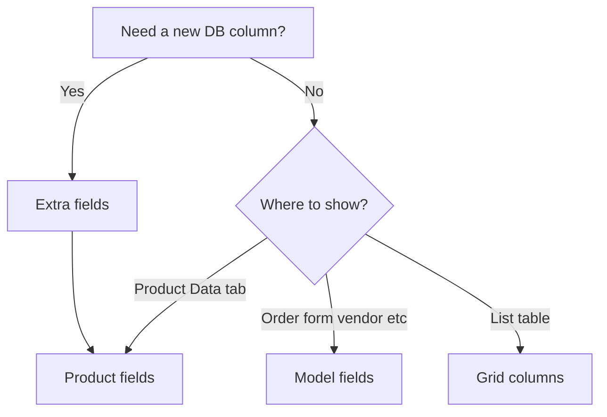

# Manager cookbooks

Short scenarios for integrators: configure fields and grid columns in the MS3 1.13.x Vue manager without patching PHP core.

API reference and full xtype lists live under [Utilities](/en/components/minishop3/interface/utilities/). Cookbooks explain **when** to use each tool and how to finish the task in the UI.

## Which tool to use

| Tool | Table | Purpose |
| --- | --- | --- |
| [Extra fields](/en/components/minishop3/interface/utilities/extra-fields) | `ms3_extra_fields` | New DB column + form widget |
| [Model fields](/en/components/minishop3/interface/utilities/model-fields) | `ms3_model_fields` | Sections, order, xtype for **existing** columns |
| [Product fields](/en/components/minishop3/interface/utilities/product-fields) | `ms3_product_fields` | Product “Data” tab layout (`page_key=product_data`) |

List columns are separate: [Grid columns](/en/components/minishop3/interface/utilities/grid-columns).

## Permissions

| Action | Policy |
| --- | --- |
| CRUD extra fields, model fields, product fields | `mssetting_save` |
| PUT grid-config (order, column types) | `mssetting_save` |
| GET grid-config, order and category lists | `view_document` |
| Order card | `msorder_view` and order edit permission |

## Cookbooks

| Page | Outcome |
| --- | --- |
| [Custom order field](/en/components/minishop3/manager/examples/order-custom-field) | Text extra field on order card |
| [Custom product field](/en/components/minishop3/manager/examples/product-extra-field) | Numeric extra field + Data tab section |
| [Extra fields](/en/components/minishop3/manager/extra-fields/cookbook) | xtypes, repeater, key-value |
| [Model fields](/en/components/minishop3/manager/model-fields/cookbook) | Sections, visible list, page-fields |
| [Product fields](/en/components/minishop3/manager/product-fields/cookbook) | Sections and visibility on Data tab |
| [Grid columns](/en/components/minishop3/manager/grid-config/cookbook) | Badge, price, inline edit in category |

## Requirements

- MiniShop3 **1.13.x**, MODX 3, Vue manager from the package
- Config writes: `mssetting_save`
- Grid read: `view_document`
