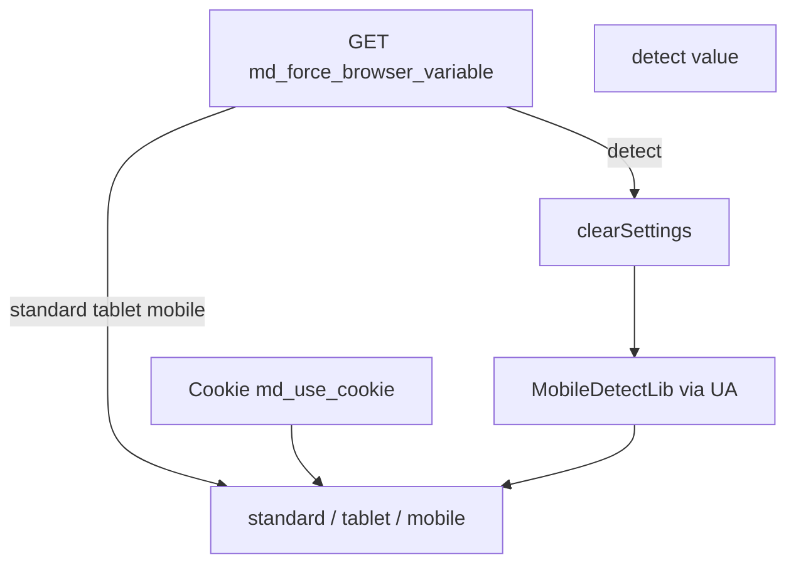

# Integration

Four ways to output different content by device type, forced mode, and PHP API.

Plugin **MobileDetect** listens to `OnWebPagePrerender` and `pdoToolsOnFenomInit`.

## Output methods

| # | Method | Event | Pros | Cons |
| --- | --- | --- | --- | --- |
| 1 | Fenom `\| mobiledetect` | `pdoToolsOnFenomInit` | Code in false branches does not run | Requires pdoTools |
| 2 | Fenom blocks | `pdoToolsOnFenomInit` | Readable markup | `{mobile}` = phone **and** tablet |
| 3 | Snippet `[[!MobileDetect]]` | any | Works without Fenom | Verbose syntax |
| 4 | HTML tags | `OnWebPagePrerender` | Page cache friendly | MODX tags inside blocks parse first |

## Fenom modifier

Recommended when pages are parsed via pdoTools/Fenom:

::: code-group

```fenom
{if 'standard' | mobiledetect}
  <p>Desktop</p>
{/if}

{if 'tablet' | mobiledetect}
  <p>Tablet</p>
{/if}

{if 'mobile' | mobiledetect}
  <p>Mobile (phone or tablet)</p>
{/if}
```

```modx
[[!pdoPage?
  &element=`tplWithFenom`
]]
```

:::

The modifier compares the expected type with the current one (`standard`, `tablet`, `mobile`) and returns `1` or `0`.

## Fenom blocks

The plugin registers blocks on `pdoToolsOnFenomInit`:

| Block | Shown when |
| --- | --- |
| `{mobile}{/mobile}` | `mobile` or `tablet` |
| `{phone}{/phone}` | `mobile` only (phone) |
| `{tablet}{/tablet}` | `tablet` only |
| `{desktop}{/desktop}` | `standard` (desktop) |
| `{standard}{/standard}` | `standard` (desktop) |

::: code-group

```fenom
{phone}
  <nav class="mobile-menu">...</nav>
{/phone}

{desktop}
  <nav class="desktop-menu">...</nav>
{/desktop}
```

```modx
[[!pdoPage?
  &element=`tplNavigation`
]]
```

:::

## MobileDetect snippet

The snippet returns `1` or `0`. Parameter `&input` is the expected device type.

::: code-group

```modx
[[!MobileDetect:is=`1`:then=`
  <p>Mobile view</p>
`:else=``:input=`mobile`]]

[[!MobileDetect:is=`1`:then=`
  <p>Desktop view</p>
`:else=``:input=`standard`]]
```

```fenom
{if $modx->runSnippet('MobileDetect', ['input' => 'mobile']) == 1}
  <p>Mobile view</p>
{/if}
```

:::

Details: [MobileDetect snippet](snippets/mobiledetect).

## HTML tags

Wrap content in configurable tags (default `standard`, `tablet`, `mobile`):

```html
<standard>
  <p>Desktop layout</p>
</standard>
<tablet>
  <p>Tablet layout</p>
</tablet>
<mobile>
  <p>Phone layout</p>
</mobile>
```

Filtering on `OnWebPagePrerender`:

| Device type | Removed blocks | Kept |
| --- | --- | --- |
| desktop (`standard`) | `tablet`, `mobile` | `standard` |
| tablet | `mobile`; `standard` if `md_tablet_is_standard = No` | `tablet` (+ `standard` if tablet = desktop) |
| mobile | `standard`, `tablet` | `mobile` |

::: warning Not recommended for heavy snippets
MODX parses `[[!Snippet]]` inside all blocks before filtering. For conditional snippets use the Fenom modifier or blocks.
:::

## Device detection



Priority: GET parameter → cookie (if enabled) → User-Agent auto-detection.

## Forced mode

Pass a GET parameter (default `browser`):

| URL | Result |
| --- | --- |
| `?browser=standard` | Desktop |
| `?browser=tablet` | Tablet |
| `?browser=mobile` | Mobile |
| `?browser=detect` | Clear cookie, auto-detect |

When `md_use_cookie = Yes` the choice is stored in an HTTP-only cookie.

### tplMobileDetectSwitch switcher

Chunk from the package — Desktop / Tablet / Mobile / Auto links:

::: code-group

```fenom
{$modx->getChunk('tplMobileDetectSwitch')}
```

```modx
[[$tplMobileDetectSwitch]]
```

:::

### Current mode placeholder

The plugin sets `mobiledetect.device`:

::: code-group

```modx
Current mode: [[+mobiledetect.device]]
```

```fenom
{set $device = $_modx->getPlaceholder('mobiledetect.device') ?: ''}
<p>Mode: {$device}</p>
```

:::

## PHP API

```php
/** @var MobileDetect $md */
$md = $modx->getService('mobiledetect', 'MobileDetect', MODX_CORE_PATH . 'components/mobiledetect/');
if (!$md) {
    return;
}

$key = $md->config['force_browser_variable'];
$forced = isset($_GET[$key]) ? $modx->stripTags($_GET[$key]) : '';

$device = $md->resolveDevice($forced);  // standard | tablet | mobile
$type = $md->getDeviceType();

$md->isMobile();   // mobile or tablet
$md->isTablet();
$md->isDesktop();  // standard

$detector = $md->getDetector();  // Detection\MobileDetect
$detector->isMobile();
```

## Typical scenarios

### Different site header

Fenom blocks in a shared header chunk — `{phone}` for compact menu, `{desktop}` for full menu.

### No redirect needed

MobileDetect does **not** redirect to an `m.` subdomain. Content is filtered on the same page.

### Mobile and desktop in one resource

HTML tags `<standard>` and `<mobile>` in resource content work without pdoTools if the template does not block prerender.

## Related

- [System settings](settings) — `md_*` keys
- [MobileDetect snippet](snippets/mobiledetect)
- [Troubleshooting](troubleshooting) — Fenom, cache, upgrade
