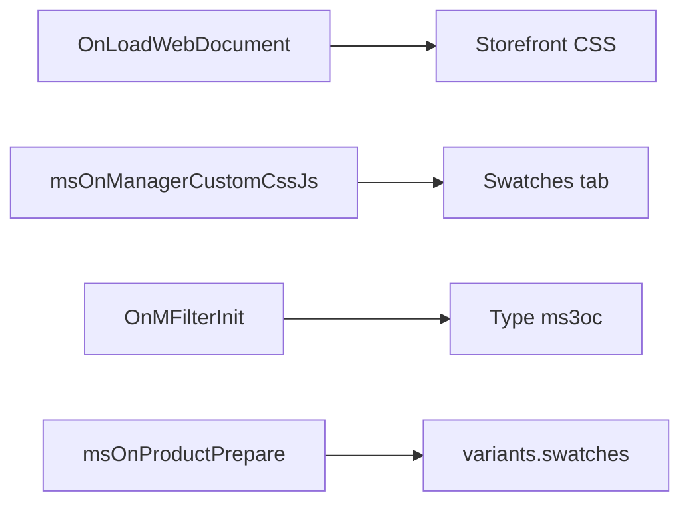
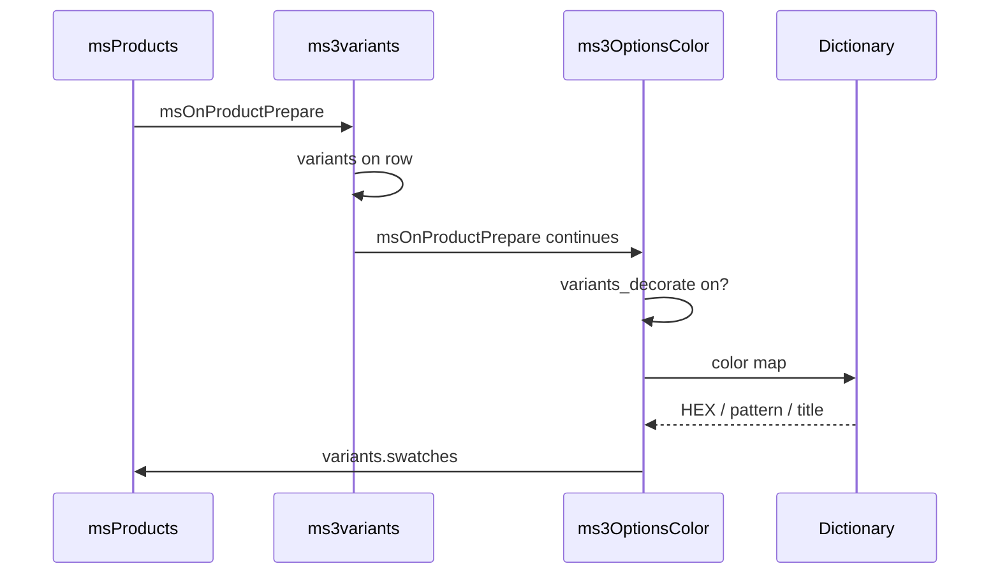
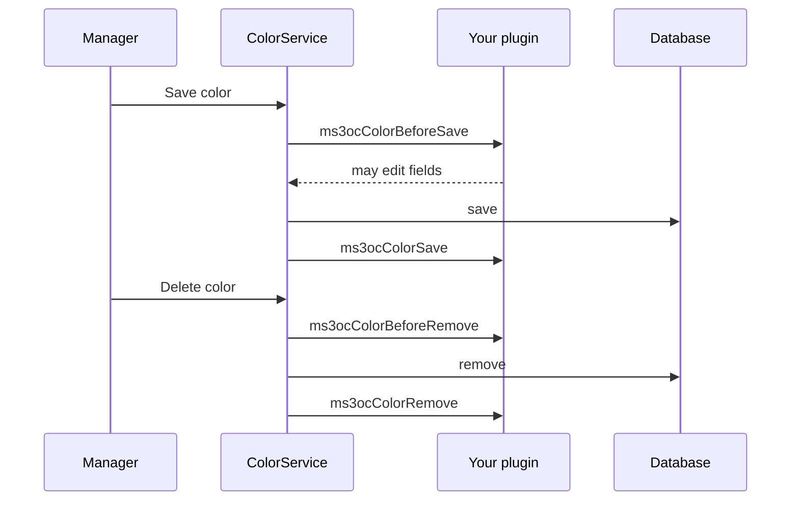

# Events

## Plugin subscriptions

The **ms3OptionsColor** plugin listens to:

| Event | Action |
| --- | --- |
| `OnLoadWebDocument` | Loads storefront swatch CSS when `ms3optionscolor_frontend_css` is on |
| `msOnManagerCustomCssJs` | Swatches tab and color squares in option chips on the product card |
| `OnMFilterInit` | Registers filter type `ms3oc` |
| `msOnProductPrepare` | Adds dictionary colors to catalog variants (after ms3variants) |



Put your own logic in a separate plugin. On `OnMFilterInit` register another type key. Do not overwrite `ms3oc` if you want a parallel type.

### Enriching ms3variants

The package does not create variants and does not change price, stock, or `_variant_id`. It only enriches the variant list already prepared by ms3variants:



1. Reads setting `ms3optionscolor_variants_decorate`.
2. If the catalog row has `variants`, loads the color dictionary once per request.
3. On matching key and value writes `color`, `pattern`, `title` into `swatches`.
4. Updates `variants_json` for the chunk.

The listing needs `usePackages=ms3Variants`. Markup example: [ms3variants](ms3variants).

## Dictionary events

When a color is saved or removed in the dictionary:



| Event | When | Parameters |
| --- | --- | --- |
| `ms3ocColorBeforeSave` | before DB write | `color` object, source `data` |
| `ms3ocColorSave` | after successful write | `color` object |
| `ms3ocColorBeforeRemove` | before delete | `color` object |
| `ms3ocColorRemove` | after delete | `color` object |

You cannot cancel save via returnedValues. In `BeforeSave` you may change fields on `$color`. The original array stays in `data`. After save read the final object in `ms3ocColorSave`.

## Plugin example

::: code-group

```php
<?php
/** @var modX $modx */
switch ($modx->event->name) {
    case 'ms3ocColorBeforeSave':
        /** @var xPDOObject $color */
        $color = $modx->getOption('color', $scriptProperties);
        if ($color && $color->get('title') === '') {
            $color->set('title', $color->get('value'));
        }
        break;
}
```

:::

Add your subscription under **Elements → Plugins → System Events**.
