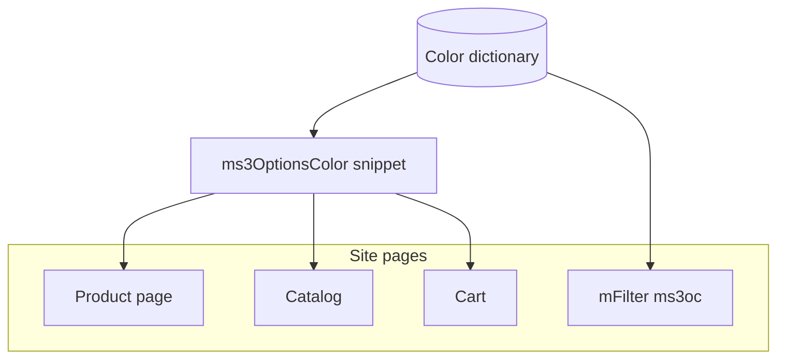
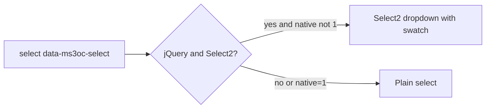

# Frontend

On the storefront you render swatches with snippet `ms3OptionsColor`, select with chunk `tplMs3OptionsColorSelect`, and filters with type `ms3oc`. Snippet parameters and chunk list: [Snippets](snippets/). Styles rely on data attributes (`[data-ms3oc-swatch]`, `[data-empty]`, `[data-size]`…), not required CSS classes.



## CSS and JS

When `ms3optionscolor_frontend_css=Yes` the plugin and snippet load `css/web/main.css`. Select needs a separate include:

::: code-group

```fenom
<link rel="stylesheet" href="{'assets_url' | option}components/ms3optionscolor/css/web/main.css">
<script src="{'assets_url' | option}components/ms3optionscolor/js/web/select.js"></script>
```

```modx
<link rel="stylesheet" href="[[++assets_url]]components/ms3optionscolor/css/web/main.css">
<script src="[[++assets_url]]components/ms3optionscolor/js/web/select.js"></script>
```

:::

`select.js` finds `[data-ms3oc-select]`. With jQuery + Select2 it builds a dropdown with swatches. Otherwise you keep a plain `<select>` with `data-ms3oc-select-plain` (parameter `native=1` / `data-ms3oc-native`).



Set swatch size with `data-size`: `sm`, `md`, `lg`. Without the attribute the size is 1.75rem.


## Product page

::: code-group

```fenom
{'!ms3OptionsColor' | snippet : [
  'product' => $_modx->resource.id,
  'options' => 'color',
  'tpl' => 'tplMs3OptionsColor'
]}
```

```modx
[[!ms3OptionsColor?
  &product=`[[*id]]`
  &options=`color`
  &tpl=`tplMs3OptionsColor`
]]
```

:::

Default `tplMs3OptionsColor` renders `<span data-ms3oc-swatch>` with `data-color`, `data-pattern`, `data-ral`, `data-status`. An empty swatch gets `data-empty`.

Parameters and row fields: [ms3OptionsColor snippet](snippets/ms3OptionsColor).

### Select

::: code-group

```fenom
{$_modx->getChunk('tplMs3OptionsColorSelect', [
  'product' => $_modx->resource.id,
  'option_key' => 'color',
  'caption' => 'Цвет',
  'placeholder' => 'Выберите цвет',
  'native' => 1
])}
```

```modx
[[$tplMs3OptionsColorSelect?
  &product=`[[*id]]`
  &option_key=`color`
  &caption=`Цвет`
  &placeholder=`Выберите цвет`
  &native=`1`
]]
```

:::

The chunk calls the snippet with `tplMs3OptionsColorSelectOption`. Parameters `tpl` / `optionTpl` override the single-option chunk. Form field name: `options[color]` (or your `option_key`).

| Chunk parameter | Purpose |
| --- | --- |
| `product` | Product ID |
| `option_key` | Option key, default `color` |
| `caption` | Label text |
| `placeholder` | Empty option at the top |
| `native` | `1` disables Select2 |
| `selected` / `selectedValue` | Preselected value |
| `activeOnly` / `includeUnset` | Same as snippet |
| `multiple` / `required` | `<select>` attributes |
| `field_id` | Element id |

## Catalog

On listing rows pass the product ID:

::: code-group

```fenom
{'!ms3OptionsColor' | snippet : [
  'product' => $id,
  'options' => 'color',
  'tpl' => 'tplMs3OptionsColor',
  'limit' => 6
]}
```

```modx
[[!ms3OptionsColor?
  &product=`[[+id]]`
  &options=`color`
  &tpl=`tplMs3OptionsColor`
  &limit=`6`
]]
```

:::


## byOptions

When values already exist (cart, custom JSON), do not read product options from the database:

::: code-group

```fenom
{set $colors = $_modx->runSnippet('!ms3OptionsColor', [
  'product' => $product.id,
  'byOptions' => json_encode($product.options),
  'return' => 'data'
])}
```

```modx
[[!ms3OptionsColor?
  &product=`[[+id]]`
  &byOptions=`{"color":["Синий","Чёрный"]}`
  &return=`data`
]]
```

:::

`byOptions` is a JSON string. In a cart chunk Fenom/`runSnippet` is easier. In MODX tags pass already serialized JSON.

## Cart

Example chunk `tplMs3OptionsColorCart` has three branches:

| Cart line | Behavior |
| --- | --- |
| Has `options._variant_id` | Read-only swatch for `color` (+ label `size` when present). Without color the swatch block is not rendered. **No** `cart/changeOption`. Link "change variant" → PDP `?variant=ID` |
| Bundle (`options.msbundles` / `bundle_hash`) | Read-only. Swatch when `options.color`. Otherwise one color from `product.color` or all product colors. **No** `cart/changeOption` |
| Regular line | When the product has option `color`, `<select>` + `cart/changeOption` shows even without `options.color` on the line. Inline swatch and label only when color is already selected. Size: select only when `options.size` is already set |

Storefront CSS must be loaded. Otherwise the cart swatch often stays zero width.

Display contract for the chunk: color swatch and size label. Other option keys are not output. Variant identity (`_variant_id`, price, canonical options) stays with ms3variants.

Include the chunk in `tpl.msCart` row template under the product name, or replace it with your own using the same branches.

## mFilter and ms3variants

Separate pages:

- [mFilter](mfilter) — filter type `ms3oc`, Filter Set, row chunk
- [ms3variants](ms3variants) — `variants[].swatches` in the catalog

## Custom swatch chunk

Minimum contract for CSS and select:

::: code-group

```fenom
<span data-ms3oc-swatch
      {if !$color && !$pattern}data-empty{/if}
      {if $pattern}data-has-pattern{/if}
      title="{($title ?: $value) | escape}"
      data-option="{$option_key | escape}"
      data-value="{$value | escape}"
      data-color="{if $color}#{$color | escape}{/if}"
      data-pattern="{$pattern | escape}"
      data-ral="{$ral | escape}"
      data-status="{$status ?: 'active'}"
      style="{if $color}background-color:#{$color | escape};{/if}{if $pattern}background-image:url('{$pattern | escape}');background-size:cover;{/if}">
</span>
```

```modx
<span data-ms3oc-swatch[[+color:empty=`[[+pattern:empty=` data-empty`]]`]][[+pattern:notempty=` data-has-pattern`]]
      title="[[+title:default=`[[+value]]`]]"
      data-option="[[+option_key]]"
      data-value="[[+value]]"
      data-color="[[+color:notempty=`#[[+color]]`]]"
      data-pattern="[[+pattern]]"
      data-ral="[[+ral]]"
      data-status="[[+status:default=`active`]]"
      style="[[+color:notempty=`background-color:#[[+color]];`]][[+pattern:notempty=`background-image:url('[[+pattern]]');background-size:cover;`]]"></span>
```

:::

You can change theme classes. Select JS and default CSS rely on `data-ms3oc-*`. Stock package chunks are Fenom.
