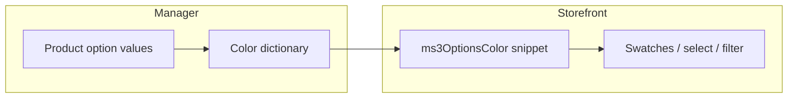

# ms3OptionsColor

With ms3OptionsColor you assign a color, pattern, or RAL to [miniShop3](/components/minishop3/) option values and show swatches on the storefront, in select, in filters, and in the cart. The dictionary is shared: one `option_key` + `value` pair for the whole catalog. Assign `color=Синий` once and the same swatch appears on every product with that value.

Start here: [Quick start](quick-start).

## Features

### Manager

CMP on Vue 3 and PrimeVue (via VueTools): **Dictionary** and **RAL** tabs. Search by key and value, status filter, HEX / pattern / RAL dialog.

On the product card, the **Swatches** tab sits next to **Product properties**. Set option values first, then assign swatches. On option chips the script draws a color square.

### Storefront

Snippet `ms3OptionsColor` and Fenom chunks. Storefront CSS loads automatically when `ms3optionscolor_frontend_css` is enabled. Select with swatch works via Select2 or a plain `<select>`.

### mFilter and ms3variants

Filter type `ms3oc` renders swatches from the dictionary and does not replace the built-in `colors` type. With [ms3variants](/components/ms3variants/), catalog variants can show colors from the dictionary. Details: [mFilter](mfilter), [ms3variants](ms3variants).

## Requirements

| Component | Version |
| --- | --- |
| MODX Revolution | ≥ 3.0.3 |
| miniShop3 | cart, product options, manager API |
| VueTools | ≥ 1.1.2-pl |
| pdoTools | 3.x |
| PHP | ≥ 8.2 |
| mFilter | optional, for `ms3oc` filter type |
| ms3variants | optional: variant colors in the catalog |

## Installation

1. Install **ms3OptionsColor** via **System → Package Management**.
2. Clear the MODX cache.
3. Make sure the manager role has `msproduct_save` (same as saving a miniShop3 product). The package does not create its own ACL keys.
4. Open **Extras → ms3OptionsColor**. The dictionary should open without a blank screen or VueTools errors.

On install the package prepares the database for the color dictionary and RAL Classic, adds the manager menu item, and enables the plugin for the product tab, storefront styles, and filter. Step-by-step with the first swatch: [Quick start](quick-start).

## Package elements

| Type | Name | Purpose |
| --- | --- | --- |
| Snippet | `ms3OptionsColor` | Swatches, option for select, `return=data` |
| Plugin | `ms3OptionsColor` | Product tab, storefront CSS, mFilter, variant colors in the catalog |
| Chunks | `tplMs3OptionsColor*` | Storefront, select, cart, mFilter |
| Menu | `ms3OptionsColor` | Dictionary and RAL CMP |

## Next steps

| Task | Section |
| --- | --- |
| First swatch in 15 minutes | [Quick start](quick-start) |
| `ms3optionscolor_*` keys | [System settings](settings) |
| Select, cart, CSS/JS | [Frontend](frontend) |
| Snippet parameters and chunks | [Snippets](snippets/) |
| Catalog filter `ms3oc` | [mFilter](mfilter) |
| Variant colors in the catalog | [ms3variants](ms3variants) |
| CMP and product tab | [Manager overview](interface/) |
| Flows A–I with screenshots | [Flows](interface/flows) |
| Dictionary and plugin events | [Events](events) |
| Common errors | [FAQ](faq) |
