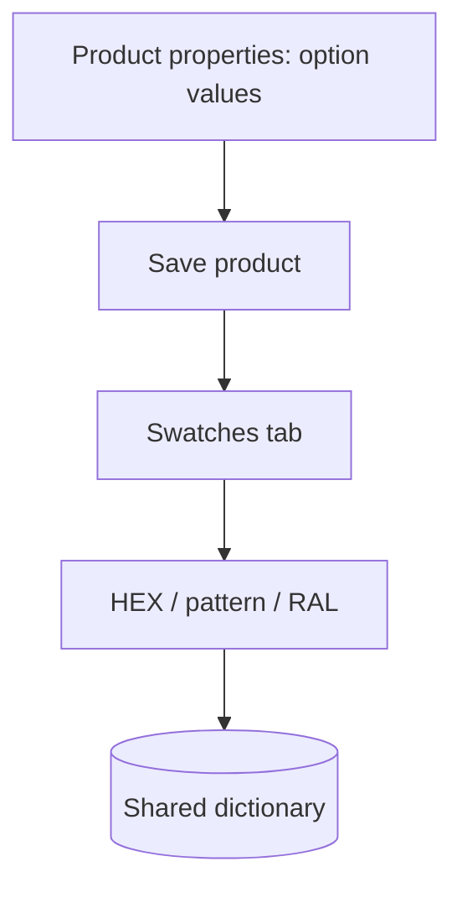

# Manager overview

Open **Components → ms3OptionsColor** from the menu or at `manager/?a=index&namespace=ms3optionscolor`. The UI uses Vue 3 and PrimeVue via VueTools.

Step-by-step flows: [Flows](flows).

## How the section works

The dictionary list and **Swatches** tab save data through the miniShop3 connector, not a separate URL. That is intentional: on some hosts a direct API address returns 404. You need miniShop3 installed and `msproduct_save` for the manager role.

## CMP screen

Top to bottom:

1. Title and short description.
2. **Dictionary** and **RAL** tabs (when `ms3optionscolor_ral_enabled` is enabled).
3. Table with search, status filter, and actions.

### Dictionary

| Action | How |
| --- | --- |
| Search | Field "Search value or key" (case-insensitive, including Cyrillic) |
| Status filter | all / not set / active / disabled |
| Edit / assign | Pencil icon in the row |
| Delete | **Delete** button in the dialog with confirm |

The dictionary is shared: one `option_key` + `value` pair for the whole catalog.

### RAL

**RAL** tab: search by code and name, **Add**, edit row.

### Color dialog

In the dialog you set HEX (bar + RGB/HSV), pattern URL, RAL, title, activity. Mode switch: **Color** / **Pattern**.

Choosing RAL fills its HEX. If you change HEX manually or save **Pattern** mode, the form clears the previous RAL link so code and color stay in sync.

On save the package normalizes pattern URL and **Image** field: `/assets/…` stays a site-root path, a full URL of the same site becomes relative, external HTTPS/CDN URLs stay as-is.

## Product Swatches tab

On `product_create` / `product_update` the plugin registers the **Swatches** tab among Vue product tabs.

Workflow:

1. On **Product properties** add option values (`color` or keys from `ms3optionscolor_default_option_key`).
2. Save the product.
3. On **Swatches** assign HEX / pattern / RAL to rows with status "not set".

Hints from miniShop3 `comboColors` appear in the UI. The package does not write color into `msOption.properties`.

On **Product properties** script `product-option-swatch.js` draws a swatch square in option chips. The `/map` request uses the same miniShop3 connector.

## Limitations

- Without VueTools the manager section and product tab will not open.
- Without `msproduct_save` the dictionary will not save.
- Filter type `ms3oc` appears only when mFilter is installed.
