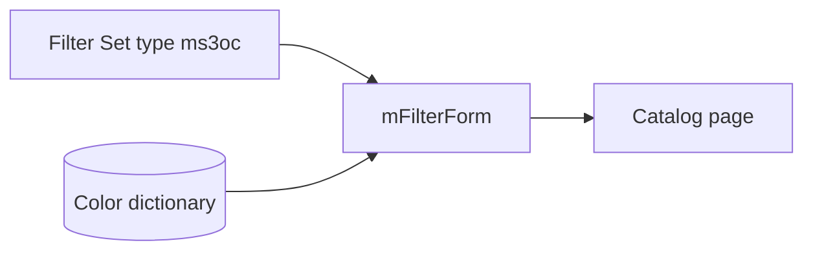

# mFilter

The package adds filter type **`ms3oc`**. Shoppers see color squares from the dictionary, not a plain value list. The built-in mFilter type `colors` is unchanged.

You need [mFilter](/components/mfilter/) installed. Without it, `OnMFilterInit` never runs and type `ms3oc` will not appear.



## Filter Set setup

1. Create a **Filter Set** in mFilter and attach it to the catalog page.
2. Add an option filter in the set JSON:

```json
{
  "color": {
    "type": "ms3oc",
    "source": "option",
    "field": "color",
    "label": "Цвет",
    "tpl": "tplMFilterMs3OptionsColor",
    "multiple": true
  }
}
```

| Field | Purpose |
| --- | --- |
| `type` | Always `ms3oc` for dictionary swatches |
| `source` | Usually `option` |
| `field` | miniShop3 option key, most often `color` |
| `label` | Block label on the storefront |
| `tpl` | Row chunk: stock `tplMFilterMs3OptionsColor` or your own |
| `multiple` | Several values at once |

The object key (`"color"` in the example) must match what you pass to `mFilterForm` as `filters`.

## Call on the page

Run the results snippet (`mFilter` / `baseIds`) first, then the form:

::: code-group

```fenom
{'!mFilterForm' | snippet : [
  'filters' => 'color',
  'tplItem' => 'tplMFilterMs3OptionsColor'
]}
```

```modx
[[!mFilterForm?
  &filters=`color`
  &tplItem=`tplMFilterMs3OptionsColor`
]]
```

:::

`mFilter` / `mFilterForm` parameters depend on your build. See [mFilter snippets](/components/mfilter/snippets/). For ms3OptionsColor you need:

- Filter Set with `"type": "ms3oc"`;
- `filters` matching the JSON key;
- `mFilterForm` passing `hex` / `pattern` / `ral` on each item (or flat `$hex`, `$pattern`, `$ral`);
- `&tplItem=tplMFilterMs3OptionsColor` when your mFilter version needs it.


## Chunk `tplMFilterMs3OptionsColor`

The stock chunk draws a checkbox, swatch, and label. Two data shapes:

| Source | Fields |
| --- | --- |
| demo / manual call | `$item.value`, `$item.label`, `$item.hex`, `$item.pattern`, `$item.ral`, `$item.count`, `$item.selected` |
| mFilterForm | flat `$value`, `$label`, `$hex`, `$pattern`, `$ral`, `$count`, `$active` |

Minimal custom row (Fenom):

```fenom
<label data-ms3oc-filter{if $active?} data-selected{/if}>
  <input type="checkbox" name="{$key}[]" value="{$value | escape}" {if $active?}checked{/if}>
  <span data-ms3oc-swatch data-size="sm"
        {if !$hex && !$pattern}data-empty{/if}
        style="{if $hex}background-color:{$hex};{/if}{if $pattern}background-image:url('{$pattern}');{/if}"></span>
  <span data-ms3oc-filter-label>{$label ?: $value}</span>
  <span data-ms3oc-filter-count>{$count}</span>
</label>
```

Storefront CSS (`ms3optionscolor_frontend_css`) must be on, or the filter swatch often has no size.

## Common issues

| Symptom | Check |
| --- | --- |
| Text only, no swatches | Filter Set uses `colors` instead of `ms3oc` |
| Type `ms3oc` missing | mFilter installed, cache cleared, plugin on `OnMFilterInit` |
| Empty squares | No HEX/pattern in the dictionary for those option values |
| No styles | `ms3optionscolor_frontend_css` or a manual `<link>` to `css/web/main.css` |

Screenshot flow: [Flow G](interface/flows#flow-g-catalog-filter-with-mfilter). General storefront: [Frontend](frontend).
