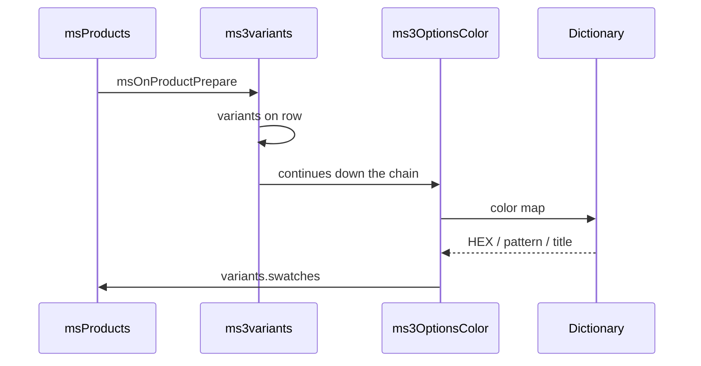

# ms3variants

With [ms3variants](/components/ms3variants/) installed, ms3OptionsColor can add dictionary colors to each catalog variant. The package does not create variants and does not change price, stock, or `_variant_id`. It only enriches an already prepared list.



## Requirements

1. ms3variants is installed.
2. The listing has `usePackages=ms3Variants`.
3. Setting `ms3optionscolor_variants_decorate` is Yes.
4. The variant `options` include a key from `ms3optionscolor_default_option_key` (for example `color`) with an exact dictionary value match.

Turn off with `ms3optionscolor_variants_decorate` = No. Variants stay as in ms3variants, without `swatches`.

## Listing call

::: code-group

```fenom
{'!msProducts' | snippet : [
  'parents' => $_modx->resource.id,
  'usePackages' => 'ms3Variants',
  'tpl' => 'tpl.msProducts.row'
]}
```

```modx
[[!msProducts?
  &parents=`[[*id]]`
  &usePackages=`ms3Variants`
  &tpl=`tpl.msProducts.row`
]]
```

:::

After the plugins, the catalog row has `variants`, `has_variants`, `variants_json`. OptionsColor adds `variants[].swatches` for keys from the setting.

## Row chunk markup

Looping the variants array is easiest in a Fenom chunk (pdoTools):

```fenom
{if $has_variants?}
  {foreach $variants as $variant}
    {set $sw = $variant.swatches.color ?: []}
    <button type="button" {if !$variant.in_stock}disabled{/if}>
      <span data-ms3oc-swatch
            {if !$sw.color && !$sw.pattern}data-empty{/if}
            {if $sw.pattern}data-has-pattern{/if}
            style="{if $sw.color}background-color:#{$sw.color};{/if}{if $sw.pattern}background-image:url('{$sw.pattern}');{/if}"></span>
      {$variant.options_array.color} / {$variant.options_array.size}
    </button>
  {/foreach}
{/if}
```

Here `swatches.color` matches option key `color`. If the setting has several keys (`color,material`), read `swatches.material` and so on.

One swatch entry:

| Field | Description |
| --- | --- |
| `color` | HEX without `#` |
| `pattern` | Pattern URL |
| `title` | Label from the dictionary |
| `value` | Option value (present even without a dictionary match) |

Without an exact `option_key` + `value` match, `color` / `pattern` / `title` stay empty.

![Catalog with variants[].swatches](/components/ms3optionscolor/screenshots/storefront-variants.png)

## Product colors without SKUs

If you do not need to walk variants, call the snippet in the same chunk:

::: code-group

```fenom
{'!ms3OptionsColor' | snippet : [
  'product' => $id,
  'options' => 'color',
  'tpl' => 'tplMs3OptionsColor',
  'limit' => 6
]}
```

```modx
[[!ms3OptionsColor?
  &product=`[[+id]]`
  &options=`color`
  &tpl=`tplMs3OptionsColor`
  &limit=`6`
]]
```

:::

## Cart

The `options._variant_id` branch in chunk `tplMs3OptionsColorCart` shows a read-only color and a link to PDP `?variant=ID`. Variant changes and price still belong to ms3variants. More: [Frontend](frontend#cart).

## Common issues

| Symptom | Check |
| --- | --- |
| No `variants[].swatches` | `usePackages=ms3Variants`, decorate setting = Yes |
| Empty `swatches.color` | Option value matches the dictionary literally |
| No `variants` at all | ms3variants and listing parameter |
| Zero-size swatch | `ms3optionscolor_frontend_css` |

Events: [Events](events#enriching-ms3variants). Flow: [Flow I](interface/flows#flow-i-variant-colors-in-the-catalog). Setting: [System settings](settings#ms3optionscolor_variants_decorate).
