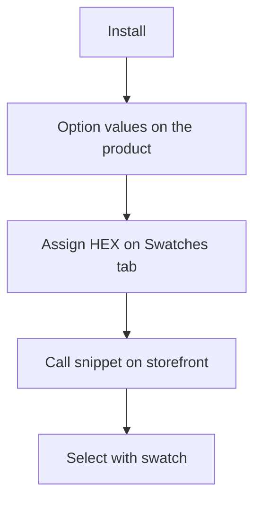

# Quick start

In 15 minutes you will install the package, assign HEX to option value `color`, and show swatches on the product page.



## Before you start

You already have MODX 3, miniShop3, VueTools ≥ 1.1.2-pl, pdoTools, and PHP 8.2+. You need a product with option `color` and at least one value. For the Swatches tab and CMP the role needs `msproduct_save` (same as saving a miniShop3 product). The package does not create separate ACL keys.

## Installation

1. Install **ms3OptionsColor** via **System → Package Management**.
2. Clear the MODX cache.
3. Open **Extras → ms3OptionsColor**. The dictionary list should load without a blank screen or VueTools errors.

On install the package prepares the database for the dictionary and RAL Classic, adds the menu item, and enables the plugin: product tab, storefront styles, mFilter.

## Step 1. Open the dictionary

Direct link: `manager/?a=index&namespace=ms3optionscolor`.


The **Dictionary** tab shows key/value pairs. **RAL** opens the RAL Classic reference when `ms3optionscolor_ral_enabled` is enabled.

## Step 2. Assign a color on the product card

1. Open a miniShop3 product.
2. On **Product properties**, add values for option `color` and save the product.
3. Go to the **Swatches** tab.


Values without a swatch show status "not set". Click **Assign** / **Edit**, enter HEX or RAL, and save.

The record goes into the shared dictionary. The same `color=Синий` on another product gets the same swatch. On **Product properties**, assigned values show a color square in the chips.


## Step 3. Output on the storefront

CSS (`css/web/main.css`) loads automatically when `ms3optionscolor_frontend_css=Yes`. On the product template, the snippet is enough:

::: code-group

```fenom
{'!ms3OptionsColor' | snippet : [
  'product' => $_modx->resource.id,
  'options' => 'color',
  'tpl' => 'tplMs3OptionsColor'
]}
```

```modx
[[!ms3OptionsColor?
  &product=`[[*id]]`
  &options=`color`
  &tpl=`tplMs3OptionsColor`
]]
```

:::

If CSS is disabled in settings, add a manual `<link>`:

::: code-group

```fenom
<link rel="stylesheet" href="{'assets_url' | option}components/ms3optionscolor/css/web/main.css">
```

```modx
<link rel="stylesheet" href="[[++assets_url]]components/ms3optionscolor/css/web/main.css">
```

:::


## Step 4. Add a select

Include `select.js` and call the chunk:

::: code-group

```fenom
<script src="{'assets_url' | option}components/ms3optionscolor/js/web/select.js"></script>

{$_modx->getChunk('tplMs3OptionsColorSelect', [
  'product' => $_modx->resource.id,
  'option_key' => 'color',
  'caption' => 'Цвет',
  'placeholder' => 'Выберите цвет',
  'native' => 1
])}
```

```modx
<script src="[[++assets_url]]components/ms3optionscolor/js/web/select.js"></script>

[[$tplMs3OptionsColorSelect?
  &product=`[[*id]]`
  &option_key=`color`
  &caption=`Цвет`
  &placeholder=`Выберите цвет`
  &native=`1`
]]
```

:::

With `native=1` you keep a plain `<select>`. Without the flag, when jQuery + Select2 are on the page, the script builds a dropdown with swatches.


## Next

- Setting keys: [System settings](settings)
- Cart: [Frontend](frontend)
- Snippet parameters: [Snippets](snippets/)
- Catalog filter: [mFilter](mfilter)
- Variant colors: [ms3variants](ms3variants)
- CMP and dialogs: [Manager overview](interface/)
- Step-by-step flows: [Flows](interface/flows)
