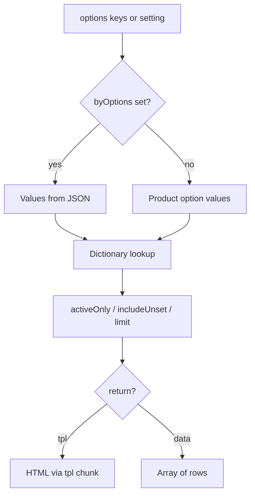

# ms3OptionsColor

The snippet reads product option values (or ready JSON), matches them to the color dictionary, and returns HTML via a chunk or an array of rows.

Place it on the product page, in a catalog row chunk, or in a cart chunk. Prefer an uncached call: `[[!ms3OptionsColor]]` / `{'!ms3OptionsColor' | snippet}`.

On each run the snippet may register storefront CSS when `ms3optionscolor_frontend_css` is enabled.

## How rows are selected



1. Option keys come from the `options` parameter or `ms3optionscolor_default_option_key`.
2. When `byOptions` is set, values come from JSON. Product options are not read from the database.
3. Otherwise values are read for product `product` (current resource by default).
4. Each value is looked up in the dictionary. With `includeUnset=1`, values without a dictionary entry still appear (empty swatch).
5. With `activeOnly=1`, inactive dictionary entries are hidden.
6. `limit` trims the list from the top.
7. With `return=tpl` each row renders through chunk `tpl`. With `return=data` you get an array.

## Parameters

| Parameter | Default | Description |
| --- | --- | --- |
| `product` | current resource id | miniShop3 product ID. `0` or empty: current resource |
| `options` | from setting / `color` | Option keys comma-separated, e.g. `color` or `color,material` |
| `byOptions` | - | JSON of option values. When set, the product is not read from the database |
| `tpl` | `tplMs3OptionsColor` | Row chunk: Elements name or `@FILE path/to/file.tpl` |
| `return` | `tpl` | `tpl` — HTML, `data` — array of rows |
| `activeOnly` | `1` | Only active dictionary entries |
| `includeUnset` | auto | Include values without a dictionary entry. Default `1` with `byOptions`, otherwise `0` |
| `limit` | `0` | Max rows. `0` — no limit |
| `selectedValue` | - | Set field `selected` on the row with this `value` (handy for `<option>`) |
| `toPlaceholder` | - | Placeholder name. The snippet prints nothing to output |

The alias `selected` for `selectedValue` is also accepted.

## Row fields

Each row (in the chunk and in `return=data`) includes:

| Field | Description |
| --- | --- |
| `option_key` | Option key |
| `value` | Option value (as in miniShop3) |
| `color` | HEX **without** `#` |
| `pattern` | Pattern / background URL |
| `ral` | RAL code |
| `title` | Label (if empty, chunks often use `value`) |
| `description` | Description |
| `image` | Image |
| `active` | Whether the dictionary entry is active |
| `status` | `active` / `inactive` / `unset` |
| `selected` | `true` when `value` matches `selectedValue` |

In CSS and select use `#{$color}` or `data-color="#{$color}"`: the field holds the code without `#`.

## Examples

### Product page

::: code-group

```fenom
{'!ms3OptionsColor' | snippet : [
  'product' => $_modx->resource.id,
  'options' => 'color',
  'tpl' => 'tplMs3OptionsColor'
]}
```

```modx
[[!ms3OptionsColor?
  &product=`[[*id]]`
  &options=`color`
  &tpl=`tplMs3OptionsColor`
]]
```

:::

Without `&options` the snippet uses keys from `ms3optionscolor_default_option_key`.

### Multiple option keys

::: code-group

```fenom
{'!ms3OptionsColor' | snippet : [
  'product' => $_modx->resource.id,
  'options' => 'color,material',
  'tpl' => 'tplMs3OptionsColor'
]}
```

```modx
[[!ms3OptionsColor?
  &product=`[[*id]]`
  &options=`color,material`
  &tpl=`tplMs3OptionsColor`
]]
```

:::

### Catalog row

In the `msProducts` row chunk pass the line product ID and a short list:

::: code-group

```fenom
{'!ms3OptionsColor' | snippet : [
  'product' => $id,
  'options' => 'color',
  'tpl' => 'tplMs3OptionsColor',
  'limit' => 6
]}
```

```modx
[[!ms3OptionsColor?
  &product=`[[+id]]`
  &options=`color`
  &tpl=`tplMs3OptionsColor`
  &limit=`6`
]]
```

:::

### Show values without a dictionary color

An empty swatch (checkerboard in stock CSS) helps while the manager has not assigned HEX yet:

::: code-group

```fenom
{'!ms3OptionsColor' | snippet : [
  'product' => $_modx->resource.id,
  'options' => 'color',
  'includeUnset' => 1,
  'tpl' => 'tplMs3OptionsColor'
]}
```

```modx
[[!ms3OptionsColor?
  &product=`[[*id]]`
  &options=`color`
  &includeUnset=`1`
  &tpl=`tplMs3OptionsColor`
]]
```

:::

### Hide inactive rows and limit the list

::: code-group

```fenom
{'!ms3OptionsColor' | snippet : [
  'product' => $_modx->resource.id,
  'options' => 'color',
  'activeOnly' => 1,
  'limit' => 4,
  'tpl' => 'tplMs3OptionsColor'
]}
```

```modx
[[!ms3OptionsColor?
  &product=`[[*id]]`
  &options=`color`
  &activeOnly=`1`
  &limit=`4`
  &tpl=`tplMs3OptionsColor`
]]
```

:::

### To a placeholder

::: code-group

```fenom
{'!ms3OptionsColor' | snippet : [
  'product' => $_modx->resource.id,
  'options' => 'color',
  'toPlaceholder' => 'ms3oc.swatches'
]}
<div class="product-colors">
  {$_modx->getPlaceholder('ms3oc.swatches')}
</div>
```

```modx
[[!ms3OptionsColor?
  &product=`[[*id]]`
  &options=`color`
  &toPlaceholder=`ms3oc.swatches`
]]
<div class="product-colors">
  [[+ms3oc.swatches]]
</div>
```

:::

### return=data (custom loop)

::: code-group

```fenom
{set $rows = $_modx->runSnippet('!ms3OptionsColor', [
  'product' => $_modx->resource.id,
  'options' => 'color',
  'return' => 'data'
])}
<ul>
{foreach $rows as $row}
  <li>
    <span style="background:#{$row.color}"></span>
    {$row.title ?: $row.value}
    {if $row.ral} (RAL {$row.ral}){/if}
  </li>
{/foreach}
</ul>
```

```modx
[[!ms3OptionsColor?
  &product=`[[*id]]`
  &options=`color`
  &return=`data`
  &toPlaceholder=`ms3oc.rows`
]]
```

:::

In MODX tags it is easier to send the array to a placeholder and parse it with your own snippet or Fenom chunk. In Fenom a loop over `runSnippet` output is simpler.

### byOptions: cart and ready JSON

When values already exist (cart line, custom JSON), do not read product options from the database:

::: code-group

```fenom
{set $colors = $_modx->runSnippet('!ms3OptionsColor', [
  'product' => $product.id,
  'byOptions' => json_encode($product.options),
  'return' => 'data',
  'includeUnset' => 1
])}
{foreach $colors as $row}
  {if $row.option_key == 'color'}
    <span data-ms3oc-swatch
          style="{if $row.color}background:#{$row.color}{/if}"></span>
    {$row.value}
  {/if}
{/foreach}
```

```modx
[[!ms3OptionsColor?
  &product=`[[+id]]`
  &byOptions=`{"color":["Синий","Чёрный"]}`
  &return=`data`
  &includeUnset=`1`
]]
```

:::

`byOptions` is a JSON string. In a cart chunk Fenom is easier. Ready cart branch example: chunk `tplMs3OptionsColorCart` on [Frontend](/components/ms3optionscolor/frontend#cart).

### Select with a preselected value

Chunk `tplMs3OptionsColorSelect` calls the snippet itself. Direct option chunk call:

::: code-group

```fenom
<select name="options[color]" data-ms3oc-select data-ms3oc-native="1">
  <option value="">Выберите цвет</option>
  {'!ms3OptionsColor' | snippet : [
    'product' => $_modx->resource.id,
    'options' => 'color',
    'tpl' => 'tplMs3OptionsColorSelectOption',
    'selectedValue' => 'Синий',
    'includeUnset' => 1
  ]}
</select>
```

```modx
<select name="options[color]" data-ms3oc-select data-ms3oc-native="1">
  <option value="">Выберите цвет</option>
  [[!ms3OptionsColor?
    &product=`[[*id]]`
    &options=`color`
    &tpl=`tplMs3OptionsColorSelectOption`
    &selectedValue=`Синий`
    &includeUnset=`1`
  ]]
</select>
```

:::

Ready select with label:

::: code-group

```fenom
<script src="{'assets_url' | option}components/ms3optionscolor/js/web/select.js"></script>
{$_modx->getChunk('tplMs3OptionsColorSelect', [
  'product' => $_modx->resource.id,
  'option_key' => 'color',
  'caption' => 'Цвет',
  'placeholder' => 'Выберите цвет',
  'selectedValue' => 'Синий',
  'native' => 1
])}
```

```modx
<script src="[[++assets_url]]components/ms3optionscolor/js/web/select.js"></script>
[[$tplMs3OptionsColorSelect?
  &product=`[[*id]]`
  &option_key=`color`
  &caption=`Цвет`
  &placeholder=`Выберите цвет`
  &selectedValue=`Синий`
  &native=`1`
]]
```

:::

Select chunk parameters: `product`, `option_key`, `caption`, `placeholder`, `native`, `selected` / `selectedValue`, `activeOnly`, `includeUnset`, `multiple`, `required`, `field_id`, `tpl` / `optionTpl`.

### Custom chunk via @FILE

Path is relative to `pdotools_elements_path` (usually `core/elements/`):

::: code-group

```fenom
{'!ms3OptionsColor' | snippet : [
  'product' => $_modx->resource.id,
  'options' => 'color',
  'tpl' => '@FILE chunk/ms3OptionsColor/tpl.option_row.tpl'
]}
```

```modx
[[!ms3OptionsColor?
  &product=`[[*id]]`
  &options=`color`
  &tpl=`@FILE chunk/ms3OptionsColor/tpl.option_row.tpl`
]]
```

:::

Dots and `_` are allowed in the file name. Segment `..` is rejected. Minimum row markup: [custom swatch chunk](/components/ms3optionscolor/frontend#custom-swatch-chunk).

## Common issues

| Symptom | What to check |
| --- | --- |
| Empty output | Product has option values; key matches `options` / setting |
| No color squares | Dictionary entry and CSS (`ms3optionscolor_frontend_css`) |
| No options in select | Chunk `tpl` must be `tplMs3OptionsColorSelectOption` or your own with `<option>` |
| `byOptions` returns nothing | JSON is valid; keys match options; try `includeUnset=1` |

Next: [Frontend](/components/ms3optionscolor/frontend), [mFilter](/components/ms3optionscolor/mfilter), [ms3variants](/components/ms3optionscolor/ms3variants). Chunk overview: [Snippets](index).
