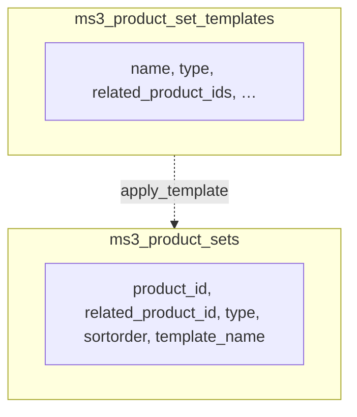
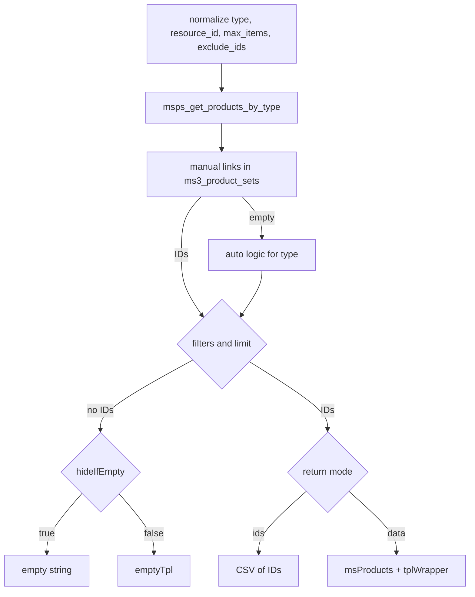
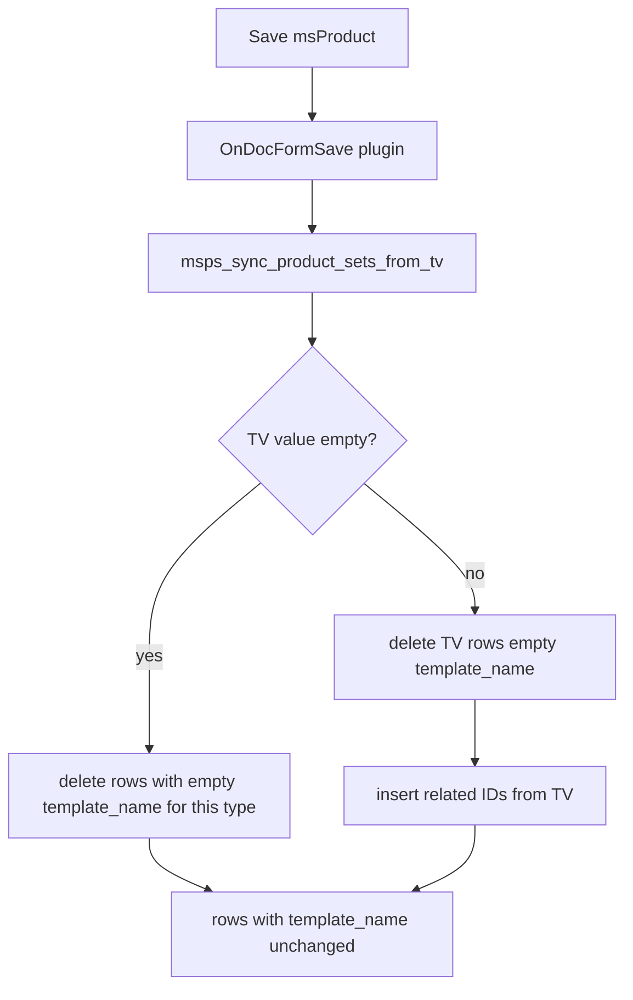

# ms3ProductSets architecture

Related: [Flows](/en/components/ms3productsets/flows), [API](/en/components/ms3productsets/api), [Set types](/en/components/ms3productsets/types).

## Component overview

- **Output snippet:** `ms3ProductSets`. Builds an ID list for the set type and renders via `msProducts`.
- **Lexicon/config snippet:** `mspsLexiconScript`. Exposes `window.mspsLexicon` and `window.mspsConfig`.
- **Connector:** `assets/components/ms3productsets/connector.php`. Single entry for frontend and manager actions.
- **Helpers:** `core/components/ms3productsets/include/helpers.php`. Shared logic for sets, templates and utilities.
- **Plugins:**
  - `OnDocFormSave`: sync TVs into the link table
  - `OnResourceDelete`: clean links for the deleted resource
- **Manager UI:** Vue app in `assets/components/ms3productsets/js/mgr/`.

## Database tables

Templates for bulk apply and output rows (logical link: `template_name` on rows matches the template name):

### `ms3_product_sets`

Links used to output sets.

- `product_id`: product whose card shows the set
- `related_product_id`: recommended product
- `type`: set type
- `sortorder`: order
- `template_name`: template name when the link came from bulk apply
- `discount`: present in the schema; helpers never read or write it
- unique key: (`product_id`, `related_product_id`, `type`)

### `ms3_product_set_templates`

Templates for bulk apply to categories.

- `name`
- `type`
- `related_product_ids` (comma-separated IDs)
- `sortorder`
- `description` (added by upgrade resolver)

## Selection algorithm (high level)

1. Normalize parameters (`type`, `resource_id`, `max_items`, `exclude_ids`, chunks).
2. Call `msps_get_products_by_type(...)`:
   - first manual set from `ms3_product_sets` (published, not deleted `msProduct` only)
   - if empty: auto logic for the type
3. If no IDs:
   - `hideIfEmpty=true` → `''`
   - else output `emptyTpl`
4. If `return=ids` → return CSV of IDs.
5. Else output via `msProducts` + optional `tplWrapper`.

## Per-type logic

- `vip`: manual `type=vip`. Fallback to `ms3productsets.vip_set_{set_id}`.
- `auto_sales`: SQL on `ms3_order_product + ms3_order` (statuses `2,4,5`). Fallback to `similar`.
- `similar`: products in the same category (`parent`), excluding current/`exclude_ids`.
- `buy_together`, `also-bought`, `cross-sell`: `msps_get_auto_sales`, then `msps_get_auto_recommendations`.
- `cart_suggestion`: auto by category via `msps_get_auto_recommendations`.
- `popcorn`: auto by category. If empty, fallback to random catalog products.
- `auto`, `custom`: auto by category.

## TV -> table data flow

1. Manager fills set TVs (`ms3productsets_*`) on the product.
2. `OnDocFormSave` checks those TVs exist on the resource template.
3. `msps_sync_product_sets_from_tv`:
   - TV **has a value:** removes only rows with empty `template_name` (TV rows), then inserts new IDs from the TV. Template-based links stay.
   - TV is **empty:** removes only rows **without** `template_name`. Links created by bulk category templates are kept.

## Bulk template apply flow

1. Manager UI calls `apply_template`.
2. Categories expand recursively down to products (`msProduct`).
3. Template is read from `ms3_product_set_templates`.
4. Rows are inserted into `ms3_product_sets` with `template_name`.
5. With `replace=true`, only links of this `type` **and** this `template_name` are removed first. Other templates and TV rows stay.
