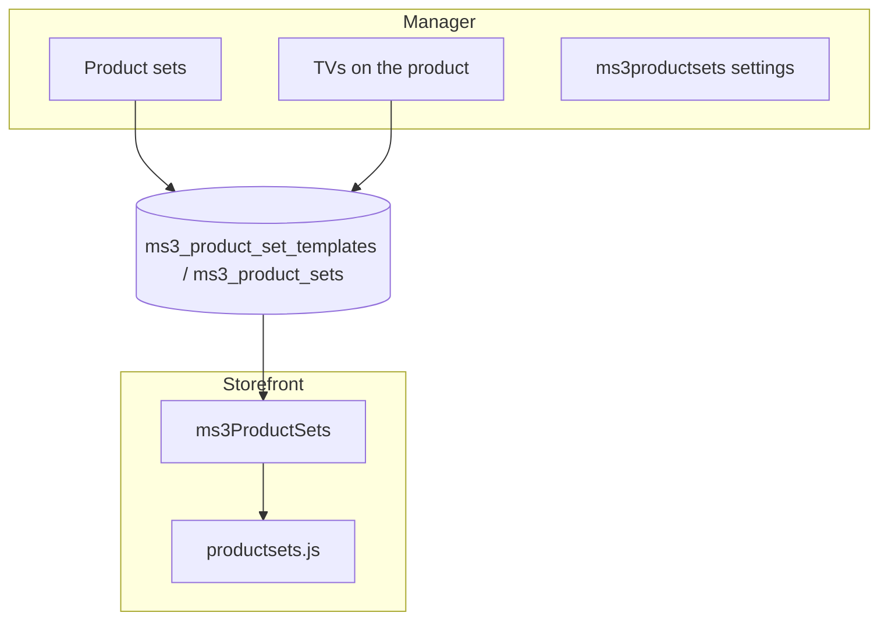

# Manager scenarios

Step-by-step actions in **Components → Product sets**.

## Map

---

## Flow A: First template

1. Open **Components → Product sets** (tab **Set list**).
2. Click **New set**.
3. Fill in **Name**, **Type**, and pick products in **Product IDs**.
4. Click **Save**.

Details: [Manager guide](../admin).

---

## Flow B: Edit a template

1. In the **Set list** table, click **Edit** on a row.
2. Update the name, type, or product list.
3. Save.

Renaming a template or changing its type updates `template_name` and `type` on rows already applied. Product IDs are left as they are. To replace products, run **Apply** again with **Replace existing sets of this template**.

---

## Flow C: Apply to a category

1. Open the **Apply** tab.
2. Select a template.
3. Set **Category ID (parent)** in the tree.
4. Optionally enable **Replace existing sets of this template**.
5. Click **Apply**.

The toast shows how many links were created.

---

## Flow D: Unbind a template

1. Select the same template and category.
2. Click **Unbind**.

Only rows with matching `type` and `template_name` are removed. TVs and other templates stay.

---

## Flow E: Delete a template

1. In the table, click **Delete**.
2. Confirm in the dialog.

The template disappears from the list. Links with the same `template_name` and `type` are removed from `ms3_product_sets`.

---

## Flow F: TVs on the product card

1. Open an `msProduct` resource in the manager.
2. Fill the **ms3ProductSets** TVs (`ms3productsets_buy_together`, `similar`, `popcorn`, `cart_suggestion`, `vip`).
3. Save the resource.

Plugin **ms3ProductSets SyncTV** (`OnDocFormSave`) writes the values into `ms3_product_sets`.

---

## Flow G: Storefront output

1. Load `mspsLexiconScript`, CSS, and JS. See [integration](../integration).
2. Call `ms3ProductSets` with the needed `type` on the product card, in the cart, or on the home page.
3. For AJAX, use `window.ms3ProductSets.render()`.

Technical diagrams: [Flows](../flows), [API](../api).

---

## Flow H: Settings and auto mode

1. **Settings → System settings**, namespace **ms3productsets**.
2. Set `max_items`, `cache_lifetime`, `auto_recommendation`, `vip_set_1`.

With `auto_recommendation=0`, the storefront keeps only manual links and VIP sets from settings.
