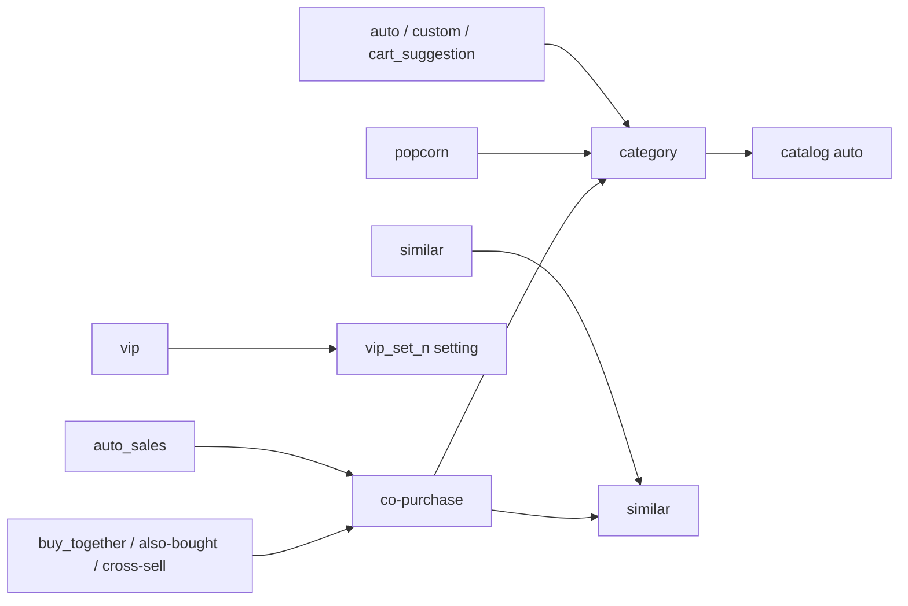

# ms3ProductSets set types

A set type chooses which manual links to read and which auto logic to run when those links are empty.

## Common rules (all types)

1. Manual links in `ms3_product_sets` for (`product_id`, `type`) are checked first. Unpublished and deleted IDs are dropped (`msps_filter_valid_product_ids`). One bad ID does not empty the block. `showUnpublished=true` will not bring those IDs back from the table.
2. If there are no manual links, auto logic for the type runs.
3. When the result is empty:
   - `hideIfEmpty=true` → empty string `''`
   - `hideIfEmpty=false` → `emptyTpl`
4. `max_items` is clamped to `1..100`.
5. If `return=ids`, the snippet returns only the ID list.

## Parameters that most often affect output

- `resource_id` / `productId`: base product
- `category_id`: forced category for auto modes
- `set_id`: VIP set number (`vip_set_{set_id}`)
- `exclude_ids`: IDs to exclude

## 1. `buy_together`

### For managers

“Frequently bought together” on the product card.

### For developers

Priority:

1. Manual links `type=buy_together`.
2. If empty: `msps_get_auto_sales` (co-purchase from orders).
3. If still empty: `msps_get_auto_recommendations` by product category/`category_id`.

::: code-group

```fenom
{'ms3ProductSets' | snippet : [
  'type' => 'buy_together',
  'resource_id' => $_modx->resource.id,
  'max_items' => 6,
  'tpl' => 'tplSetItem'
]}
```

```modx
[[!ms3ProductSets?
  &type=`buy_together`
  &resource_id=`[[*id]]`
  &max_items=`6`
  &tpl=`tplSetItem`
]]
```

:::

## 2. `similar`

### For managers

Alternatives from the same category.

### For developers

Priority:

1. Manual links `type=similar`.
2. If empty: `msps_get_similar_products`:
   - category (`parent`) of the current product
   - current product and `exclude_ids` excluded

::: code-group

```fenom
{'ms3ProductSets' | snippet : [
  'type' => 'similar',
  'resource_id' => $_modx->resource.id,
  'exclude_ids' => $_modx->resource.id,
  'max_items' => 8,
  'tpl' => 'tplSetItem'
]}
```

```modx
[[!ms3ProductSets?
  &type=`similar`
  &resource_id=`[[*id]]`
  &exclude_ids=`[[*id]]`
  &max_items=`8`
  &tpl=`tplSetItem`
]]
```

:::

## 3. `popcorn`

### For managers

Compact impulse / add-on block.

### For developers

Priority:

1. Manual links `type=popcorn`.
2. If empty: auto by current product category.
3. If still empty: random catalog products (`resource_id=0`, then shuffle).

::: code-group

```fenom
{'ms3ProductSets' | snippet : [
  'type' => 'popcorn',
  'resource_id' => $_modx->resource.id,
  'max_items' => 4,
  'tpl' => 'tplPopcorn'
]}
```

```modx
[[!ms3ProductSets?
  &type=`popcorn`
  &resource_id=`[[*id]]`
  &max_items=`4`
  &tpl=`tplPopcorn`
]]
```

:::

## 4. `cart_suggestion`

### For managers

Suggestions in the cart or before checkout.

### For developers

Priority:

1. Manual links `type=cart_suggestion`.
2. If empty: auto by `category_id` or `resource_id` category.

::: code-group

```fenom
{'ms3ProductSets' | snippet : [
  'type' => 'cart_suggestion',
  'category_id' => 5,
  'resource_id' => 0,
  'max_items' => 6,
  'tpl' => 'tplSetItem'
]}
```

```modx
[[!ms3ProductSets?
  &type=`cart_suggestion`
  &category_id=`5`
  &resource_id=`0`
  &max_items=`6`
  &tpl=`tplSetItem`
]]
```

:::

## 5. `auto_sales`

### For managers

Recommendations from real orders (“often bought together”).

### For developers

Priority:

1. Manual links `type=auto_sales`.
2. If empty: SQL on orders (`ms3_order_product` + `ms3_order`, statuses `2,4,5`).
3. If no stats: fallback to `similar`.

::: code-group

```fenom
{'ms3ProductSets' | snippet : [
  'type' => 'auto_sales',
  'resource_id' => $_modx->resource.id,
  'max_items' => 6,
  'tpl' => 'tplSetItem'
]}
```

```modx
[[!ms3ProductSets?
  &type=`auto_sales`
  &resource_id=`[[*id]]`
  &max_items=`6`
  &tpl=`tplSetItem`
]]
```

:::

## 6. `vip`

### For managers

Manual promo sets and campaign blocks.

### For developers

Priority:

1. Manual links `type=vip`.
2. If empty: `ms3productsets.vip_set_{set_id}`.

If `set_id` is missing or less than 1, `set_id=1` is used.

::: code-group

```fenom
{'ms3ProductSets' | snippet : [
  'type' => 'vip',
  'set_id' => 1,
  'max_items' => 8,
  'tpl' => 'tplSetVIP'
]}
```

```modx
[[!ms3ProductSets?
  &type=`vip`
  &set_id=`1`
  &max_items=`8`
  &tpl=`tplSetVIP`
]]
```

:::

## 7. `auto`

### For managers

General recommendations for home, categories and landings.

### For developers

Priority:

1. Manual links `type=auto`.
2. If empty: `msps_get_auto_recommendations`:
   - by product category (`resource_id`)
   - or by given `category_id`

::: code-group

```fenom
{'ms3ProductSets' | snippet : [
  'type' => 'auto',
  'category_id' => 5,
  'resource_id' => 0,
  'max_items' => 12,
  'tpl' => 'tplSetItem'
]}
```

```modx
[[!ms3ProductSets?
  &type=`auto`
  &category_id=`5`
  &resource_id=`0`
  &max_items=`12`
  &tpl=`tplSetItem`
]]
```

:::

## 8. Synonyms

- `also-bought` and `cross-sell` use the same auto path as `buy_together` (co-purchase, then category).
- `custom` is handled as `auto`.

## 9. Fallback matrix

Auto chains when manual links are empty:



| Type | When there are no manual links |
| --- | --- |
| `buy_together` / `also-bought` / `cross-sell` | co-purchase (`msps_get_auto_sales`) → category |
| `similar` | similar by category |
| `popcorn` | auto by category → random catalog (`resource_id=0`) |
| `cart_suggestion` | auto by category/`category_id` |
| `auto_sales` | order stats → fallback to `similar` |
| `vip` | system setting `vip_set_{set_id}` |
| `auto` | auto by category/catalog |

## 10. Practical tips

1. For large catalogs start with `auto`/`similar` and add manual links only for key SKUs.
2. For promos and seasonal blocks, `vip` + system settings work well.
3. For `auto_sales` ensure enough orders exist, otherwise you will often fall back to `similar`.
4. For stable order use manual links or `sortby`. Auto modes are often random.
