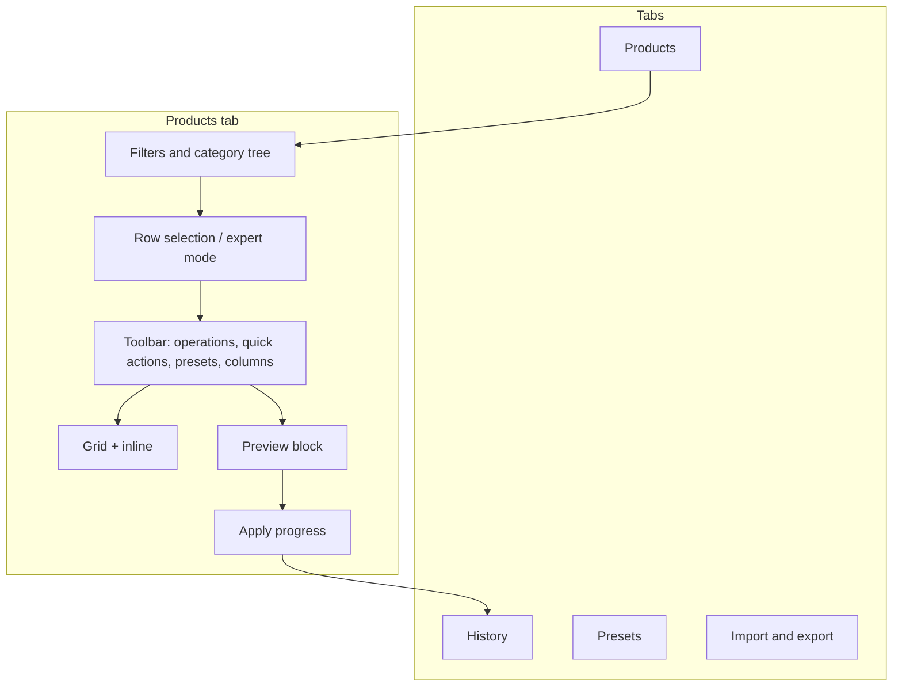
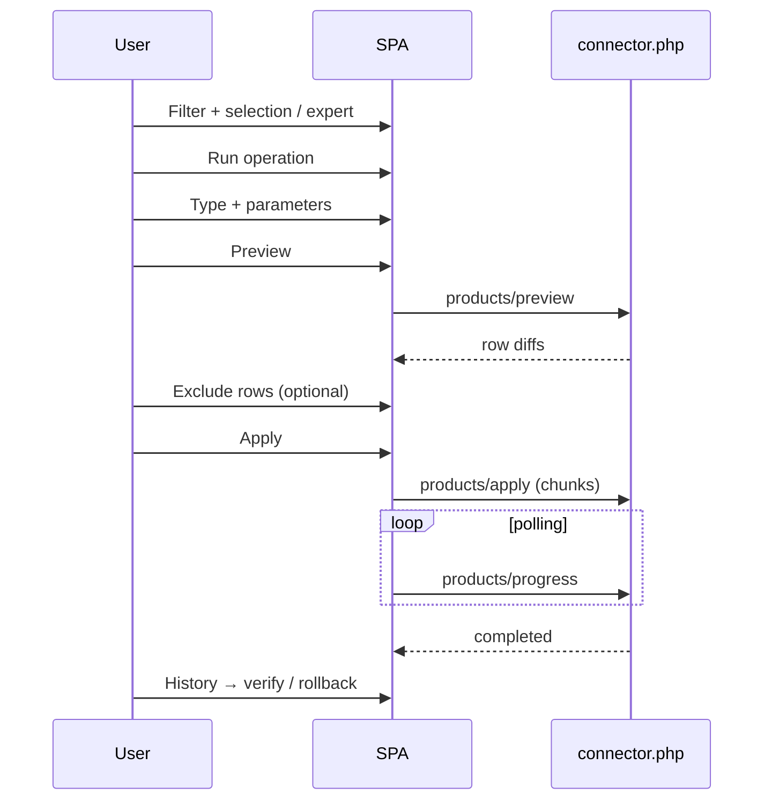
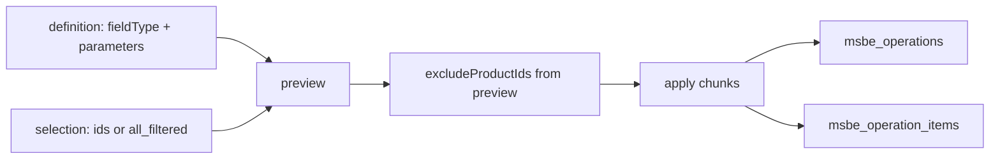

# User flows

Step-by-step guide to msBulkEditor: filtering, operations, rollback. Flows A–J. Screenshots are inline below.

---

## Application map

| Tab | Route | Permission | Main actions |
| --- | --- | --- | --- |
| Products | `#/products` | `msbulkeditor_view` | Filter, selection, operations, preview, apply, inline |
| History | `#/history` | `msbulkeditor_view` | Log, rollback, item detail |
| Presets | `#/presets` | `msbulkeditor_presets` | CRUD JSON operations |
| Import & export | `#/import-export` | `msbulkeditor_import_export` | CSV/XLSX export, import round-trip |

Tabs without permission are hidden. A direct URL without permission redirects to **Products**.

---

## Selection scope

Every bulk operation, export, or preset apply needs a **selection scope**.

| Mode | How to enable | What is included |
| --- | --- | --- |
| **Selected rows** | Row checkboxes (or header checkbox for current page) | `selectedIds` only |
| **All matching filter** | **Expert mode** toggle + active filters | All IDs matching `filterSpec` (limit `msbulkeditor_expert_limit`, default 5000) |

KPI **Matching filter** and **Selected** show selection size. The label next to expert mode explains the apply scope.

**Toolbar lock:** without selected rows and without expert mode, **Run operation**, **Quick actions**, and **Presets** menu are disabled.

In expert mode the `⋯` column offers **Select only this row** (crosshair) — `selectedIds = [id]` without turning expert off. Details: [products grid](products-grid#actions-column-expert-mode-only).

---

## Flow A — Bulk operation (full cycle)

Use for price, stock, TV, options, and other types from **Run operation**.

### Steps

1. **Products** → set [filters](products-grid#search-and-filters) and/or category tree.
2. Select rows **or** enable **expert mode** and check “Matching filter: N”.
3. **Run operation** → pick type in **Operation type** (see [type table](#fieldtype-reference)).
4. Fill the form (fields depend on type).
5. **Preview** — diff table appears below the grid.
6. Uncheck rows if needed ([preview](preview-and-apply)).
7. **Apply** — progress shows “X of Y”.
8. **History** — verify; on error use **Rollback**.

Details: [preview](preview-and-apply).

---

## Flow B — Quick actions

Shortcut for frequent operations without picking type in the Select.

1. Selection (rows or expert).
2. **Quick actions** (lightning icon).
3. Menu item → dialog with **locked** operation type.
4. Parameters → **Preview** → **Apply**.

| Menu item | `fieldType` |
| --- | --- |
| Change template | `template` |
| Change parent | `category` (`change_parent`) |
| Change vendor | `vendor` |
| Set text | `text_set` |
| Regenerate gallery previews | `gallery_regenerate` |
| Clear resource cache | `resource_utility` (`clear_cache`) |
| Regenerate URI | `resource_utility` (`regenerate_uri`) |
| Soft delete | `soft_delete` |
| Change file source | `source` |
| Change content type | `content_type` |
| Assign resource group | `resource_group` |
| Change dates | `dates` |
| Change user | `user` |

Details: [quick actions](quick-actions).

---

## Flow C — Preset

1. On **Products**, build an operation and verify preview **or** write JSON manually.
2. **Presets** → name + JSON → **Save**.
3. Rename: load preset → new name → **Save** (old name is removed).
4. To run again:
   - **Presets** → **Apply** on the row, **or**
   - **Products** → **Presets** toolbar menu → click name.

Details: [presets](presets).

---

## Flow D — Inline edit (single cell)

No bulk operation dialog.

1. Click cell (`pagetitle`, `price`, `stock`, `published`, `article`, `weight`, text TV, scalar option).
2. **Image TV** — double-click → MODX media browser.
3. Enter / blur / toggle → save via preview/apply pipeline for **one ID**.

Details: [inline editing](inline-editing).

---

## Flow E — Column settings

1. **Products** → **Table settings** (columns icon).
2. Move columns between Available and Visible; reorder with arrows or drag.
3. Width — in dialog or by dragging column header border.
4. **Save** — persisted in `ui/state` (per MODX user).
5. **Restore** — browser localStorage snapshot, not factory defaults.

Details: [columns](column-settings).

---

## Flow F — Catalog filtering

1. **Search**, **category**, **published** → **Apply filters**.
2. **More filters** — template, vendor, additional category, image, MS3 labels, deleted, duplicate URI.
3. Category tree syncs with **Category** filter.
4. **Reset** — defaults.

Details: [products grid](products-grid).

---

## Flow G — Export

1. On **Products** — filter + selection (rows or expert).
2. **Import & export** → **Export** block.
3. CSV/XLSX, column list → **Run export** (file download).

Details: [import and export](import-export).

---

## Flow H — Import (round-trip)

1. Export → edit in Excel (`price`, `count`, etc.).
2. **Import & export** → **Choose file** → parse (then **Replace file** if needed).
3. Column mapping → **Import preview** → **Apply import**.
4. Optionally **Clear preview**.

Alternative: JSON + mapping in **Advanced** block — [import and export](import-export).

---

## Flow I — History and rollback

### Full rollback

1. **History** → row with **Completed** status.
2. **Rollback** → confirm → restore `old` values from `msbe_operation_items`.

### Partial rollback

1. **Changes** on the operation row.
2. Select items with status `applied`.
3. **Rollback selected**.
4. Click the **ID** in the panel to copy it (toast).

### Bulk rollback

Select multiple completed operations → checkboxes → **Rollback selected**.

Details: [history](history). Requires `msbulkeditor_rollback`.

---

## Flow J — TV / option binding wizard

Before preview on **TV** or **Option** operations:

1. Fill TV name or option key → **Preview**.
2. If bindings are missing, the wizard dialog opens.
3. Review templates/categories without links.
4. For mixed templates — optionally enable “primary scope only”.
5. **Apply and continue** → `bindings/apply` → preview.
6. **Cancel** — operation stops.

Details: [binding wizard](binding-wizard).

---

## `fieldType` reference

Types in **Run operation** (Operation type Select):

| UI (EN) | `fieldType` | Document |
| --- | --- | --- |
| Price | `price` | [product and prices](product-and-prices) |
| Stock | `stock` | [product and prices](product-and-prices) |
| Boolean toggle | `boolean_toggle` | [resource fields](resource-fields) |
| Categories | `category` | [product and prices](product-and-prices) |
| Option | `option` | [options](options) |
| TV parameter | `tv` | [TVs](tv-parameters) |
| Vendor | `vendor` | [product and prices](product-and-prices) |
| Template | `template` | [quick actions](quick-actions) |
| File source | `source` | [quick actions](quick-actions) |
| Content type | `content_type` | [quick actions](quick-actions) |
| User | `user` | [quick actions](quick-actions) |
| Text field | `text_set` | [product and prices](product-and-prices) |
| Text replace | `text_replace` | [resource fields](resource-fields) |
| SEO | `seo` | [resource fields](resource-fields) |
| Product link | `link` | [resource fields](resource-fields) |
| Dates | `dates` | [resource fields](resource-fields) |
| Resource group | `resource_group` | [resource fields](resource-fields) |
| Variant (ms3Variants) | `variant` | [product and prices](product-and-prices) |

**Quick actions only** (not in main Select): `gallery_regenerate`, `resource_utility`, `soft_delete`.

### Dialog screenshots

| Type | Screenshot |
| --- | --- |
| Price |  |
| Price (transfer) |  |
| Stock |  |
| Boolean |  |
| Categories |  |
| Categories (remove_all) |  |
| Option |  |
| Option (tags) |  |
| TV |  |
| Vendor |  |
| Template |  |
| File source |  |
| Content type |  |
| User |  |
| Resource group |  |
| Text field |  |
| Dates |  |
| Text replace |  |
| SEO |  |
| Product links |  |
| Variant |  |
| TV preview |  |
| Option preview |  |
| Category tree |  |

---

## Typical business scenarios

### −10% discount on a category

1. Category tree → branch → **Include subcategories**.
2. Expert mode → check matching filter count.
3. **Run operation** → **Price** → **Percent**, “−”, `10`, rounding.
4. Optionally **Copy current price to old_price**.
5. Preview → apply.

### Bulk template change

1. Filter by old template (more filters).
2. Expert or page selection.
3. **Quick actions** → **Change template** → new ID → preview → apply.

### Stock update from Excel

1. Export `id,stock` (or `id,count`).
2. Edit in Excel → import → target field Stock → mapping → preview → apply.

### Undo a bad promotion

1. **History** → operation → **Rollback** or **Changes** → partial rollback.

### Weekly repeatable operation

1. Save a **preset** once.
2. Next time: filter → selection → **Apply** preset.

---

## Permissions and limits

| Permission | Actions |
| --- | --- |
| `msbulkeditor_view` | Grid, preview, history read |
| `msbulkeditor_edit` | Apply, inline, import apply |
| `msbulkeditor_rollback` | Rollback |
| `msbulkeditor_presets` | Preset CRUD |
| `msbulkeditor_import_export` | File import/export |

System settings: `msbulkeditor_expert_limit`, `msbulkeditor_preview_detail_limit`, `msbulkeditor_chunk_size`, `msbulkeditor_import_max_rows` — [System settings](../settings).

---

## Operation data shape

---

## See also

- [Interface overview](./)
- [Quick start](../quick-start)
- [Features](../features)
- [Binding wizard](binding-wizard)
- [Resource fields](resource-fields)
