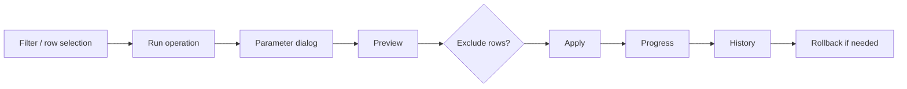

# Interface

msBulkEditor opens in the MODX manager as a Vue 3 (VueTools) app. Tabs in the top navigation:

| Tab | Route | Tab permission | Purpose |
| --- | --- | --- | --- |
| **Products** | `/products` | `msbulkeditor_view` (`canView`) | Grid, filters, operations, preview |
| **History** | `/history` | `msbulkeditor_view` | Operation log, rollback |
| **Presets** | `/presets` | `msbulkeditor_presets` (`canManagePresets`) | Saved operations |
| **Import & export** | `/import-export` | `msbulkeditor_import_export` (`canImportExport`) | CSV/XLSX |

Tabs without permission are **hidden**. A direct visit to `/presets` or `/import-export` without permission redirects to **Products**.

**Flow reference (A–J):** [flows](flows).

On first load and tab change a short skeleton screen is shown.

---

## Products tab — screen layout

Top to bottom:

1. **KPI** — “Matching filter”, “Selected”, expert scope label.
2. **Toolbar** — search, filters, quick actions, presets, table settings, run operation.
3. **Product table** — checkboxes, columns, inline cells.
4. **Preview** (after preview) — summary, diff table, Apply / Cancel.
5. **Progress** (during apply) — X of Y.

→ [products grid](products-grid)

---

## Documentation sections

| Section | Document |
| --- | --- |
| **All flows (A–J)** | [flows](flows) |
| TV/option binding wizard | [binding wizard](binding-wizard) |
| Boolean, SEO, replace, dates, links | [resource fields](resource-fields) |
| Quick actions | [quick actions](quick-actions) |
| Product & prices | [product and prices](product-and-prices) |
| MiniShop3 options | [options](options) |
| TV parameters | [TVs](tv-parameters) |
| Column settings | [columns](column-settings) |
| Inline editing | [inline editing](inline-editing) |
| History & rollback | [history](history) |
| Preview and apply | [preview](preview-and-apply) |
| Presets | [presets](presets) |
| Import / export | [import and export](import-export) |

---

## Bulk operation workflow

1. Select products **or** enable expert mode and configure filters.
2. **Run operation** (or a quick action / preset).
3. Fill the form → **Preview**.
4. Optionally uncheck preview rows.
5. **Apply** → wait for progress.
6. Check the result in **History**; on error — **Rollback**.

Step-by-step: [flows](flows).

---

## Navigation

- [← Features](../features)
- [User flows →](flows)
- [Products grid →](products-grid)
