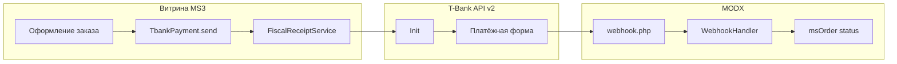

<!-- TODO: translate from docs/components/msptbank/index.md -->


# mspTBank

**mspTBank** подключает [T-Bank](https://developer.tbank.ru/) (эквайринг API v2) к [MiniShop3](/components/minishop3/) в MODX Revolution 3.x: создание платежа **Init**, редирект на форму банка, **webhook** с проверкой подписи **Token**, чеки 54-ФЗ через **Receipt** и обновление статуса заказа.

Пространство имён настроек: **`msptbank`**. Точка входа уведомлений: `assets/components/msptbank/webhook.php`.

С чего начать: [Быстрый старт](quick-start).

## Возможности

- **Redirect-оплата**: `TbankPayment::send()` вызывает Init и возвращает `PaymentURL`.
- **Webhook**: POST на `webhook.php`, проверка Token, сверка суммы, идемпотентное обновление статуса.
- **Одностадийная схема**: по умолчанию списание после успешной оплаты (`CONFIRMED`).
- **Двухстадийная схема**: настройка `msptbank_two_stage`, `PayType = T`, auto-**Confirm** после `AUTHORIZED`.
- **Чеки 54-ФЗ**: `Receipt` в Init, Confirm и Refund при включённом `msptbank_send_receipt`.
- **Возврат**: processor `refund` (API Refund), опционально смена статуса через `msptbank_status_refunded`.
- **Тестовый контур**: `msptbank_test_mode` переключает API на `rest-api-test.tinkoff.ru/v2`.
- **Отладка**: `msptbank_debug` пишет запросы/ответы в лог MODX без пароля терминала.

Для чеков нужна онлайн-касса в терминале T-Bank и Email или Phone в заказе. Если контактов нет, компонент пишет warning и отправляет платёж без `Receipt`, чтобы не блокировать покупателя.

## Системные требования

| Требование | Версия |
| --- | --- |
| MODX Revolution | 3.0+ |
| PHP | 8.2+ (расширения `json`, `curl`) |
| MiniShop3 | 1.0+ |
| pdoTools | 3.0+ (рекомендуется для Fenom) |

### Зависимости

- [MiniShop3](/components/minishop3/): заказы, способы оплаты, статусы (`ms3_status_paid`, `ms3_status_canceled` и др.).

## Регистрация в T-Bank

Подключите интернет-эквайринг в личном кабинете [Т-Бизнес](https://www.tbank.ru/business/). Создайте магазин и терминал, скопируйте:

- **TerminalKey** → [`msptbank_terminal_key`](settings)
- **Password** терминала → [`msptbank_password`](settings)

Оба значения по 20 символов, регистр важен. Password терминала храните как секрет. Не публикуйте его в git и тикетах.

Путь в кабинете (формулировки могут отличаться):

```text
Личный кабинет интернет-эквайринга → Магазины → нужный магазин → Терминалы → Настроить
```

Подробнее: [Быстрый старт, ключи](quick-start#шаг-2-ключи-терминала-в-modx).

## Установка

1. Установите **MiniShop3** и **pdoTools**.
2. Установите пакет **mspTBank** через **Управление пакетами**.
3. **Очистите кэш** MODX.
4. В **Системные настройки → `msptbank`** задайте [ключи терминала](settings).
5. Включите способ оплаты **TBank** в MiniShop3.

Резолвер создаёт способ оплаты с классом **`MspTBank\Payment\TbankPayment`**. Двухстадийность включается настройкой `msptbank_two_stage`, отдельного способа в MS3 нет.

Плагин **`msptbank_bootstrap`** на **`OnMODXInit`** подключает автозагрузку `MspTBank\`. Плагин должен быть включён.

## Быстрая настройка webhook

В параметрах терминала T-Bank укажите **Notification URL**:

```text
https://ваш-домен.ru/assets/components/msptbank/webhook.php
```

Компонент также передаёт `NotificationURL` в Init. Без доступного webhook заказ может остаться неоплаченным после успешной оплаты в банке.

## Архитектура



## Быстрые ссылки

| Нужно | Документ |
| --- | --- |
| Установить и принять первый платёж | [Быстрый старт](quick-start) |
| Все ключи `msptbank_*` | [Системные настройки](settings) |
| Webhook, чеки, двухстадийная, возврат | [Интеграция](integration) |
| Заказ не оплачен, тест | [FAQ](faq) |
| Оформление заказа MS3 | [MiniShop3: заказ](/components/minishop3/frontend/order) |

## Документация по разделам

- [Быстрый старт](quick-start): установка, ключи, Notification URL, тестовая карта.
- [Системные настройки](settings): таблицы настроек, чеки 54-ФЗ, связанные ключи MiniShop3.
- [Интеграция и сценарии](integration): API ↔ код, Receipt, поток оплаты, оплата после проверки менеджером, processor refund.
- [FAQ](faq): типовые ошибки и диагностика.

Лицензия пакета: GPLv2 и новее.
