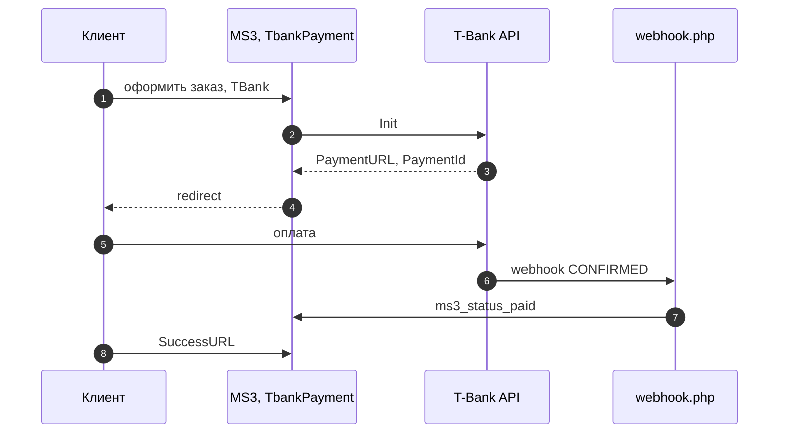
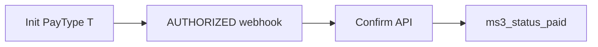
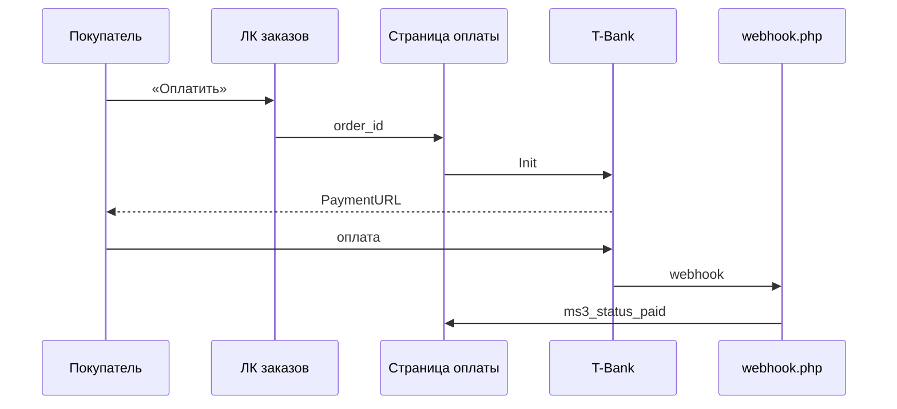

<!-- TODO: translate from docs/components/msptbank/integration.md -->


# Интеграция mspTBank

Нужны только шаги установки? Откройте [Быстрый старт](quick-start). Ниже сопоставлены методы [T-Bank API v2](https://developer.tbank.ru/eacq/api) и классы **mspTBank** для MiniShop3.

## API ↔ код

| Метод T-Bank | Класс / точка входа | Назначение |
| --- | --- | --- |
| **Init** | `ApiClient::init()`, `TbankPayment::send()`, `FiscalReceiptService` | Создание платежа, получение `PaymentURL`, передача `Receipt` |
| **GetState** | `ApiClient::getState()`, `TbankPayment::receive()` | Статус при возврате покупателя с `PaymentId` |
| **Confirm** | `ApiClient::confirm()`, `WebhookHandler`, `FiscalReceiptService` | Подтверждение двухстадийного платежа после `AUTHORIZED`, передача `Receipt` |
| **Cancel** | `ApiClient::cancel()` | Отмена (в публичных сценариях MS3 не вызывается автоматически) |
| **Refund** | `ApiClient::refund()`, `RefundProcessor`, `FiscalReceiptService` | Полный или частичный возврат, передача `Receipt` |
| Webhook (POST) | `webhook.php`, `WebhookHandler::handle()` | Уведомления банка, проверка Token, смена статуса заказа |
| Подпись Token | `Signature::generate()` / `verify()` | SHA256 по правилам T-Bank |

## Webhook {#webhook}

**URL на сайте:**

```text
https://ваш-домен.ru/assets/components/msptbank/webhook.php
```

Тот же путь компонент передаёт в Init как **NotificationURL**.

**Обработка:**

1. JSON-тело декодируется в массив.
2. `Signature::verify()` сверяет поле **Token** с Password терминала.
3. Заказ ищется по **OrderId** (сначала `msOrder.num`, затем числовой `id`).
4. **Amount** в копейках сравнивается с `order.cost * 100`.
5. Статус T-Bank мапится на статусы MS3.

| Статус T-Bank | Действие |
| --- | --- |
| `CONFIRMED`, `AUTHORIZED` | `status_id = ms3_status_paid`, в `properties` пишется `tbank_payment_id` |
| `AUTHORIZED` + `msptbank_two_stage` | дополнительно вызывается **Confirm** |
| `REJECTED` | `status_id = ms3_status_canceled` |
| `REFUNDED` | При `msptbank_status_refunded > 0` меняется статус заказа |
| `NEW`, `FORM_SHOWED` | без смены статуса (ожидание) |

Повторный webhook идемпотентен: если заказ уже оплачен, статус не дублируется.

Факт оплаты для магазина фиксируйте по **webhook**, а не только по возврату браузера на `SuccessURL`.

## Поток одностадийной оплаты

1. Покупатель оформляет заказ и выбирает **TBank**.
2. `TbankPayment::send()` вызывает **Init** без `PayType`.
3. MS3 возвращает фронтенду redirect на `PaymentURL`.
4. Покупатель платит в форме T-Bank.
5. Банк шлёт POST на `webhook.php` со статусом **`CONFIRMED`**.
6. `WebhookHandler` выставляет **`ms3_status_paid`**.



## Двухстадийная схема {#двухстадийная}

При **`msptbank_two_stage`** = «Да» в Init добавляется **`PayType = T`**.

1. После оплаты банк присылает **`AUTHORIZED`** (холд).
2. `WebhookHandler` вызывает **Confirm** с суммой из webhook.
3. Заказ переводится в **`ms3_status_paid`**.

Двухстадийность **не откладывает** показ платёжной формы. Покупатель всё равно уходит в T-Bank сразу после `send()`. Сценарий «сначала проверка менеджером» собирается отдельно (см. [ниже](#оплата-после-проверки-менеджером)).



## Чеки 54-ФЗ {#чеки-54-фз}

Если **`msptbank_send_receipt`** включён, компонент добавляет объект **Receipt** в запросы **Init**, **Confirm** и **Refund**. За сборку отвечает `FiscalReceiptService`: он получает параметры будущего API-запроса, заказ MiniShop3 и сценарий `ReceiptScenario`, затем добавляет `Receipt`.

Состав чека:

- товары заказа из `msOrder->getMany('Products')`
- доставка отдельной позицией, если `delivery_cost > 0`
- корректировка итоговой суммы, если сумма строк отличается от суммы операции
- Email или Phone покупателя из адреса заказа, затем из клиента MiniShop3
- `Taxation` из настройки `msptbank_taxation`
- ставка НДС по всем позициям из `msptbank_vat`.

Сценарии `PaymentMethod`:

| Сценарий | Где используется | PaymentMethod |
| --- | --- | --- |
| `PaymentInit` | Init | `full_payment`, при `msptbank_two_stage`: `full_prepayment` |
| `PaymentConfirm` | Confirm после `AUTHORIZED` | `full_payment` |
| `RefundFull` | полный Refund | `full_payment` |
| `RefundPartial` | частичный Refund | `full_payment`, одна агрегированная позиция возврата |

T-Bank требует Email или Phone. Если оба значения пустые или не проходят базовую проверку, компонент пишет warning и отправляет платёж без `Receipt`, чтобы не блокировать покупателя. Если онлайн-касса не подключена в терминале T-Bank, отключите `msptbank_send_receipt`.

Если сумма строк чека не может быть приведена к сумме платежа или возврата, компонент выбрасывает `TbankException` и запрос к T-Bank не отправляется.

## Ответ `send()` {#ответ-send}

Успешный `TbankPayment::send()` возвращает в `data`:

| Поле | Смысл |
| --- | --- |
| `redirect` | URL платёжной формы T-Bank |
| `payment_link` | То же значение (алиас для фронтенда) |
| `payment_id` | `PaymentId` из ответа Init |

Обёртка MiniShop3 при оформлении заказа может дополнительно отдавать `order_id`, `order_num`, `msorder`. Набор полей зависит от вашего чекаута MS3.

`tbank_payment_id` в `order.properties` появляется **после успешного webhook**, не в момент Init.

## `receive()` {#receive}

MiniShop3 вызывает `receive()` когда покупатель возвращается на сайт (SuccessURL / FailURL).

- Если в запросе нет **PaymentId**, метод возвращает успех без смены статуса. Источник истины: webhook.
- Если **PaymentId** есть, компонент вызывает **GetState** и при необходимости обновляет статус (fallback, если webhook задержался).

## Оплата после проверки менеджером {#оплата-после-проверки-менеджером}

Целевой сценарий:

1. Заказ создаётся **без** немедленного redirect в T-Bank.
2. Менеджер проверяет заказ и переводит в статус «к оплате».
3. В личном кабинете покупатель нажимает «Оплатить».
4. Отдельная страница один раз вызывает `send()` и делает redirect.

В пакет **сниппет не входит**. Ниже пример отдельного сниппета `mspTBankPayOrder` для страницы оплаты.

```php
<?php
declare(strict_types=1);

use MiniShop3\Model\msOrder;
use MiniShop3\Model\msPayment;
use MODX\Revolution\modX;
use MspTBank\Payment\TbankPayment;

/** @var modX $modx */

$orderId = (int)($scriptProperties['order_id'] ?? $_GET['order_id'] ?? 0);
if ($orderId < 1) {
    return '';
}

$order = $modx->getObject(msOrder::class, $orderId);
if (!$order) {
    return '';
}

$user = $modx->user;
$currentUserId = (int)$user->get('id');
if ($currentUserId < 1) {
    return '';
}

$orderUserId = (int)$order->get('user_id');
if ($orderUserId < 1 || $orderUserId !== $currentUserId) {
    return '';
}

// Замените на свои ID статусов «к оплате».
$payableStatusIds = [3, 4];
if (!in_array((int)$order->get('status_id'), $payableStatusIds, true)) {
    return '';
}

$ms3 = $modx->services->get('ms3');
if (!$ms3) {
    return '';
}

$paymentId = (int)$order->get('payment_id');
$msPayment = $modx->getObject(msPayment::class, $paymentId);
if (!$msPayment) {
    return '';
}

$class = (string)$msPayment->get('class');
if ($class === '' || !class_exists($class)) {
    return '';
}

$handler = new $class($ms3, []);
if (!$handler instanceof TbankPayment) {
    return '';
}

$result = $handler->send($order);
$message = $result['message'] ?? 'send failed';
if (empty($result['success'])) {
    $modx->log(modX::LOG_LEVEL_ERROR, '[mspTBankPayOrder] ' . $message);
    return '';
}

$data = $result['data'] ?? [];
$url = $data['payment_link'] ?? $data['redirect'] ?? '';
if ($url === '') {
    return '';
}

$modx->sendRedirect($url);
return '';
```

Это полный пример для базового сценария «кнопка в личном кабинете → отдельная страница оплаты → redirect в T-Bank». Замените только ID статусов в `$payableStatusIds` и ID документа оплаты в ссылке ниже.

Подключение на странице оплаты:

```modx
[[!mspTBankPayOrder]]
```

Если нужно передать ID заказа явно:

```modx
[[!mspTBankPayOrder? &order_id=`123`]]
```

**Не вызывайте `send()` при каждом рендере списка заказов**. Каждый вызов создаёт новый платёж через Init.

Ссылка в списке заказов (Fenom):

```fenom
{if $status_id in [3, 4]}
  <a href="[[~25]]?order_id={$id}">Оплатить</a>
{/if}
```

На странице `[[~25]]` разместите некэшированный сниппет с redirect.



## Возврат через processor {#возврат}

Processor **`refund`** в `core/components/msptbank/processors/`.

```php
$response = $modx->runProcessor('refund', [
    'order_id' => 123,
    'amount' => 100.50, // опционально, в рублях. Пусто: полный возврат
    'payment_id' => '', // опционально. Иначе берётся из order.properties.tbank_payment_id
], [
    'processors_path' => $modx->getOption('core_path') . 'components/msptbank/processors/',
]);
```

Условия:

- у заказа способ оплаты с классом `MspTBank\Payment\TbankPayment`
- в `properties` есть `tbank_payment_id` (после оплаты) или передан `payment_id`
- заданы `msptbank_terminal_key` и `msptbank_password`.

Если включён `msptbank_send_receipt`, processor добавляет `Receipt` в Refund. Для полного возврата чек строится по позициям заказа. Для частичного возврата отправляется одна строка «Возврат по заказу №...».

При успехе и `msptbank_status_refunded > 0` статус заказа обновляется сразу. Дополнительно webhook может прислать **`REFUNDED`**.

Готовой кнопки возврата в менеджере MS3 **нет**. Вызывайте processor из своего кода или кастомного UI.

## Ограничения

- Валюта: **RUB**. Сумма в API передаётся в копейках (`Amount = round(cost * 100)`).
- Только **redirect** на форму T-Bank, без встроенного виджета на сайте.
- Чеки **54-ФЗ** требуют подключённую онлайн-кассу в терминале T-Bank и Email или Phone в заказе.
- UI возврата в админке не поставляется.
- Повторный `send()` до webhook создаёт **новый** платёж Init.

## Что дальше

- [Системные настройки](settings)
- [FAQ](faq): webhook не доходит, тестовый контур
- [MiniShop3: оформление заказа](/components/minishop3/frontend/order)
