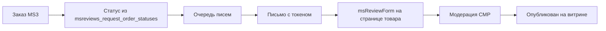

<!-- TODO: translate from docs/components/msreviews/index.md -->

# msReviews

**msReviews** — дополнение для [MODX Revolution 3](https://modx.com/) и [MiniShop3](/components/minishop3/): отзывы 1–5★, Q&A, фото к отзывам, подтверждённая покупка, JSON-LD и Vue-админка модерации.

С чего начать: [Быстрый старт](quick-start).

## Минимальный путь на витрине

1. Установить **MiniShop3** и **msReviews** через ModStore.
2. На шаблоне **msProduct** вывести блок сниппетов (см. [Быстрый старт](quick-start#шаг-2-блок-на-карточке-товара)).
3. В **Системные настройки** (namespace `msreviews`) задайте статусы заказа для писем и правила модерации.
4. **Настройки → Очистить кэш** и открыть карточку товара.
5. Модерация: **Extras → msReviews**.

## Быстрые ссылки

| Нужно | Документ |
| --- | --- |
| Установить и вывести блок на странице товара | [Быстрый старт](quick-start) |
| Переход с 1.1 на 1.2 | [Обновление до 1.2](upgrade-1.2) |
| Все ключи `msreviews_*` | [Системные настройки](settings) |
| Как собрать блок на карточке | [Интеграция](integration) |
| Карточка товара | [Страница товара](frontend/product) |
| Как подключить `reviews.css` в каталоге | [Каталог](frontend/catalog#подключение-reviewscss-в-каталоге), [msRatingSummary](snippets/msRatingSummary#подключение-reviewscss) |
| Параметры сниппетов | [Сниппеты (обзор)](snippets/index) |
| Чанки и CSS-токены | [Чанки](chunks) |
| CMP и модерация | [Админка](manager) |
| Connector API | [AJAX API](api) |
| Капча и события | [События MODX](events) |
| Диагностика | [FAQ](faq) |

## Возможности

- **Карточка товара** — сводка рейтинга, список отзывов, форма, Q&A, JSON-LD Product + Review
- **Готовые блоки для карточки** — `msReviewsHub`, вкладки, фильтры, CTA и галерея одним или несколькими вызовами
- **Каталог** — строка ★ 4.4 (32) через `tplRatingCatalog` или `msRatingBadge`
- **Главная** — `msReviewsLatest`, `msTopRatedProducts`, `msQuestionsLatest`
- **Verified purchase** — метка по токену из письма после заказа MS3
- **UGC** — плюсы/минусы, сценарий, вариант, «рекомендую», фото, оценки по критериям
- **Engagement** — «полезно», правка и удаление своего отзыва
- **CMP** — дашборд, модерация, ручное добавление и правка отзывов, медиа, CSV import/export, очередь писем

## Системные требования

| Требование | Версия |
| --- | --- |
| MODX Revolution | 3.0.3+ |
| PHP | 8.2+ |
| MiniShop3 | 1.0+ |
| VueTools | 1.1.2+ (только CMP) |
| pdoTools | 3.0+ (обязателен: чанки на Fenom, пагинация pdoPage) |

### Зависимости

- **[MiniShop3](/components/minishop3/)** — товары `msProduct`, заказы, verified purchase
- **[pdoTools](/components/pdotools/) 3.0+** — рендер чанков витрины. Без него сниппеты вернут пустую строку

### Опционально

- **[CrawlerDetect](/components/crawlerdetect/)** — блок ботов при `msreviews_crawler_block_enabled`

## Установка

1. [Подключите ModStore](https://modstore.pro/info/connection).
2. **Extras → Installer → Download Extras** — **msReviews** → **Download** → **Install**.
3. Убедитесь, что установлены **MiniShop3**, **pdoTools 3.0+** и **VueTools** (для CMP).
4. **Настройки → Очистить кэш**.

## Термины

| Термин | Описание |
| --- | --- |
| **product_id** | ID ресурса (`site_content.id`). На карточке товара MS3 совпадает с id товара. В CMP с **1.2.1** отзыв можно привязать к любому неудалённому ресурсу |
| **display_avg** | Рейтинг для сортировки топа (алгоритм Wilson или среднее) |
| **verified** | Отзыв с подтверждённой покупкой по токену заказа |
| **Готовые блоки** | `msReviewsHub`, `msReviewsTabbed`, `msReviewsFilters` — вместо ручной сборки по частям |
| **pending** | Отзыв на модерации, не виден на витрине |

## Поток verified-отзыва

```mermaid
flowchart LR
  order[Заказ MS3]
  status[Статус из msreviews_request_order_statuses]
  queue[Очередь писем]
  email[Письмо с токеном]
  form[msReviewForm на странице товара]
  mod[Модерация CMP]
  pub[Опубликован на витрине]
  order --> status --> queue --> email --> form --> mod --> pub
```

См. [Интеграция](integration), [Системные настройки](settings).
