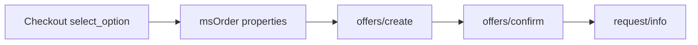

# Requests and manager

## Lifecycle

1. Checkout selection is stored in `properties.msyandexdelivery`.
2. On the order tab you run **Create** → Platform `offers/create`.
3. **Confirm** → `offers/confirm` with `offer_id`.
4. **Refresh status** → `request/info` (service may also use `actual_info` / `history`).

There is **no** webhook. Other-day API does not push status. Refresh by polling.

Request data lives in table **`msyandex_requests`** (`msydRequest` model) and order properties.

## MiniShop3 order tab

Plugin `msYandexDelivery Manager order tab` on `msOnManagerCustomCssJs` (order page) registers the tab via `MS3OrderTabsRegistry`. **VueTools** is required.

The tab shows status, offer/request id, price, tracking, and Create / Confirm / Refresh actions.

## CMP

The **msYandexDelivery** menu opens the CMP: connection test, calculate test, HTTP log view/clear. **System settings** opens namespace `msyandexdelivery`.

## Connector

Endpoint: `assets/components/msyandexdelivery/connector.php`.

| action | Context | Purpose |
| --- | --- | --- |
| `calculate` | web | Quote |
| `select_option` | web | Persist selection (`ms3_token` required) |
| `list_pickup_points` | web | Pickup point list |
| `test_connection` | mgr | API access check |
| `test_calculate` | mgr | Test quote |
| `get_log` / `clear_log` | mgr | Request log |
| `get_order_summary` | mgr | Order summary |
| `create_request` | mgr | Create offer |
| `confirm_request` | mgr | Confirm offer |
| `refresh_status` | mgr | Refresh status |

`cancel_request` is listed among mgr actions but **not** implemented in the connector `switch` (`unknown_action`). `YandexPlatformClient` has cancel; the UI is not wired yet.

## Platform API (client)

Base host: `msyandexdelivery_base_url`. Client paths:

| Method | Path |
| --- | --- |
| POST | `/api/b2b/platform/pricing-calculator` |
| POST | `/api/b2b/platform/offers/create` |
| POST | `/api/b2b/platform/offers/confirm` |
| GET | `/api/b2b/platform/request/info` |
| GET | `/api/b2b/platform/request/actual_info` |
| GET | `/api/b2b/platform/request/history` |
| POST | `/api/b2b/platform/request/cancel` |
| POST | `/api/b2b/platform/location/detect` |
| POST | `/api/b2b/platform/pickup-points/list` |

Service: `MsYandexDelivery\Service\YandexDeliveryService`. HTTP: `MsYandexDelivery\Api\YandexPlatformClient`.

## Plugins

| Plugin | Events |
| --- | --- |
| msYandexDelivery Autoload | `OnMODXInit` (priority -100) |
| msYandexDelivery Delivery | `msOnGetDeliveryCost` |
| msYandexDelivery Order persist | `msOnSubmitOrder`, `msOnBeforeCreateOrder`, `msOnCreateOrder` |
| msYandexDelivery Manager order tab | `msOnManagerCustomCssJs` |
