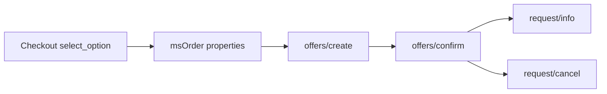

# Requests and manager

## Lifecycle



1. At checkout the selection is stored in `properties.msyandexdelivery`.
2. On the order tab, **Create** calls Platform `offers/create`.
3. **Confirm** → `offers/confirm` with `offer_id`.
4. **Refresh status** → `request/info`.
5. **Cancel** → `request/cancel` (while the request is not yet with a courier).

There are **no** push webhooks. Other-day API does not provide them. Refresh status manually or in batch.

Request data lives in table **`msyandex_requests`** (model `msydRequest`) and in order properties.

## MiniShop3 order tab


Plugin `msYandexDelivery Manager order tab` on `msOnManagerCustomCssJs` (order page) registers the tab via `MS3OrderTabsRegistry`. **VueTools** is required.

The tab shows status, offer/request id, price, tracking, and Create / Confirm / Refresh / Cancel.

**Cancel** is available after the request is confirmed and before the parcel is handed to a courier. It is unavailable for completed requests (delivered, cancelled, returned, failed), orders at a pickup point, returns in progress, and the status “On the way to recipient”. After a successful cancel the tab shows “Cancelled”.

## Status polling

Batch polling pulls current statuses from Yandex Delivery for active requests. Completed ones (delivered, cancelled, returned, failed) are skipped. Requests that have not synced recently are updated first.

Each change is saved on the MiniShop3 order. To auto-update order status or send notifications, hook a plugin to the status-change event (see below).

### Scheduler

Task file: `core/components/msyandexdelivery/elements/tasks/sync_statuses.php`

1. Install [Scheduler](https://modx.com/extras/package/scheduler) or similar.
2. Create a File task pointing at that path.
3. Interval 15–30 minutes.
4. You can set `limit` in task properties. Otherwise `msyandexdelivery_sync_poll_limit` is used.

### Cron without Scheduler

Set a long `msyandexdelivery_sync_secret` and call the connector:

```bash
curl -sS 'https://example.com/assets/components/msyandexdelivery/connector.php?action=sync_statuses&secret=YOUR_SECRET'
```

POST works too. Without the secret and without a manager session the response is `unauthorized`. If you are already logged into the manager, `action=sync_statuses` works without the secret.

### Plugin on status change

```php
<?php
/** @var modX $modx */
switch ($modx->event->name) {
    case 'msYandexDeliveryOnStatusChange':
        $orderId = (int) ($modx->event->params['order_id'] ?? 0);
        $normalized = (string) ($modx->event->params['normalized_status'] ?? '');
        // e.g. change MS3 status when delivered
        break;
}
```

Subscribe the plugin to the event. MODX creates the name on the first `invokeEvent`, or add `msYandexDeliveryOnStatusChange` to the package Events list.

## Connector

Single endpoint: `assets/components/msyandexdelivery/connector.php`.

| action | Context | Purpose |
| --- | --- | --- |
| `calculate` | web | Rate quote |
| `select_option` | web | Persist selection (`ms3_token` required) |
| `list_pickup_points` | web / mgr | Pickup point list |
| `get_order_summary` | mgr | Order summary |
| `create_request` | mgr | Create offer |
| `confirm_request` | mgr | Confirm offer |
| `refresh_status` | mgr | Refresh status |
| `cancel_request` | mgr | Cancel request |
| `sync_statuses` | mgr or secret | Batch poll of active requests |

## Platform API (client)

Base host: `msyandexdelivery_base_url`. Client paths:

| Method | Path |
| --- | --- |
| POST | `/api/b2b/platform/pricing-calculator` |
| POST | `/api/b2b/platform/offers/create` |
| POST | `/api/b2b/platform/offers/confirm` |
| GET | `/api/b2b/platform/request/info` |
| GET | `/api/b2b/platform/request/actual_info` |
| GET | `/api/b2b/platform/request/history` |
| POST | `/api/b2b/platform/request/cancel` |
| POST | `/api/b2b/platform/location/detect` |
| POST | `/api/b2b/platform/pickup-points/list` |

Service: `MsYandexDelivery\Service\YandexDeliveryService`. HTTP: `MsYandexDelivery\Api\YandexPlatformClient`.

## Plugins

| Plugin | Events |
| --- | --- |
| msYandexDelivery Autoload | `OnMODXInit` (priority -100) |
| msYandexDelivery Delivery | `msOnGetDeliveryCost` |
| msYandexDelivery Order persist | `msOnSubmitOrder`, `msOnBeforeCreateOrder`, `msOnCreateOrder` |
| msYandexDelivery Manager order tab | `msOnManagerCustomCssJs` |
