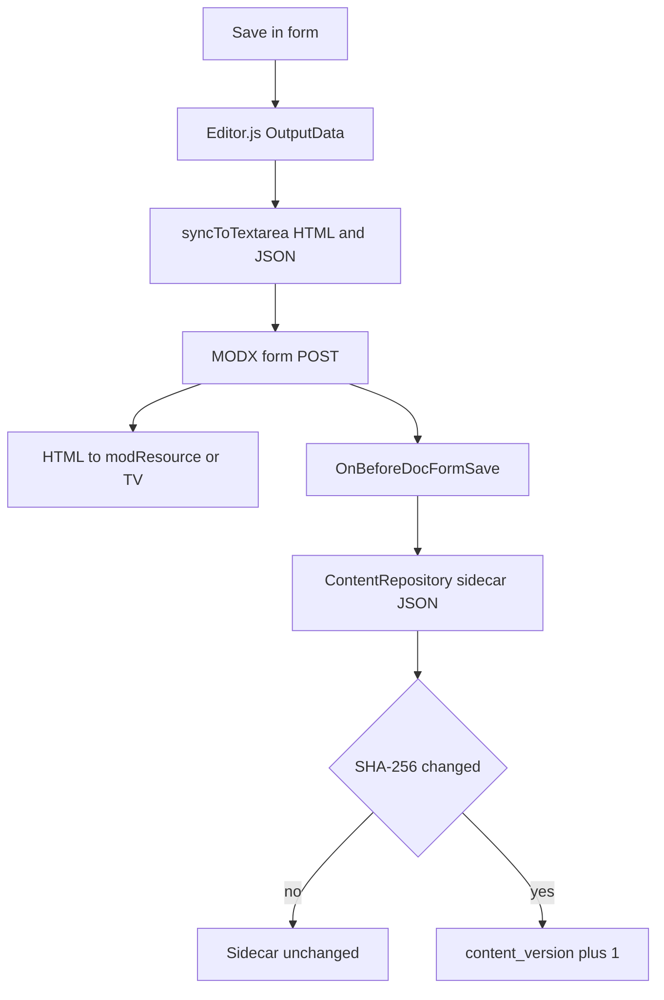
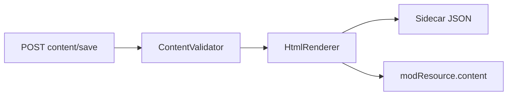

# Flows (technical)

Save and load diagrams. Editor guide: [Editor guide](/en/components/mxeditorjs/user-guide).

## Data model

mxEditorJs uses **Canonical JSON + HTML snapshot**:

- **JSON** (Editor.js OutputData): source of truth in sidecar tables
- **HTML**: frontend snapshot in `modResource.content` or TV textarea

```mermaid
flowchart LR
  ED[Editor.js in manager] --> JSON[(mxeditorjs_content / mxeditorjs_tv_content)]
  ED --> HTML[modResource.content / TV textarea]
  HTML --> SITE[Template [[*content]]]
```

## Loading resource form

1. Plugin on `OnDocFormPrerender` loads CSS/JS and fills `window.mxEditorJsConfig`
2. `MODx.loadRTE` initializes Editor.js on `#ta` (main content) and on `textarea.modx-richtext` except `#ta` (TVs)
3. `content/get` reads JSON from sidecar
4. If JSON is empty for main content: HTML migration offer (`content/migrate`, `dry_run`)

## Save via MODX form (primary path)



1. User clicks **Save**
2. Editor.js returns OutputData
3. Client (`syncToTextarea`, debounce 500 ms):
   - HTML → textarea (client `renderPreviewHtml`)
   - JSON → hidden `mxeditorjs_json` / `mxeditorjs_tv_{id}_json`
4. `hookBeforeSubmit` flushes JSON to hidden fields
5. Form POST → MODX saves HTML to resource/TV
6. `OnBeforeDocFormSave` → `ContentRepository` / `TvContentRepository.save(JSON)`
7. Dedup: if SHA-256 of JSON is unchanged, sidecar is not rewritten. Otherwise `content_version` increments. Empty `blocks: []` is **not** saved by the plugin ([#6](https://github.com/Ibochkarev/mxEditorJs/issues/6)): the sidecar stays as-is.

Server `HtmlRenderer` is **not** called on this path. The client builds HTML in the textarea.

## Save via connector



`POST content/save` + `content_json`:

1. `ContentValidator`
2. `HtmlRenderer` → HTML
3. Write sidecar
4. For main content: update `modResource.content`

Use for AJAX or custom integrations. TVs do not update `modResource.content` via connector.

## HTML → Editor.js migration

1. UI: modal when opening a resource without sidecar but with HTML
2. `content/migrate?dry_run=1`: block preview
3. Confirm → `HtmlMigrator.convert()` → save sidecar. `modResource.content` is not updated ([#5](https://github.com/Ibochkarev/mxEditorJs/issues/5))
4. `force`, `confirmed`: overwrite existing sidecar

Supported: `p`, `h1`–`h6`, `ul`/`ol`, `blockquote`, `img`, `table`, `pre`/`code`, `hr`. Not migrated: embed, gallery, attaches, checklist.

## Media

| Action | Connector | Settings |
| --- | --- | --- |
| Image / gallery upload | `media/upload` | `image_mediasource`, `image_upload_path` |
| Attachment upload | `media/uploadFile` | `file_mediasource`, `file_upload_path` |
| Folder browse | `media/browse` | `type=image` or `type=file` |

## Resource delete

`OnResourceDelete` removes rows in `mxeditorjs_content` and related `mxeditorjs_tv_content`.

## Plugin and events

| Event | Purpose |
| --- | --- |
| `OnRichTextEditorRegister` | Register mxEditorJs in RTE list |
| `OnDocFormPrerender` | Config, assets, init |
| `OnBeforeDocFormSave` | Save JSON to sidecar |
| `OnResourceDelete` | Clean sidecar |
