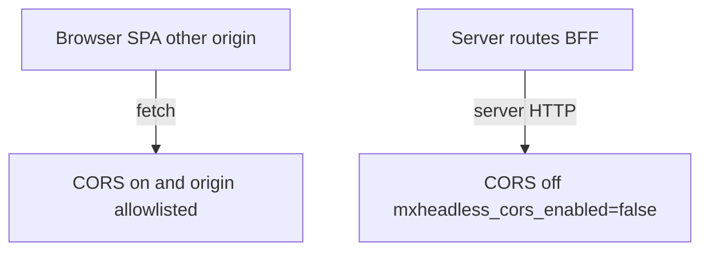

# CORS

You need CORS when a **browser** on another origin calls the API directly: Nuxt SPA, Next client components. Server-side calls (`$fetch` in server routes, RSC, Route Handlers) do not need CORS.

## Settings

| Key | Default | Notes |
| --- | --- | --- |
| `mxheadless_cors_enabled` | `false` | Master switch |
| `mxheadless_cors_allowed_origins` | empty | Comma-separated exact origins, or `*` |
| `mxheadless_cors_allowed_methods` | `GET,POST,PUT,PATCH,DELETE,OPTIONS` | |
| `mxheadless_cors_allowed_headers` | `Authorization,Content-Type,X-Request-ID,X-CSRF-Token,X-Context,X-API-Key,Idempotency-Key` | |
| `mxheadless_cors_expose_headers` | `ETag,X-Request-ID,X-RateLimit-Limit,X-RateLimit-Remaining,X-RateLimit-Reset,Idempotency-Replayed,X-CSRF-Token` | Browser JS can read these |
| `mxheadless_cors_allow_credentials` | `false` | Do not combine with `*` origins |

## What the default means

`mxheadless_cors_enabled=false` turns CORS off. The API does not send `Access-Control-*` headers.

That is not "allow everyone". With CORS disabled, browser cross-origin requests fail in the client. Same-origin pages and server-side callers are unaffected.

When you set `mxheadless_cors_enabled=true`, the allowlist still applies. Headers go out only if `Origin` matches `mxheadless_cors_allowed_origins`, or the list is exactly `*`. Even with `*`, the response echoes the request origin, not an unconditional `*` with credentials.

## Local Nuxt or Next SPA

Frontend on `localhost:3000`, MODX/API on another host or port:

```text
mxheadless_cors_enabled = true
mxheadless_cors_allowed_origins = http://localhost:3000
mxheadless_cors_allow_credentials = false
```

If you need session cookies from MODX in the browser, set `mxheadless_cors_allow_credentials = true` and list the exact origin (not `*`).

In browser developer tools, preflight `OPTIONS` should return `204` and `Access-Control-Allow-Origin: http://localhost:3000`.

## Production SPA on another domain

```text
mxheadless_cors_enabled = true
mxheadless_cors_allowed_origins = https://app.example.com
```

Add staging explicitly:

```text
mxheadless_cors_allowed_origins = https://app.example.com,https://staging.example.com
```

Discovery (`GET /api/v1`) returns `data.cors.enabled` and `data.cors.allowed_origins`. Compare that with your SPA origin before debugging fetch errors.

## Skip CORS entirely

If Nuxt or Next talks to MODX only from server routes, leave `mxheadless_cors_enabled=false`. The browser never hits MODX, so CORS does not apply.



## Preflight and curl check

A matching Origin on `OPTIONS` returns `204` with CORS headers. Even when CORS is disabled, preflight still returns `204` without `Access-Control-*`.

Simulate preflight:

```bash
curl -i -X OPTIONS 'https://modx.example.com/api/v1/health' \
  -H 'Origin: https://app.example.com' \
  -H 'Access-Control-Request-Method: GET'
```

With CORS on and the origin allowlisted, expect `204` and `Access-Control-Allow-Origin: https://app.example.com`. With CORS off or a wrong origin, those headers are missing.

`Access-Control-Expose-Headers` includes `ETag` for revalidation from `fetch`.

## MiniShop3

If MiniShop3 Web API runs on the same site, mirror the SPA origin in `ms3_cors_allowed_origins`. See [MiniShop3](/components/mxheadless/extensions/minishop3).
