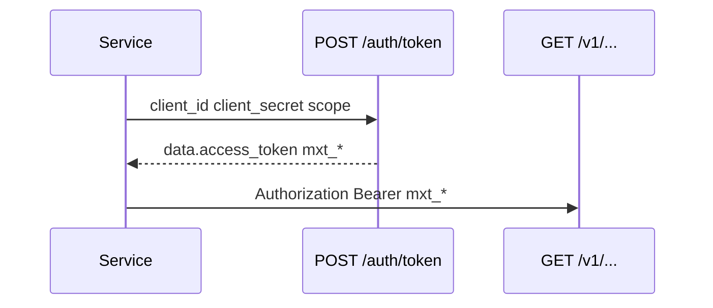

# OAuth

Short-lived bearer tokens `mxt_*`. Disabled by default.

## Enable

| Key | Default | Purpose |
| --- | --- | --- |
| `mxheadless_oauth_enabled` | `false` | `POST /api/v1/auth/token` |
| `mxheadless_oauth_token_ttl` | `3600` | Access token TTL (seconds) |
| `mxheadless_oauth_password_grant_enabled` | `false` | `password` grant |

## Client

```bash
php core/components/mxheadless/bin/oauth-client-create.php \
  --client-id=next-preview \
  --name='Next preview' \
  --scopes=resources.read,preview \
  --grants=client_credentials
```

The secret is shown once. Tables: `mxheadless_oauth_clients`, `mxheadless_oauth_tokens` (hash).

## Issue a token



```bash
curl -s -X POST https://example.com/api/v1/auth/token \
  -H 'Content-Type: application/json' \
  -d '{
    "grant_type": "client_credentials",
    "client_id": "next-preview",
    "client_secret": "YOUR_CLIENT_SECRET",
    "scope": "resources.read"
  }'
```

The response is an envelope: `data.access_token` (`mxt_...`), `data.token_type`, `data.expires_in`, `data.scope`. Then:

```bash
TOKEN=$(curl -s -X POST https://example.com/api/v1/auth/token \
  -H 'Content-Type: application/json' \
  -d '{"grant_type":"client_credentials","client_id":"...","client_secret":"...","scope":"resources.read"}' \
  | jq -r .data.access_token)

curl -s https://example.com/api/v1/resources \
  -H "Authorization: Bearer $TOKEN"
```

Supports `application/json` and `application/x-www-form-urlencoded`. For client credentials, HTTP Basic with `client_id`/`client_secret` is also allowed.

## Grants

| Grant | When |
| --- | --- |
| `client_credentials` | Server-to-server (default) |
| `password` | Only if `mxheadless_oauth_password_grant_enabled=true` |

OAuth error: `400` `invalid_grant`.

## Key or token

| Credential | When |
| --- | --- |
| `mxh_*` | CI, long-running background jobs, no token refresh |
| `mxt_*` | TTL, rotation without redeploying secrets in every service |

Both types pass the same scope check. CSRF is not required.
