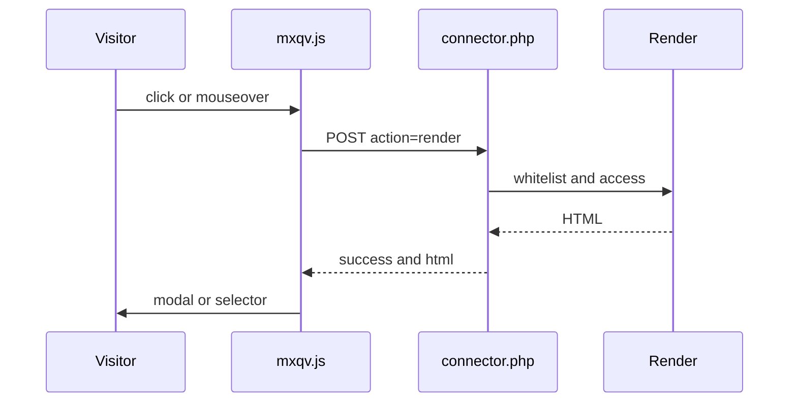

# mxQuickView architecture

## Component overview

- **Init snippet** `mxQuickView.initialize` — CSS/JS, `window.mxqvConfig`, modal modes `native`/`bootstrap`/`fancybox`.
- **Frontend JS** `assets/components/mxquickview/js/mxqv.min.js` — event delegation, AJAX to the connector, modal/selector render, loop navigation, ms3Variants helpers.
- **Connector** `assets/components/mxquickview/connector.php` — HTTP entry for action `render`.
- **Processor** `core/components/mxquickview/src/Processors/Render.php` — whitelist, resource access, render `chunk|snippet|template`.
- **Base product chunk** `core/components/mxquickview/elements/chunks/mxqv_product.tpl` — quick view card with cart form and variants block.

## Data flow

1. The user clicks or hovers an element with `data-mxqv-*`.
2. `mxqv.js` builds a POST to `connector.php` (`mode`, `data_action`, `element`, `id`, `context`, `output`, `modal_library`).
3. The connector validates the HTTP method and `action=render`, then calls `Render::run(...)`.
4. The processor:
   - checks `id`, `element`, `data_action`;
   - loads the resource and view permission;
   - validates the element against the whitelist;
   - builds HTML via `getChunk`, `runSnippet`, or `$resource->process()` (for `template`).
5. The connector returns JSON `{success, html|message}`.
6. JS inserts HTML into the chosen modal (`native`/`bootstrap`/`fancybox`) or the `selector` container.

## Render placeholders

Passed into render:

- resource fields (`$resource->toArray()`);
- `content`, `assets_url`;
- `mxqv_content_html` (copy of `content`), `mxqv_intro_html` (wrapped `introtext` when non-empty; unused in the default `mxqv_resource` chunk);
- with MiniShop3: `msProductData` fields;
- with ms3Variants: `has_variants`, `variants_html`, `variants_json`.
- Bundled chunks and HTML after `process()` are parsed with Fenom via pdoTools when available.

## Security

- The connector accepts only `POST`.
- Resource existence (`id`, `deleted=0`) and view access (`view` or `load` policy, or `view` permission).
- Whitelist is required for `chunk` and `snippet`.
- Whitelist is required for `template`. Empty `mxquickview_allowed_template` disables template render.

## Data storage

No dedicated DB tables for quick view. The component uses MODX resources and (optionally) MiniShop3/ms3Variants models.

## Files and roles

| File | Role |
| --- | --- |
| `assets/components/mxquickview/connector.php` | AJAX entry point |
| `core/components/mxquickview/src/Processors/Render.php` | Render logic |
| `core/components/mxquickview/elements/snippets/mxqv_initialize.php` | Frontend and modal markup |
| `assets/components/mxquickview/js/mxqv.min.js` | Client behavior (minified) |
| `assets/components/mxquickview/css/mxqv.min.css` | Modal and card styles (minified) |
